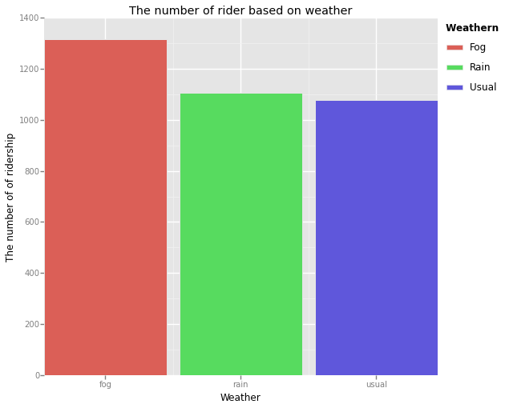

# This is how we used the Linear Regression with Python

#### Specifically, this is for Udacity Class Introduction to Data Science

    %%writefile udlr.py
    
    import numpy as np
    import pandas
    from ggplot import *
    
    def normalize_features(array):
        """Normalized the features in the data set"""
        array_normalized = (array-array.mean())/array.std()
        mu = array.mean()
        sigma = array.std()
        
        return array_normalized, mu, sigma
    
    def compute_cost(features, values, theta):
        """
        Compute the cost function fiven a set of features/values,
        and the values for our thetas
        """
        m = len(values)
        H = np.dot(features, theta)
        cost = (np.square(H-values)).sum().(2*m)
        
        return cost
    
    def gradient_descent(features,values,theta, alpha, num_iterations)
        """
        Perform gradient descent given a data set with an arbitrary number of features
        """
        m = len(values)
        cost_history = []
        
        for i in range(num_iterations):
            J = compute_cost(features, values, theta)
            cost_history.append(J)
            H = np.dot(features, theta)
            GD = (alpha/m)*np.dot((values-H), features)
            theta = np.add(theta,GD)
        
        return theta, pandas.Series(cost_history)
    
    def plot_cost_history(alpha, cost_history):
        """
        Viewing plot for our cost history
        
        For function called only in the function it self, print this return function
        
        """
        cost_df = pandas.DataFrame({
            'Cost_History': cost_history,
            'Iteration': range(len(cost_history))
    })
        return ggplot(cost_df, aes('Iteration', 'Cost_History')) + \
                geom_point() + ggtitle('Cost History for alpha = %.3f' % alpha )
        
        
    def predictions(features,values,alpha,num_iterations):
    
        
        
        m = len(values)
        
        features,mu,sigma = normalize_features(features)
        
        #create one features with one. This acts like constanta, bias unit.
        features['ones'] = np.ones(m)
        
        #If we look here, features and values is turned into np object array
        #So we can do vectorize computation, without even to use (np.add, np.subtract, etc)
        features_array = np.array(features)
        values_array = np.array(values).flatten()#return a copy of the array collapsed into one dimension
        
    
        
        #Init theta, perform gradient descent
        theta_gradient_descent = np.zeros(len(features.columns))
        theta_gradient_descent, cost_history = gradient_descent(features_array,
                                                                values_array,
                                                                theta_gradient_descent,
                                                                alpha,
                                                                num_iterations
                                                                )
        
        plot = None
        #Uncomment to see
        #plot = plot_cost_history(alpha, cost_history)
        predictions = np.dot(features_array, theta_gradient_descent)
        return predictions, plot
        
    def separate_data_from_predictions(dataframe):
            """
        dataframe itself is a pandas dataframe called weather_turnstile in the Udacity Class
        We use the predictions function to predict ridership NYC subway using linear regresion with gradient descent
        
        Separate the input from predictions to encapsulate it
        """
            
        dummy_units = pandas.get_dummies(dataframe['UNIT'], prefix='unit')
        features = dataframe[['rain','precipi', 'Hour', 'meantempi']].join(dummy_units)
        values = dataframe[['ENTRIESn_hourly']]
    
        #Set MANUAL alpha, num_iter
        alpha = 0.1
        num_iterations = 75
        
        return predictions(features,values,alpha,num_iterations)

    Overwriting udlr.py

### Visualize turnstile_weather

    from pandas import *
    from ggplot import *
    from datetime import datetime
    
    def plot_weather_date(filename):
        data = pandas.read_csv(filename)
        get_day = lambda d : datetime.strftime(datetime.strptime(d, '%Y-%m-%d').date(), '%a')
        data['DAYSn'] = data['DATEn'].apply(lambda d: get_day(d))
        grouped = data.groupby(['DAYSn'], as_index = False).mean()
        print grouped
        plot = ggplot(grouped, aes('DAYSn', 'ENTRIESn_hourly')) + geom_bar(aes(weight = 'ENTRIESn_hourly'), fill = 'blue', stat = 'identity')
        return plot
    
    print plot_weather_date('turnstile_data_master_with_weather.csv')
    
    
        
        

      DAYSn    Unnamed: 0       Hour  ENTRIESn_hourly  EXITSn_hourly  \
    0   Fri  70410.623803  10.959636      1333.800773    1070.734344   
    1   Mon  67947.979363  10.931706      1084.888769     869.015152   
    2   Sat  75044.070127  10.879585       809.925317     681.034775   
    3   Sun  63713.827882  10.894261       604.620120     514.766136   
    4   Thu  66082.544485  10.932870      1305.176382    1044.300695   
    5   Tue  57099.915715  10.840182      1307.073259    1046.467860   
    6   Wed  61748.322656  10.825944      1335.901803    1071.181540   
    
       maxpressurei  maxdewpti  mindewpti  minpressurei  meandewpti  \
    0     30.004952  56.706608  47.692308     29.874937   51.952485   
    1     30.093767  58.551704  48.727722     29.883075   53.745032   
    2     29.975392  58.279873  50.782411     29.855360   54.278374   
    3     30.071598  56.155649  48.369604     29.945723   52.365292   
    4     30.030086  55.476910  45.222617     29.922571   50.724646   
    5     29.995784  58.210458  49.469167     29.831124   53.214550   
    6     30.024700  57.268625  47.498356     29.924539   52.507541   
    
       meanpressurei       fog      rain  meanwindspdi   mintempi  meantempi  \
    0      29.944951  0.000000  0.251643      3.743859  55.966728  63.960328   
    1      29.983292  0.201376  0.598957      6.408911  56.323442  63.313146   
    2      29.915342  0.000000  0.250750      4.747578  58.513033  67.020761   
    3      30.003730  0.198771  0.198771      4.801229  56.178632  63.573329   
    4      29.977579  0.250236  0.250236      5.752265  55.484968  64.488024   
    5      29.935652  0.247116  0.250753      7.509008  56.464962  64.716738   
    6      29.979618  0.248668  0.500170      5.744529  54.265223  63.267717   
    
        maxtempi   precipi  thunder  
    0  71.451966  0.060394        0  
    1  69.699802  0.111195        0  
    2  74.528489  0.017552        0  
    3  70.366531  0.176906        0  
    4  72.990220  0.017517        0  
    5  72.721398  0.168005        0  
    6  71.521714  0.667847        0  
    <ggplot: (277609837)>

    %pylab inline

    Populating the interactive namespace from numpy and matplotlib

### This is how we visualize the data, based on the weather how much subway ridership

    from pandas import *
    from ggplot import *
    from datetime import datetime
    
    def plot_weather(filename):
        data = pandas.read_csv(filename)
    
        data['WEATHERn'] = 'usual'
        list_weather = ['fog','rain','thunder']
        for e in list_weather:
            data['WEATHERn'][data[e] == 1] = e
        grouped = data.groupby('WEATHERn', as_index = False).mean()
        plot = ggplot(grouped, aes('WEATHERn','ENTRIESn_hourly', fill = 'WEATHERn'))+geom_bar(aes(weight = 'ENTRIESn_hourly', stat = 'identity')) \
        + ggtitle('The number of rider based on weather') + xlab('Weather') + ylab('The number of of ridership')
    
        return plot
    
    print plot_weather('turnstile_data_master_with_weather.csv')
        

    <ggplot: (279137253)>

### This is mapper and reducer function for subway station

    %%writefile riders_per_station_mapper.py
    
    import sys
    import string
    import logging
    
    from util import mapper_logfile
    logging.basicConfig(filename=mapper_logfile, format='%(message)s',
                        level=logging.INFO, filemode='w')
    
    def mapper():
        """
        The input to this mapper will be the final Subway-MTA dataset, the same as
        in the previous exercise.  You can check out the csv and its structure below:
        https://www.dropbox.com/s/meyki2wl9xfa7yk/turnstile_data_master_with_weather.csv
    
        For each line of input, the mapper output should PRINT (not return) the UNIT as 
        the key, the number of ENTRIESn_hourly as the value, and separate the key and 
        the value by a tab. For example: 'R002\t105105.0'
    
        Since you are printing the output of your program, printing a debug 
        statement will interfere with the operation of the grader. Instead, 
        use the logging module, which we've configured to log to a file printed 
        when you click "Test Run". For example:
        logging.info("My debugging message")
        
        The logging module can be used to give you more control over your debugging
        or other messages than you can get by printing them. In this exercise, print
        statements from your mapper will go to your reducer, and print statements
        from your reducer will be considered your final output. By contrast, messages
        logged via the loggers we configured will be saved to two files, one
        for the mapper and one for the reducer. If you click "Test Run", then we
        will show the contents of those files once your program has finished running.
        The logging module also has other capabilities; see 
        https://docs.python.org/2/library/logging.html for more information.
        """
        i = 0;
        ##UNIT = 1
        ##ENTRIESn_hourly = 6
        for line in sys.stdin:
            #i+=1
            #logging.info(line)
            #if i == 10:
            #    break
            
            data = line.strip().split(",")
            if data[1] == 'UNIT':
                continue
            print "{0}\t{1}".format(data[1],data[6])
            
            
         
    
    
    mapper()

    Writing riders_per_station_mapper.py

    %%writefile riders_per_station_reducer.py
    
    import sys
    import logging
    
    from util import reducer_logfile
    logging.basicConfig(filename=reducer_logfile, format='%(message)s',
                        level=logging.INFO, filemode='w')
    
    def reducer():
        '''
        Given the output of the mapper for this exercise, the reducer should PRINT 
        (not return) one line per UNIT along with the total number of ENTRIESn_hourly 
        over the course of May (which is the duration of our data), separated by a tab.
        An example output row from the reducer might look like this: 'R001\t500625.0'
    
        You can assume that the input to the reducer is sorted such that all rows
        corresponding to a particular UNIT are grouped together.
    
        Since you are printing the output of your program, printing a debug 
        statement will interfere with the operation of the grader. Instead, 
        use the logging module, which we've configured to log to a file printed 
        when you click "Test Run". For example:
        logging.info("My debugging message")
        '''
        old_unit = None
        en_hour = 0
        for line in sys.stdin:
            
            data = line.strip().split("\t")
            if len(data) != 2:
                continue
            
            this_unit, this_count = data
            if old_unit and old_unit != this_unit:
                print "{0}\t{1}".format(old_unit, en_hour)
                en_hour = 0
            old_unit = this_unit
            en_hour+= float(this_count)
            
            if old_unit != None:
                print "{0}\t{1}".format(old_unit, en_hour)
            
    
            
    reducer()

    Writing riders_per_station_reducer.py

    %%writefile ridership_by_weather_mapper.py
    
    import sys
    import logging
    
    from util import reducer_logfile
    logging.basicConfig(filename=reducer_logfile, format='%(message)s',
                        level=logging.INFO, filemode='w')
    
    def reducer():
        '''
        Given the output of the mapper for this assignment, the reducer should
        print one row per weather type, along with the average value of
        ENTRIESn_hourly for that weather type, separated by a tab. You can assume
        that the input to the reducer will be sorted by weather type, such that all
        entries corresponding to a given weather type will be grouped together.
    
        In order to compute the average value of ENTRIESn_hourly, you'll need to
        keep track of both the total riders per weather type and the number of
        hours with that weather type. That's why we've initialized the variable 
        riders and num_hours below. Feel free to use a different data structure in 
        your solution, though.
    
        An example output row might look like this:
        'fog-norain\t1105.32467557'
    
        Since you are printing the output of your program, printing a debug 
        statement will interfere with the operation of the grader. Instead, 
        use the logging module, which we've configured to log to a file printed 
        when you click "Test Run". For example:
        logging.info("My debugging message")
        '''
    
        riders = -1      # The number of total riders for this key
        num_hours = 0   # The number of hours with this key
        old_key = None
    
        for line in sys.stdin:
            # your code here
            data = line.strip().split("\t")
            if len(data) != 2:
                continue
            riders+=1
            #logging.info(riders)
            this_key, this_hours = data
            if old_key and old_key != this_key:
                print "{0}\t{1}".format(old_key, num_hours/float(riders))
                num_hours = 0
                riders = 0
            
            old_key = this_key
            num_hours += float(this_hours)
            
            
            #if old_key != None and old_key == 'nofog-norain':
                #logging.info('last')
        print "{0}\t{1}".format(old_key, num_hours/(riders+1))
                                      
            
    
    reducer()

    Writing ridership_by_weather_mapper.py

    %%writefile ridership_by_weather_reducer.py
    
    import sys
    import logging
    
    from util import reducer_logfile
    logging.basicConfig(filename=reducer_logfile, format='%(message)s',
                        level=logging.INFO, filemode='w')
    
    def reducer():
        '''
        Given the output of the mapper for this assignment, the reducer should
        print one row per weather type, along with the average value of
        ENTRIESn_hourly for that weather type, separated by a tab. You can assume
        that the input to the reducer will be sorted by weather type, such that all
        entries corresponding to a given weather type will be grouped together.
    
        In order to compute the average value of ENTRIESn_hourly, you'll need to
        keep track of both the total riders per weather type and the number of
        hours with that weather type. That's why we've initialized the variable 
        riders and num_hours below. Feel free to use a different data structure in 
        your solution, though.
    
        An example output row might look like this:
        'fog-norain\t1105.32467557'
    
        Since you are printing the output of your program, printing a debug 
        statement will interfere with the operation of the grader. Instead, 
        use the logging module, which we've configured to log to a file printed 
        when you click "Test Run". For example:
        logging.info("My debugging message")
        '''
    
        riders = -1      # The number of total riders for this key
        num_hours = 0   # The number of hours with this key
        old_key = None
    
        for line in sys.stdin:
            # your code here
            data = line.strip().split("\t")
            if len(data) != 2:
                continue
            riders+=1
            #logging.info(riders)
            this_key, this_hours = data
            if old_key and old_key != this_key:
                print "{0}\t{1}".format(old_key, num_hours/float(riders))
                num_hours = 0
                riders = 0
            
            old_key = this_key
            num_hours += float(this_hours)
            
            
            #if old_key != None and old_key == 'nofog-norain':
                #logging.info('last')
        print "{0}\t{1}".format(old_key, num_hours/(riders+1))
                                      
            
    
    reducer()

    Writing ridership_by_weather_reducer.py

    %%writefile busiest_hour_mapper.py
    import sys
    import string
    import logging
    
    from util import mapper_logfile
    logging.basicConfig(filename=mapper_logfile, format='%(message)s',
                        level=logging.INFO, filemode='w')
    
    def mapper():
        """
        In this exercise, for each turnstile unit, you will determine the date and time 
        (in the span of this data set) at which the most people entered through the unit.
        
        The input to the mapper will be the final Subway-MTA dataset, the same as
        in the previous exercise. You can check out the csv and its structure below:
        https://www.dropbox.com/s/meyki2wl9xfa7yk/turnstile_data_master_with_weather.csv
    
        For each line, the mapper should return the UNIT, ENTRIESn_hourly, DATEn, and 
        TIMEn columns, separated by tabs. For example:
        'R001\t100000.0\t2011-05-01\t01:00:00'
    
        Since you are printing the output of your program, printing a debug 
        statement will interfere with the operation of the grader. Instead, 
        use the logging module, which we've configured to log to a file printed 
        when you click "Test Run". For example:
        logging.info("My debugging message")
        """
        ##UNIT = 1
        ##ENTRIESn_hourly = 6
        ##DATEn = 2
        ##TIMEn = 3
        for line in sys.stdin:
            data = line.strip().split(",")
            if data[1] == 'UNIT':
                continue
            ans = "{0}\t{1}\t{2}\t{3}".format(data[1],data[6],data[2],data[3])
            #logging.info(ans)
            print ans
    
    mapper()

    Writing busiest_hour_mapper.py

    %%writefile busiest_hour_reducer.py
    import sys
    import logging
    import datetime
    from util import reducer_logfile
    logging.basicConfig(filename=reducer_logfile, format='%(message)s',
                        level=logging.INFO, filemode='w')
    
    def reducer():
        '''
        Write a reducer that will compute the busiest date and time (that is, the 
        date and time with the most entries) for each turnstile unit. Ties should 
        be broken in favor of datetimes that are later on in the month of May. You 
        may assume that the contents of the reducer will be sorted so that all entries 
        corresponding to a given UNIT will be grouped together.
        
        The reducer should print its output with the UNIT name, the datetime (which 
        is the DATEn followed by the TIMEn column, separated by a single space), and 
        the number of entries at this datetime, separated by tabs.
    
        For example, the output of the reducer should look like this:
        R001    2011-05-11 17:00:00	   31213.0
        R002	2011-05-12 21:00:00	   4295.0
        R003	2011-05-05 12:00:00	   995.0
        R004	2011-05-12 12:00:00	   2318.0
        R005	2011-05-10 12:00:00	   2705.0
        R006	2011-05-25 12:00:00	   2784.0
        R007	2011-05-10 12:00:00	   1763.0
        R008	2011-05-12 12:00:00	   1724.0
        R009	2011-05-05 12:00:00	   1230.0
        R010	2011-05-09 18:00:00	   30916.0
        ...
        ...
    
        Since you are printing the output of your program, printing a debug 
        statement will interfere with the operation of the grader. Instead, 
        use the logging module, which we've configured to log to a file printed 
        when you click "Test Run". For example:
        logging.info("My debugging message")
        '''
    
        max_entries = 0
        old_key = None
        datetimed = ''
        
        fmt = '%Y-%m-%d %H:%M:%S'
    
        for line in sys.stdin:
            data = line.strip().split("\t")
            if len(data) != 4:
                continue
            this_key, this_entries, this_date, this_time = data
        
            if old_key and old_key != this_key:
                print "{0}\t{1}\t{2}".format(old_key,datetimed,max(max_entries, float(this_entries)))
                max_entries = 0
    
            old_key = this_key 
            maxed = max(max_entries, float(this_entries))
            
            if max_entries < maxed:
                max_entries = maxed 
                datetimed = '{0} {1}'.format(this_date, this_time)
            elif max_entries == float(this_entries) and datetimed:
                d1= datetime.datetime.strptime(datetimed,fmt)
                d2 = datetime.datetime.strptime('{0} {1}'.format(this_date, this_time),fmt)
                datetimed = max(d1,d2).strftime(fmt)
    
            if old_key != None:
                print "{0}\t{1}\t{2}".format(old_key,datetimed,maxed)
    
                
    reducer()
    
            

    Writing busiest_hour_reducer.py

    %%writefile creating_pandas_dataframe.py
    
    from pandas import DataFrame, Series
    
    
    def create_dataframe():
        '''
        Create a pandas dataframe called 'olympic_medal_counts_df' containing
        the data from the  table of 2014 Sochi winter olympics medal counts.  
    
        The columns for this dataframe should be called 
        'country_name', 'gold', 'silver', and 'bronze'.  
    
        There is no need to  specify row indexes for this dataframe 
        (in this case, the rows will  automatically be assigned numbered indexes).
        '''
    
        countries = ['Russian Fed.', 'Norway', 'Canada', 'United States',
                     'Netherlands', 'Germany', 'Switzerland', 'Belarus',
                     'Austria', 'France', 'Poland', 'China', 'Korea', 
                     'Sweden', 'Czech Republic', 'Slovenia', 'Japan',
                     'Finland', 'Great Britain', 'Ukraine', 'Slovakia',
                     'Italy', 'Latvia', 'Australia', 'Croatia', 'Kazakhstan']
    
        gold = [13, 11, 10, 9, 8, 8, 6, 5, 4, 4, 4, 3, 3, 2, 2, 2, 1, 1, 1, 1, 1, 0, 0, 0, 0, 0]
        silver = [11, 5, 10, 7, 7, 6, 3, 0, 8, 4, 1, 4, 3, 7, 4, 2, 4, 3, 1, 0, 0, 2, 2, 2, 1, 0]
        bronze = [9, 10, 5, 12, 9, 5, 2, 1, 5, 7, 1, 2, 2, 6, 2, 4, 3, 1, 2, 1, 0, 6, 2, 1, 0, 1]
    
        # your code here
        d = {
              'country_name' : Series(countries),
              'gold' : Series(gold),
              'silver': Series(silver),
              'bronze': Series(bronze)
            }
        olympic_medal_counts_df = DataFrame(d)
    
        return olympic_medal_counts_df

    Writing creating_pandas_dataframe.py

    %%writefile np_mean_pandas_columns_with_conditions.py
    
    from pandas import DataFrame, Series
    import numpy
    
    
    def avg_medal_count():
        '''
        Compute the average number of bronze medals earned by countries who 
        earned at least one gold medal.  
        
        Save this to a variable named avg_bronze_at_least_one_gold.
        
        HINT-1:
        You can retrieve all of the values of a Pandas column from a 
        data frame, "df", as follows:
        df['column_name']
        
        HINT-2:
        The numpy.mean function can accept as an argument a single
        Pandas column. 
        
        For example, numpy.mean(df["col_name"]) would return the 
        mean of the values located in "col_name" of a dataframe df.
        '''
    
    
        countries = ['Russian Fed.', 'Norway', 'Canada', 'United States',
                     'Netherlands', 'Germany', 'Switzerland', 'Belarus',
                     'Austria', 'France', 'Poland', 'China', 'Korea', 
                     'Sweden', 'Czech Republic', 'Slovenia', 'Japan',
                     'Finland', 'Great Britain', 'Ukraine', 'Slovakia',
                     'Italy', 'Latvia', 'Australia', 'Croatia', 'Kazakhstan']
    
        gold = [13, 11, 10, 9, 8, 8, 6, 5, 4, 4, 4, 3, 3, 2, 2, 2, 1, 1, 1, 1, 1, 0, 0, 0, 0, 0]
        silver = [11, 5, 10, 7, 7, 6, 3, 0, 8, 4, 1, 4, 3, 7, 4, 2, 4, 3, 1, 0, 0, 2, 2, 2, 1, 0]
        bronze = [9, 10, 5, 12, 9, 5, 2, 1, 5, 7, 1, 2, 2, 6, 2, 4, 3, 1, 2, 1, 0, 6, 2, 1, 0, 1]
        
        df = DataFrame({
            'country_name' : countries,
            'gold' : gold,
            'silver' : silver,
            'bronze' : bronze
    })
        #print df[df['gold']>=1]
        avg_bronze_at_least_one_gold = numpy.mean(df[df['gold']>=1]['bronze'])
        ##column first then dataframe could be right also
    
        return avg_bronze_at_least_one_gold

    Overwriting np_mean_pandas_columns_with_conditions.py

    %%writefile avg_medals_countries.py
    import numpy
    from pandas import DataFrame, Series
    
    
    def avg_medal_count():
        '''
        Using the dataframe's apply method, create a new Series called 
        avg_medal_count that indicates the average number of gold, silver,
        and bronze medals earned amongst countries who earned at 
        least one medal at the 2014 Sochi olympics.
        '''
    
        countries = ['Russian Fed.', 'Norway', 'Canada', 'United States',
                     'Netherlands', 'Germany', 'Switzerland', 'Belarus',
                     'Austria', 'France', 'Poland', 'China', 'Korea', 
                     'Sweden', 'Czech Republic', 'Slovenia', 'Japan',
                     'Finland', 'Great Britain', 'Ukraine', 'Slovakia',
                     'Italy', 'Latvia', 'Australia', 'Croatia', 'Kazakhstan']
    
        gold = [13, 11, 10, 9, 8, 8, 6, 5, 4, 4, 4, 3, 3, 2, 2, 2, 1, 1, 1, 1, 1, 0, 0, 0, 0, 0]
        silver = [11, 5, 10, 7, 7, 6, 3, 0, 8, 4, 1, 4, 3, 7, 4, 2, 4, 3, 1, 0, 0, 2, 2, 2, 1, 0]
        bronze = [9, 10, 5, 12, 9, 5, 2, 1, 5, 7, 1, 2, 2, 6, 2, 4, 3, 1, 2, 1, 0, 6, 2, 1, 0, 1]
        
        df = DataFrame({
                        'country_name': countries,
                        'gold' : gold,
                        'silver': silver,
                        'bronze': bronze
    
    })
        avg_medal_count = df[['gold','silver','bronze']].apply(numpy.mean)
        
        return avg_medal_count

    Writing avg_medals_countries.py

    %%writefile numpy_medals_point_based.py
    
    import numpy
    from pandas import DataFrame, Series
    
    
    def numpy_dot():
        '''
        Imagine a point system in which each country is awarded 4 points for each
        gold medal,  2 points for each silver medal, and one point for each 
        bronze medal.  
    
        Using the numpy.dot function, create a new dataframe called 
        'olympic_points_df' that includes:
            a) a column called 'country_name' with the country name
            b) a column called 'points' with the total number of points the country
               earned at the Sochi olympics.
        '''
    
        countries = ['Russian Fed.', 'Norway', 'Canada', 'United States',
                     'Netherlands', 'Germany', 'Switzerland', 'Belarus',
                     'Austria', 'France', 'Poland', 'China', 'Korea', 
                     'Sweden', 'Czech Republic', 'Slovenia', 'Japan',
                     'Finland', 'Great Britain', 'Ukraine', 'Slovakia',
                     'Italy', 'Latvia', 'Australia', 'Croatia', 'Kazakhstan']
    
        gold = [13, 11, 10, 9, 8, 8, 6, 5, 4, 4, 4, 3, 3, 2, 2, 2, 1, 1, 1, 1, 1, 0, 0, 0, 0, 0]
        silver = [11, 5, 10, 7, 7, 6, 3, 0, 8, 4, 1, 4, 3, 7, 4, 2, 4, 3, 1, 0, 0, 2, 2, 2, 1, 0]
        bronze = [9, 10, 5, 12, 9, 5, 2, 1, 5, 7, 1, 2, 2, 6, 2, 4, 3, 1, 2, 1, 0, 6, 2, 1, 0, 1]
     
        df = DataFrame({
                        'country_name':countries,
                        'gold':gold,
                        'silver':silver,
                        'bronze':bronze
    })
        #print df.shape
        df['points'] = numpy.dot(df[['gold','silver','bronze']], [4,2,1])
        #df[['gold','silver','bronze']].apply(lambda x: numpy.dot(x,[4,2,1]))
        
        olympic_points_df = df[['country_name','points']]
        
        return olympic_points_df

    Writing numpy_medals_point_based.py

    
