The Visualization is important. Picture means thousands word is no
joke.Data Visualization is about how we turned raw data, number in table,
row, or columns, to visuals. It's about how we use visualization
presented with right kind of plot or colors.It takes our creativity to
makes visualization that is interesting, simpler, but also
understandable.

There is an experience that I have with data visualization. I once audit
data from OpenStreetMap, the open source powered for map navigation. I
downloaded whole map of jakarta in JOSM file, and began to audit the
data (in XML format). After that I uploaded the cleaned data to the
OpenStreetMap website. Turns out the data that I've cleaned change the
way it should work. Someone, from OpenStreetMap Indonesia told me that
I'm not audit the file correctly, and show me the visualization of the
map that I have audit. I make mistakes. So Visualization is important to
get insight of the data. But it also important to visualize again after
you do something with it.

Cole Nussbaumer, Founder of storrytellingwithdata.com, said that Data
Visualization is about how we turned number into picture and stories.
Makes people that read our visualization have an 'AHA' moment.

To put it simpler, Data Visualization has been split into two main
category, Exploratory and Explanatory. In Exploratory, we want to know
what is the data, how we defined it. Use the visualization to find the
gem from all the rock. Have some unbiased presentation so reader would
understand. After you get the analysis, you share your insights in the
Explanatory.

Explanatory itself has been divided into five steps.

1. Target your audience. What kind of audience that should have
   listened? If you have public audience, you want to make a
visualization that caught general attention. If you present it to other
scientists, you want to make more scientific approach. Or maybe from
different age, or different category.
2. After understand your audience, you want to make appropriate visuals.
   Choose what kind of plot, what kind of graph that optimal to
communicate your findings to your targeted audience. Use colors and
annotation.
3. Then eliminate the content that not worth adding. Decrease difficult
   grammar, or biased statement that makes your audience lost their
attention.
4. Then move the position of your plot accordingly. When they enter your
   page, what are the first visualization do they see, and what's next
in order. This is important as you want to tell a story.
5. Make it a narrative story. This is the best kind of story if you want
   to communicate your finding. 

You may also want to take [Alberto Cairo's Three Steps to Become a
Visualization
Designer](http://vizwiz.blogspot.com/2013/01/alberto-cairo-three-steps-to-become.html).

It really is how we ask interesting quesions about the data. Even if the
data simple, only containing two data points, it still can substract
effective information.

Common mistake is that we put too much thinking of our model/analysis,
but doesn't give too much for visualization. It's like when you
code tons of lines of code, but because the lack of documentations, nobody
would use it. It's the same for analysis/model. If your visualization
isn't that good, people won't understand your work and it's pretty much
useless. Data Visualization also a beatiful merge of arts and science.
You may have code intensively, but you also want it how turn those codes, result,
number to visual. How creative you are, how you choose plot kinds and
colors.

It also important to know which are the current ranking of your skills
at Designer,Engineer, and Story Teller. Here's my current ranking:

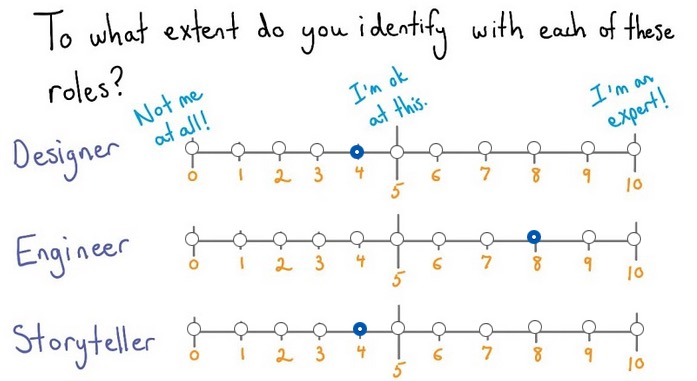

So until know, we can safely assume that Data Visualization is how we
make Data (programming), Visualization(designer) to join into a
narrative story. If you're want to be focused on the visualization part,
big data will always need programming, eventhough maybe there's some
advance tools that gonna out there that encapsulate deeper level. If
you come from a designer, you may want to practice your skills in the
Ilustrator first and try to connect things. Programmer should lern how
is the design language and principles. So whether you comes from
programmer or designer, it's a fair side for everyone.

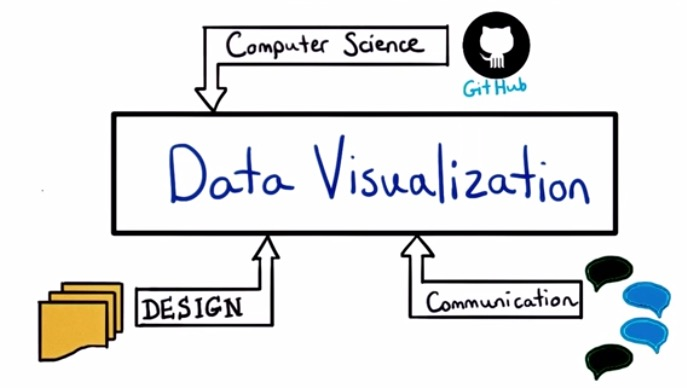

So, whether your comes from background that takes coding, design, or
communication. It takes all of these three background to make a great
visualization.

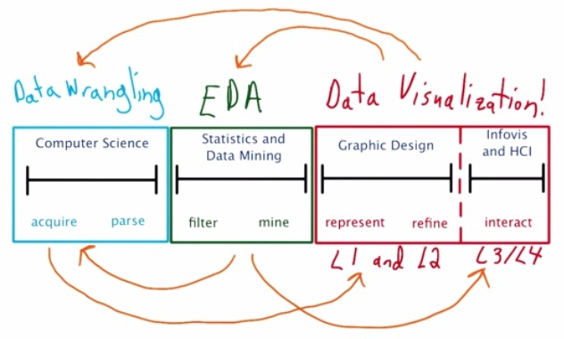

This is how Data Visualization takes a greater part in Data Science. In
Data Science, you want to wrangle the data, make an analysis from it,
and perform the visualization.

The first part of the process is wrangling and munging. You wrangle
data, from multiple resources. Either it comes from other website
through API, scrapping data, or users' log, database, load some
mapreduce pipeline.

The second part is where some says the heart of data science. Where the
magic happens.We perform some Exploratory Data Analysis, maybe some
statistical or mathematical theory implemented, to get insight of the
data.

Part three is where you make the visualization. Part one and two can't
be ignored.You want to share insights of the data that you have. And
without the data, there can't be visualization.This is where the
designer part comes from. How to choose different plot that most
effective explain your insights.

The final part is how we make the narrative story.Make some sort of
priortized order. Do this in such a way achieve Human Computer
Interaction. The best visualization is not only people understand
insight of your graph, but also discover insights theyselves.

Each step is iterative and repeatitive.You can make the visualization to
explore your data, if the visuals shows your EDA isn't that good, then
go back to perform EDA. The data that you wrangle may add to narrative
story. So this skills is expensive and much to learn.

Earlier, we talked about exploratory and explanatory. It's important to
know the difference. In the exploratory section, it's you and your
data. You want to make scatter plot, histogram, or boxplot that best
repsents the insight that you want to learn. In the explanatory section,
it's you and your audience. You want to repsent in the most interesting
way that your reader could get through.

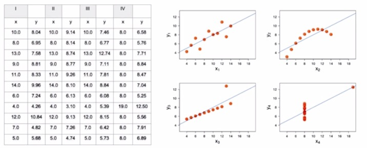

You shouldn't rely only on the summary statistics of your data. Take a
look at the different category x and y in the table on the left. You can
see that you will have some mean,correlaction coeffecient, line of best
fit, standar deviation and so on. But when you plot it in the
visualization, you will get different plot. There's also some outliers
involved. It's important to plot your data aside from the statistics
overview. This graph is drawn by Anscombe's Quartet to explain the
important of visualization in our data.Not only the visualization is
important to get insights of our data, but also how are the brain of
ours process insights faster significantly by visuals. Take a look at
this graph.

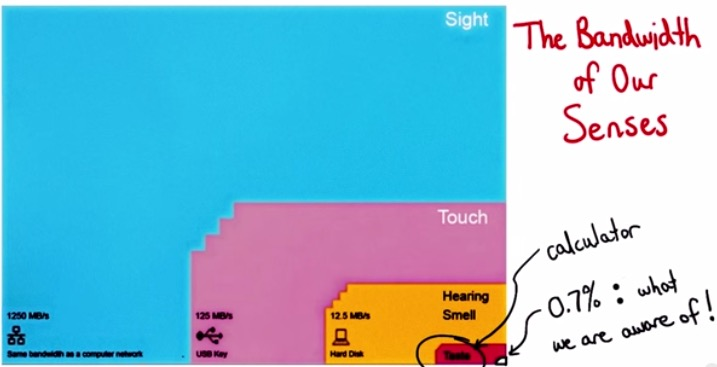

You can see that through our eyes, we proceeds faster and aware. Take a
look at the [Edwards Tufte's
explanation](http://www.edwardtufte.com/bboard/q-and-a-fetch-msg?msg_id=0002NC)
and [Penn
researchers](http://www.eurekalert.org/pub_releases/2006-07/uops-prc072606.php)
of how powerful visuals and eye in the human brain.

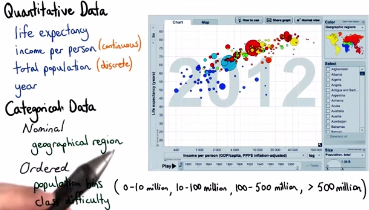

The graphs shows many types of data. There's quantitative data, data that
can you do the computational,like income,or year expectancy. There's
also Time Series data, that range from (day,month,year,etc), there's
also categorical data(Indonesia, China,Italy, etc). There's also ordered
series data, that take categorical but still ordered. Like the level
of beginner to advanced, or categorical bucket from 100 million,200
million,..., > 500 million.

This is the visualization from the video from Hans Rosling, of how he want to make
visualization that people both enjoy and understansd. I highly recommend
you to watch this 4-minutes
[video](https://www.youtube.com/watch?v=jbkSRLYSojo).

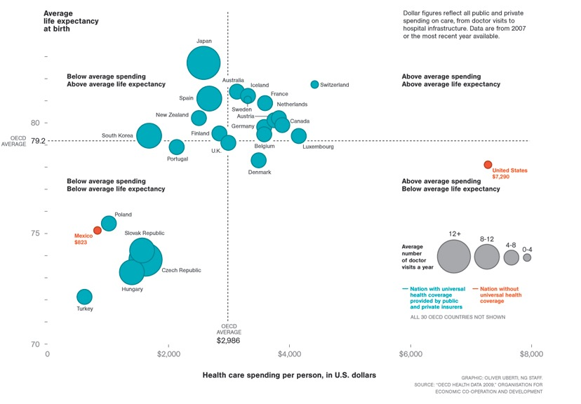

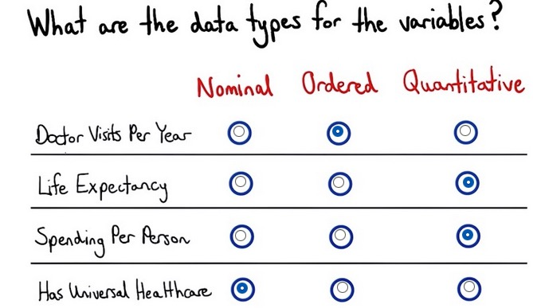

Take a look at how the graph shown and the type of data. Spending per
person and life expectancy can be moved as quantitative data, data that
we can take computation. While doctor visits, as explained, has been
divided into categorical ordered bucket, shown by the explanation on the
right. And finally, has or hasn't health care is just yes/no
categorical.

#Visual Encodings
 
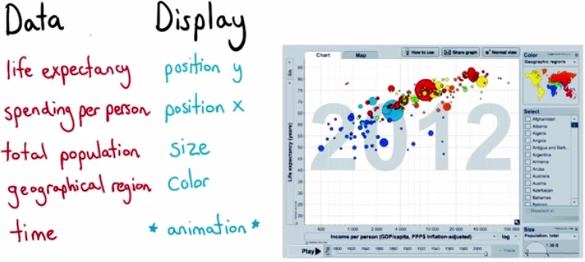

Visuals Encodings, is about how we map data to visuals. Here we can see
each of the variable fall nicely to the type of data. This is multi
dimension of data. 3D graph is difficult to perceieved than 2d graph,
because we may have ambiguous perspective. So the way we do this is set
another visuals that can add 3d dimension, which you can find any of 
these Retinal Variables.

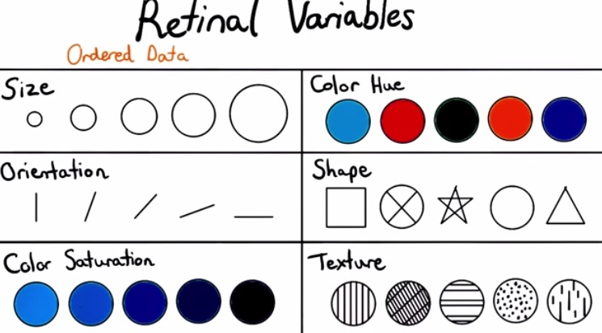

Thing to note is saturation is difficult to differentiate with human
eyes. So we can avoid that. There also time series in the graph that
presented as frame so it animate nicely when it's being playing on.

This is is from the top goal scorer history of the graph. We have
player-country as position x. Time as position y. Goal scored, how much
goals(in size) for every year. Whether they top scorer performed by color saturation.

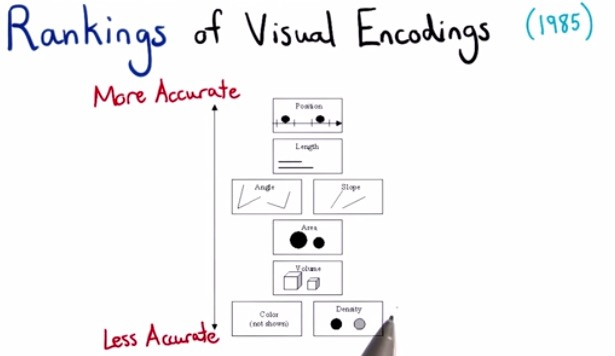

Cleveland and McGill in 1974 published a paper that shows the order in
which you want to plot the most accurate to the less acurate. If you
plot multiple dimension of data, prioritized them in order. Then you
want to take 2 of most important variables as position and the rest as
the other kind of retinal variables.

#Decomposing Visualizations

decomposing visualizations is a good practice if you're into data
visualizatins. This is like a reverse-engineering for software. You want
to know what are the graph consist of and how it effectively
represented in such a way showing their insights.Take a look at data
visualization performed [by Nelson Auner, Making
Indonesia](http://nelsonauner.com/dviz/#Interactive)

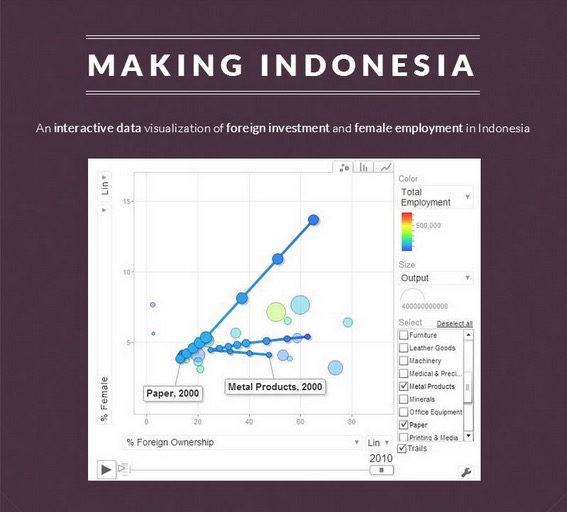

This data visualization is amazing! He's recreating the work of Hans
Rosling, winning Data Visualization Challenge 2014 at UChicago. You can
see that similar to Hans Rosling, time series as a frame that you can
play and animate towards  the end. The position is % foreign investment
as x axis and female employment as y axis, both are quantitative data.. Output as color saturation
from blue to red, and the number of firms as the size of the circle, as
quantitative discrete data. All
of these circle are categorical from every sector of the job.

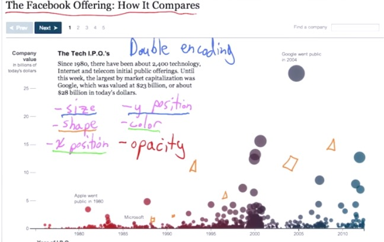

Let's take a look at Facebook Offering, you can find the link
[here](http://www.nytimes.com/interactive/2012/05/17/business/dealbook/how-the-facebook-offering-compares.html?_r=1&).
You can see that the first thing that it does is the title. It's
important to create a title that makes the readers focus on the thing
that data visualization want to say. In this example, The visualization
makes double encoding, to emphasize more on the variables. the y
position and size describes the company value, while x position and
color describe time-series year of I.P.O.

#Spectrum of **Visualization** technologies

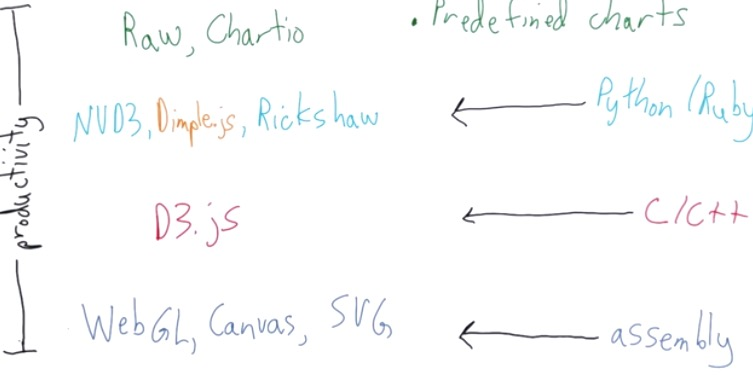

For the Data Visualization in the internet, D3.js by Javascript relies
on the programming language of the assembly level. like
html,css,svg.Because it's the lowest level, it's really efficient,
flexible, but hard to develop with.

D3.js is like the level of C++ complexity, where you pretty much
encapsulate everything that needed for data visualization.

In the higher level, there's NVD3, Dimple.JS, Rickshaw that build on top
of D3.js. This like scripting level like Python or Ruby. But it get's
lower flexibility like D3.js, and tailored for specific cases, like
Rickshaw.

In the top level, you will have Chartio. It's a library that like tool,
encapsulate from programming, and can be use for 90-95% cases. It builds
dashboards and charts.

It's important to note this spectrum level of software. There's a trade
off between the flexibility and effortless. You can stray away from the
path that Chartio uses to have more flexibility but build time slower,
or the other way around. From your data science project, you may want to
think about how much data visualization impact in your project, and
choose whichever library based on the tradeoff.

#D3: Data Driven Documents

Data is what usually refer to, in format like json or xml. The Documents
itself is the source file(html file) that we want to parse on. So D3 is
drive the data towards Documents. During there's page load, fetching html
file from web server, DOM is created.DOM is Document Object Model that
built based on parse html file from the server. as page loading, the DOM
building its structure. DOM can be parse by other programming languages,
like Python or Java.D3 is built on top of Javascript API, which build to
the DOM, that later drive to the Documents. DOM is spesification, a
hierarichal object, from the root of tree build the model. 

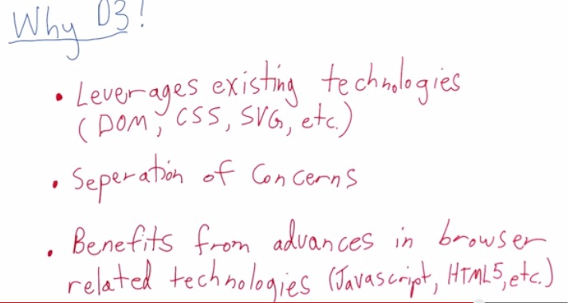

D3 has many advantage. D3 can encapsulate visualization from the mechanics. D3 code can generate its own html file and svg
objects, so designer can build on top of this and ask the developers if
it need to custom more visualization.D3 can manipulate its html file and
nodes.

Javascript itself can provide some interactive visualization on the client side, while keeping static on the server side, so D3 can
be benefit from it.For developer, they can use Javascript libraries,
text-editor,speedup performance of the Documents, or other thing that already advantage of Javascript.

> **REFERENCES**:

> * https://www.udacity.com/course/viewer#!/c-ud507/l-3068848585/m-3095208738
