This blog will explain more about how we can recreate the
visualization. We will perform metrics that can help the effectiveness
of your graphics. We also dig deep into the problems adressed for using
charts and graphics. And we also explore how D3 can engage users more.

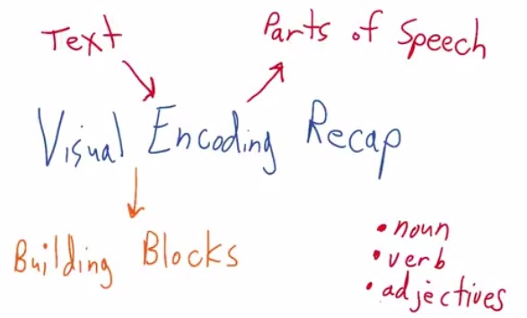

In my last
[blog](http://napitupulu-jon.appspot.com/posts/fundamentals-data-visualization-ud507.html),
Visual Encoding has been explained. You can see that Visual is the
graphic of your data. While Encoding perform as the text, like in
narrative story that you have, the Encoding is the noun,verb,adjective
that you have.

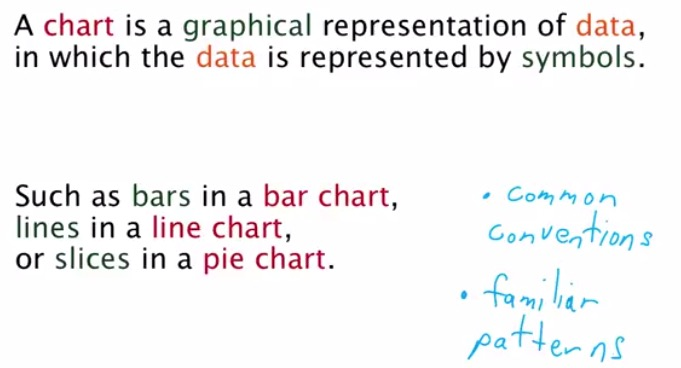

In this blog a chart is given in much constrained way. Chart is a
smaller subset of conventions that are found for combining Visual
Encodings. It does so that people not confused of our own chart,
folowwing familliar pattern found in most Visual Encoding out there
today.

For Data Visualization newbie, this image is a great place to start. It
contains most of the charts out there that we can choose. We can devise
what kind of data that we have and choose the related graph. Of course
when I said most, there's still be chart out there that new that hasn't
been listed here or maybe you yourself find a new type of chart. Be
remember though that it isn't the best recipe, as long as your audience
get which is easiest for them to capture what are you trying to present,
that is what matter. You can ask someone that is new to your data and
have feedback from him.

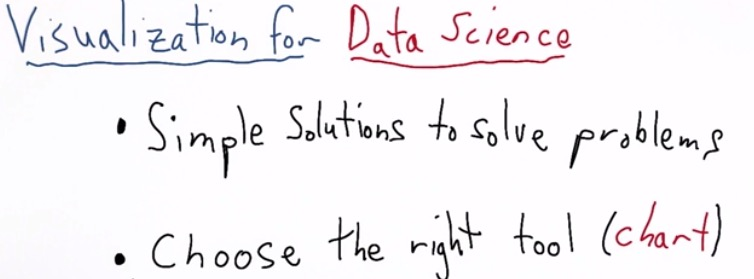

For Data Journalist, they focus on whichever complex the model of the
visualization to tell their data the most. But for Data Scientist,
addressing the problems is what matters. You want to visualize how your
algorithm solve the problems. He also want to choose which chart that
can represent the data the most. Carefully pick based on data, columns,
and variables that he has.

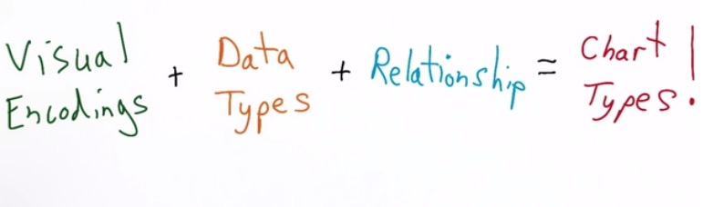

Chart is part of visuals encoding that we add some variables and
describe its relationship, make a chart. Scatter plot is one of example
when we want often describe the relationship of two variable, when we
know those two are correlated.
 
Usually, before we pick our chart, we want to know the type and
dimension of our data. For each of our variables, what is it that
categorical, continuous, time-series, etc? How many dimension that we
want to provide for our chart, 1D,2D,3D,etc?

If we have 1D variable and want to describe the distribution, we may
want to take binned histogram. Binned here is where we bin range of
values of the continuous value. If indeed we have more than 1 variable
that we want to observe the distribution, use boxplot or similar.

To plot two correlated variables, use scatter plot. If we want to
capture the trends of the data, use line plot. If you're in time-series
and want to observe variable in categorical group, use multi-line chart.

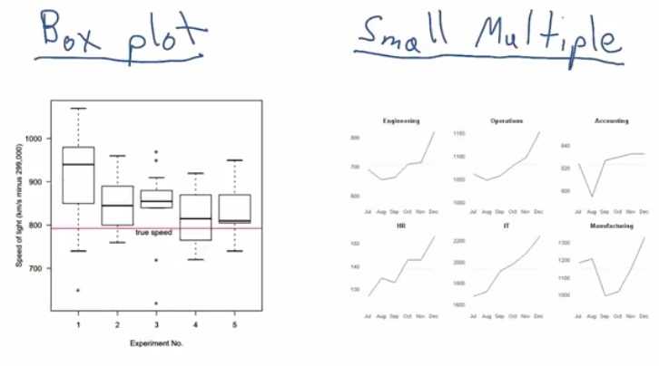

For Small Multiple,it facet your graph into multiple instances. Each
instance has one graph for each category of your particular variable.
This looks interesting, because unlike pie-charts, it plot one category
independent from the rest. You may want to avoid pie-chart, as it often
misleading. For creating a chart that takes proportion as a whole, use
stacked bar charts or table.

Here the data is has x time-series, y-values and facet categorical
department. So it has 3 dimension visualization.The plot using line-plot
but it also can use other plot.

Box Plot, like Small Multiple, perform 3D plot in this image. If you
know that the value that you have has some kind of distribution, and
want to compare for each categorical variable, use box plot. Here the
box plot used as for each experiement, the values of speed distribution. 

The different betweeen EDA and Data Visualization, is you use EDA to
gain insight for yourself based on the data, while in Data Visualization
you want to share your data with others, make them understandble even
they're unfamilliar. Boxplot and Small Multiple are common to use in
EDA. For Data Visualization, you can also use those as long as it's easy
to digest.

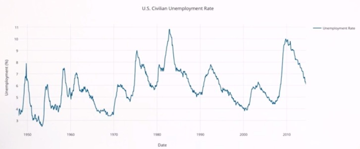

Keep in mind that you always have to be careful when labeling your data.
Here in the label we have x-axis label, y-axis label, the title, and the
legend. For the time series, we can see that it depends one another, as
t depend on t-1. For time-series data, that require to capture the
trends of your data overtime, line plot is the best chart type.

If I only to pick just three out of all the charts out there, I would
pick:

1. Scatter Plot - I use this to best represent the correlation of two
variables. Increase the dimension of my data with retinal variable.
Easily one of the best out there.

2. Line Plot - Although it often capture the general trend of scatter plot,
and why not use scatter plot instead, I will still use this because I
can know up and down of my data, changes with if I use time-series data.

3. Box Plot - It captures the distribution for each categorical of my
particular variable. I can see the mean,median, 1st and 3rd quarter to
see which weighted more, and also detect the outliers of my data.

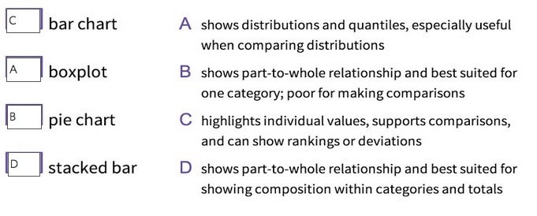

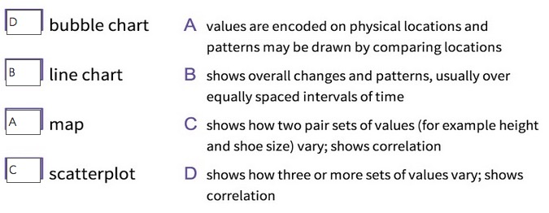

Think about the data type and the relationships before choosing Visual
Encoding, the chart type.

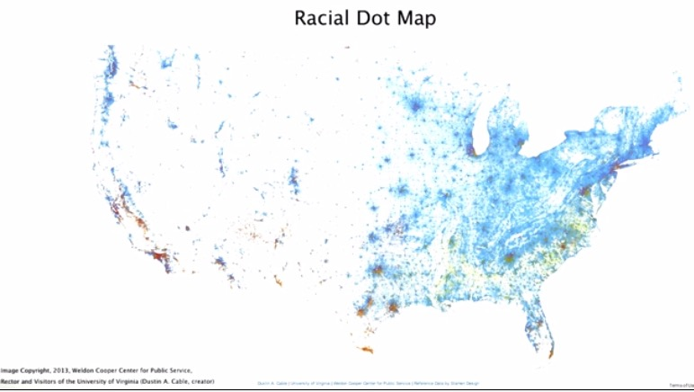

Tables represent as a lookup table between the the key and the value.
Usually we use Tables when we don't have any structured or hierarchyj of
our data. We can plot any data in Tables for everything. For the geo
tables, we can use map to plot any value based on location. Here the map
is US states which the person live in location, color depends on what
their race are.

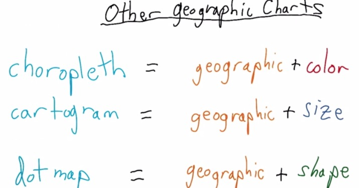

There are also other kind of map. We can use any geographical context
along with other visual encodings, such as color, size, or shape.

In plot.ly, there are some data visualization that are often used such
as bar chat, line chart, and scatter chart. But there are also some
buble map, map, or any out of the box data visualization that people
use.It entirely up to us, as a designer, to choose the best visual
representation of your data.

**Pre-atentive Processing**

Pre-atentive processing is the process on which the brain select what
stands out the most and prioritize that over the others until the end.
It reach about the speed brain recognize changes of facial expression.

In Information Visualization: Perception of Design, by Colin Ware,
pre-atentive attributes can be divided by color,hue,movement or spacial
position. This 4 can make particular value stands out the most among
others. You can make some combination of those attributes, and still
achieve pre-atentive attributes.

**Negative Spaces**

There are also negative spaces that you can use to convey your data.This
Dog Care Veterinary logo use negative spaces form a face of a dog.

**Color**

For using colors, if it doesn't convey much of your data, you should not
use colors, especially with prime, bright colors. You can use some
medium colors, or just primary black and white. Use colors if you want
to highlight specific category of one variables.

Colors can be tricky. It can give highlights about our data but fail to
some problems. You may want to check [Stephen
Few's](http://www.perceptualedge.com/articles/visual_business_intelligence/rules_for_using_color.pdf)
article.In that article, your learn how to pick the foreground and
background colour, sequential pallete of one colour, diverging pallete
of two colour and else.

Ultimately, the 2D approach performs better than 3D. It gives the
capability of seeing as a whole, rather than 3D view that often hide the
data depending on the angle. [This
link](http://phys.org/news/2011-10-heart-disease-visualization-experts-simpler.html)
explains why diagnostic accuracy of HemoVis have significant improvement
in accuracy from 31% to 91% when changing the 3D to 2D.

For the rainbow colors, we are not sure which color has distinct
information over the others, which color tells more data. [Cynthia
Brewer's ColorBrewer](http://colorbrewer2.org/) has some interesting
color that you can choose. I recommend to check the link. You can see
that the visualization using sequential (one ordered color), diverging (two ordered color) and qualitative. There's not too much color there that readers will know what to catch.10% of men suffer colorblind ([Test Here](http://www.color-blindness.com/color-blindness-tests/)), which is one of the reason you shouldn't use rainbow colors for Data Visualization. We can make order of one color or two color, vary with its saturation. But with rainbow colors, there's not much we can tell. [This link](http://www.poynter.org/uncategorized/224413/why-rainbow-colors-arent-always-the-best-options-for-data-visualizations/) also gives valid reasons why.

For choosing wisely in visualizing informations, you may want to refer
to Gestalt's Principles. Visualization best chosen if you capture the
overview your data, as a whole.Human's mind tend to understand the shape
in the simplest way.

**PROXIMITY**

When you plot a scatter plot, often points that closer together are
perceived as one group. If you can cluster the data with your own eye,
you will perceive the data must be share something in common, for each
cluster.

**SIMILARITY**

When you use visual encoding, data points with same shape,texture,color
will also be perceieved as one group. 

**FIGURE AND GROUND**

This enforce negative spaces that we discussed earlier. Don't try to
focus on the foreground, but also focus in the background. Often when
choosing the background wrong, readers will perceived differently.

**CONTINUITY**

When the data points form as a linear like, our minds try to follow the
direction, or observe the line from the beginning to the end.Other data
points that breaks the linearity tend to perceieved as interruptions, or
noise.We may see a street in the picture and tends to follow the street
leads to, or maybe you see a rocket and want to follow the direction of
the rocket.

**CLOSURE**

This is one thing that usually human can't stand to. Some of us often
want to finish unifinished things. Settle things, or perhaps for example
finish the movies that you left of, finish your laundry when it left
with the last one, or finish your readings when you interrupted in the
last page. That's why when it does have a noise, or a pixel missing in
the line chart, we finish it. We don't care about the noise, complete it
with our mind.

**SIMPLICITY**

We have discussed earlier, that when we faced with a visual objects, we
perceived to choose the simplest form of many objects.

That is all the category in the Gestalt's Principles.

**Chartjunk**

Here are view of the examples, that's pointed at Data Visualization
courses, Udacity:

* Heavy or dark grid lines
* unnecessary text
* ornamented chart axes
* pictures within graphs
* shading or 3D perspectives

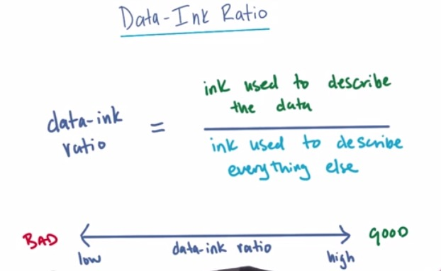

Data-ink ratio means the ratio which we need the ink to describe the
data, over everything else. We want it to have high ratio, means as
little as it can be, compared to low ratio. Anything that can't
explained be explained much would be considered junk.

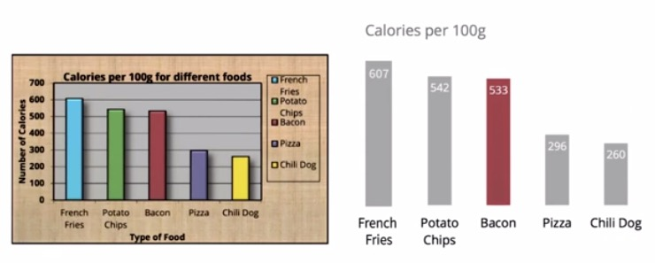

For this graph we reduce the ink to couple of things:

* Remove the background for frame and graph
* Remove the border
* Remove the legend, because it encoded in the x axis
* Remove the rainbow color, you may want to highlight one
* remove the shade and 3D perspective
* Remove overbold label.
* remove overused label
* Delete the line and just label the values directly into the bar.

Doing so will give much cleaner graph, and give the users more focus.
You can see animated graph for image above
[here](http://darkhorseanalytics.com/blog/data-looks-better-naked/).

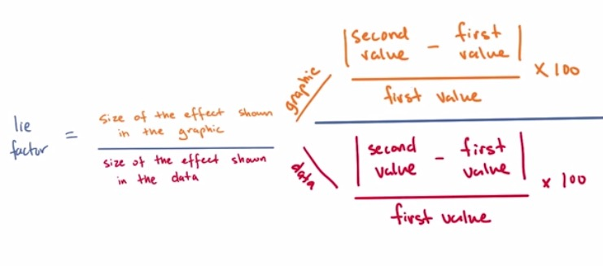

Lie Factor is the terms that you use when you tries to hide some of the
information of your data. Your data may have some noise that isn't worth
visualized, or your data have overplotting, which doesn't distinct the
plot. In this case, you probably want to jitter. 

For the Lie Factor, as calculated above. the rate from 0.95 to 1.05 is
a good boundary for your lie factor, while 1.0 is ideal. For example if
you have 50% changes (4-6) second  in data and 500% changes (40-600) inches  then you
would have 10.0 lie factor, which then tells you exaggerates in the
graphic.

**Grammar of Graphics**

[Leland Wilkinson's The Grammar of
Graphics](http://www.amazon.com/The-Grammar-Graphics-Statistics-Computing/dp/0387245448)
provide what known today as the standard grammar of visualization. At
the core level, it taught how the similarity of our data and our
visualization. 

Line Chart vs Tabular Representation. What are the advantage and
disadvantage of line over tabular?

The advantage because it's a time series data, when observing
one particular value that changes overtime, line chart are the best.The
line chart can convey trends, up and down.

The disadvantage however, is because the line chart emphasizes on the
trends of the data, we missed the detail. There's might be some noise,
or outliers that we want to convey the information from. In this case we
want to use tabular.

The Grammar means how we define the aesthetics and the labels of our
data. Even if our data change here and there, as long as we still follow
the grammar. We should be fine.

Few keys in the books are:

* Separation of data from aesthetics.
* Definition of common plot/chart elements.
* Composition of these common elements.

**Separation**

We have discussed earlier how benefit it is to separate the data from
aesthetics. You can think the aesthetics as the visual elements for each
of our variable in our data. Either it's x,y,size,color etc.
Manipulation of the data should be separated with manipulation of
aesthetics. we can manipulate, synthesize new variable based on existing
variable, but aesthetics comes with the designer side. When engineers
and designers works side by side, engineer can tasked with specific data
manipulation, while designers' responsibillities is to handle the visual
encoding of the data itself. With different kind of data and different
kind of aesthetics, we should be able to choose the chart wisely.

**Common Elements**

The Common Elements may refer to some elements that make the chart more
abstract. If you want to be good Data Visualization, you want to
reverse-engineer all the charts out there, but then you have to
understand what are the elements, the common elements to build those
chart. In Data Visualization Udacity, they list few of the most common:

* Coordinate System (cartesian vs. radial/polar)
* Scales (linear, logarithmic, etc.)
* Text annotations
* Shape (lines, circles, etc.)
* Data Types (Categorical, Continuous, etc.

**Composition**

The Composition let's you pick which of the chart that fit of the
commond elements that we specify. For example if already define the
Coordinate Systems,Scales,Text,Shape, and Data Types, you can narrow
your choice of chart to be very few. Here are the few examples:

* Categorical + Continuous x Cartesian = Bar Chart
* Categorical + Continuous x Polar = Pie Chart
* Continuous + Continuous x Cartesian = Scatter Chart

[This
link](https://ramnathv.github.io/pycon2014-r/visualize/ggplot2.html)
provide great documentation if you're familliar with R.

In the following we will see how Grammar of Graphics divide the part of
process in Data Visualization. This will give clear structure way to
create a visualization. We can separately think what are the visual
requirements and the structure of the data itself. For Designers, they
can only care about the aesthetics of the graphics. For the engineers,
what they care about is the manipulation of the data.

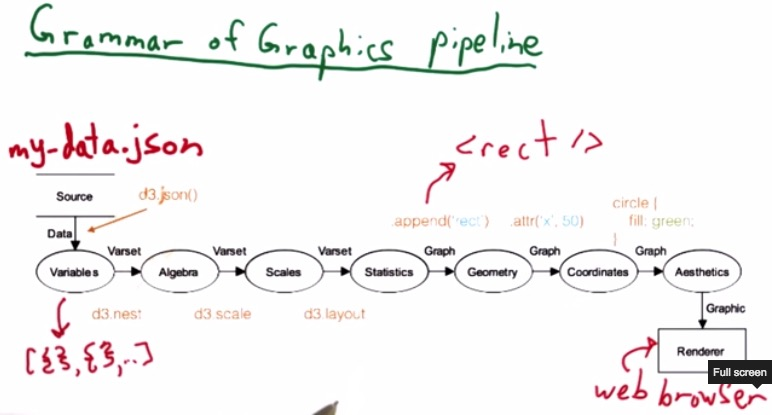
 
This pipeline here works beautifully with D3 Chainable API. Here we know
how the pipeline works a grammar. As earlier we discussed, the grammar
are important so visualization can built from a collaboration of a team.
The pipeline will help developers and designers to know which part of
pipeline that need to be modified if there are any changes.

d3.json() works to load the data file into array of Javascript object
literal.

d3.nest() will then groups each of the variables and return an array of
JSON. 

d3.scale() will scale our data into pixels for our graph that want to be
placed in out SVG.

d3.layout() will transform all the data into set of options of a chart,
depending on what kind of graph that we're trying to make.

d3.append() will placed SVG elements to our html, depending on svg,
either it's rectangle or else.

d3.attr() we can modify the attributes of our graph (e.g. bar for bar chart) and return another selection that we can keep modifying. 

For newbies at Data Visualization. Scott Murray advice to find the
topics that you care about, and then build some data and visualization.
Many of us afraid to build something and then publish it. You mau don't
have a confident to share it. You feel your visualization is not good
enough, you afraid of others comment.

It is important that you build something and directly publish on the
web. The point of visualization is to communicate your finding on the
web. Let them critique you so you can push yourself to do better. Only
concern about constructive comment. 

You also shape your mind if you comment other visualization practioners.
Don't make a negative comment. Make an example on how they could do
better. Maybe what colors to choose, or some improvement. Make a
friendly supportive comment and emphasize the advice for person new in
this field.

> **RESOURCES**:

> * https://www.udacity.com/course/viewer#!/c-ud507/l-3063188874/m-3063988926
> * http://www.storytellingwithdata.com/2013/04/chart-chooser.html
> * http://queue.acm.org/detail.cfm?id=1805128
> * http://www.amazon.com/Information-Visualization-Third-Edition-Technologies/dp/0123814642
> * http://www.slideshare.net/luisaepv/the-gestalt-laws-of-perception
> * http://graphicdesign.spokanefalls.edu/tutorials/process/gestaltprinciples/gestaltprinc.htm
> * http://jimsaw.com/design/gestalt.html
> * https://www.udacity.com/course/viewer#!/c-ud507/l-3149868537/e-3184428572/m-3159408598
