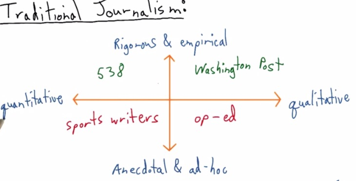
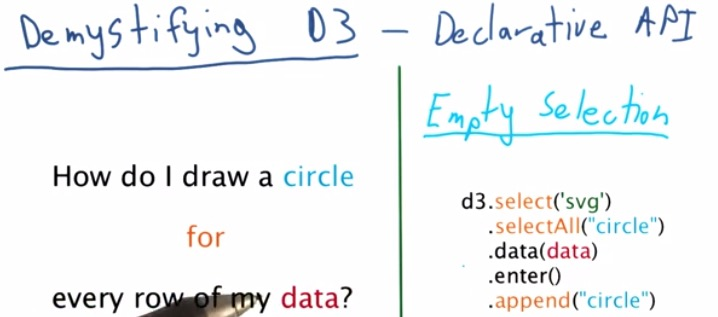
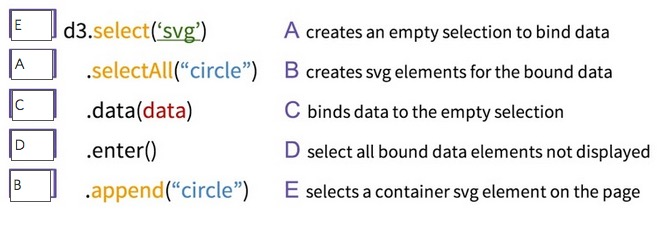
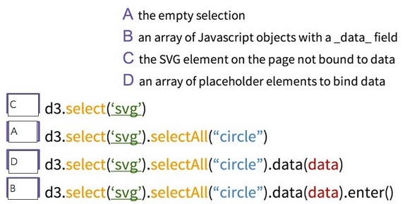

Narrative is one thing that binds all your stories. Acts as a string,
binding all your findings from the beginning to the end.

This are the quadrants shown by Nate Silver.He was known to make an
article that correctly predicting all 50 states in 2012 US presidential
election.  For all articles he split into four quadrants. He split the
article as being quantitative, which gathers all the data, or
qualitative, selection of the data. Rigorous being the research that it
put, or not anecdote, just put it without any backup for research.

For QII, this is where his website stands in. This quadrants is fit for
data science and what we will be discussed in greater depth.On the
contrary, at QI Washington Post, have some in depth research and qualitative
data.

At Quadrant III we get a sports writer. Articles mostly consist of
gathering all the information out there without throughful research.
While the op-ed, at QI is just making an article where it doesn't back
up any research. 

#  Correlation vs Causation

Correlation vs Causation is one thing that is important in journalism.
Correlation is occurs when event A occurs the same as event B occurs, in
up and down. While the Causation is event A occurs because of event B.

We must not miscalculate these two. You can make inference decision
based on descriptive data. There are difference between Descriptive
Statistics, and Inference Statistics. Suppose there are trends that
mobile device price keep getting higher. Another event occurs that
generations' height will getting higher.

This could be dangerous as analyst who thinks there is causation
published it in media, paper academic, or his blog. People read the
article and interpret wrongly. These misleading conclusions will give
serious consequences. What happen if analyst make some misleading
causation. Say an expert like mobile phone production company will set
the price higher and thus say the consumer their heights will getting
higher (Okay this two joint events sounds ridiculous, but bear with me).
It's important that we throw a great depth analysis to even makes
insights. 

# Traditional Journalism vs Data Journalism

There are different set of methods that tradional journalism used
compared with data journalism. The first one is the data. Traditionally,
charts and data that has been found only add as a secondary addition,
when they feel like their argument is too biased, hence add some data.
The data becomes much of a elements that strengthen their stories. In
newspaper, chart is surrounded by words. But in modern data journalism,
it's the chart that matters. You see that often chart will comes first
in the article, and some narrative to explain what is going on with the
chart. The chart becomes the primary, words just there to help focus the
idea. 

The second is the traditional only have one allure. We just follow from
section a to b and so forth. While in the data journalism, we can have
various different path. Says from section A you explain it continue to
section C, back to section A, maybe make some alternative links that
redirect readers to some other conclusion. Various readers comes from
diversity of background have some different path but the information
will still be the same.

The last thing that I will point out is the media that is used. In
newspaper, the chart stays static, or for some other web pages. While on
the contrary, data journalism makes some interactive, chart animation.
There's bunch of openweb technologies out there used to make a better
visualizaiton.

Scott Murray has some good insights about misconcept in Data
Visualization. Often beginners expect how to make awesome graphics.
While it's maybe true, he said that 90% of the task we've been doing is
to get data from various sources, clean it, make some analysis, and
spits the insight. The visualization is just the final segment that you
want to share your ideas.

Cole gives an example ([a sarcastic articles is
here](http://flowingdata.com/2012/08/06/fox-news-continues-charting-excellence/))
of how Fox Chart have some misleading about bar chart. The graph shows
that two bar chart and our minds will make first guess that the two bar
has difference ratio about five times or higher. But it does not the
case. The bar is there at zoomed. The y axis actually starts at 34, and
not all the way to zero. While it includes zero,the diference, at least
in terms of ratio isn't that much. If we intend to zoom that, Cole
advice would be to explain readers why we do that.

Data Visualization courses at Udacity makes three category of bias that
we see in  data visualization. It's author bias, where you as the author
makes false assumption, whether mistaken for correlation vs causation we
discussed earlier, or some visual encodings or elements, wrong chart
like pie chart. Data bias is what we usually have.It comes from faulty
measurement, human errors of input, noise, or really just an outliers. In this case you want
to detect the ourliers of your data, make some analysis wheter
missclasify as error or you want to put the outliers. And finally
readers bias, which we will be discussed later.

In earlier we know how data visualization can be divided into data
journalism or traditional journalism. This is, turns out to be the same
for author-driven vs viewer-driven. Author-driven has a flat choice of
story, where it has few of EDA, have a strong order, and only concern
about the messaging that readers get towards the end. It focus on
clarity and speed.In viewer driven however, the order, path, is
relative. The viewers can take the path, choose their own ending, they
can explore on their own, or even tell their own story. Sort of like
having an adventure book, and you are given a choice A or B if you reach
specific page. choose A will lead you to different page than if you
choose B.

**Viewer driven Examples** 

* http://sanfrancisco.crimespotting.org/#zoom=13&lon=-122.438&types=AA,Mu,Ro,SA,DP,Na,Al,Pr,Th,VT,Va,Bu,Ar&lat=37.760&hours=0-23&dtend=2015-01-02T23:59:59-07:00&dtstart=2014-12-26T23:59:59-07:00
* http://www.nytimes.com/interactive/2012/11/02/us/politics/paths-to-the-white-house.html

**Author driven Examples**

* http://visual.ly/visualizing-syrian-refugee-crisis?view=true
* http://www.nytimes.com/interactive/2012/05/17/business/dealbook/how-the-facebook-offering-compares.html?

There are also third method that incorporate between these two, called
martini glass. Which like shape side of martini glass, you have a
starting point, as you move towards the middle, it a point to a great
possibility to the ends.

**Martini Glass Examples**

* http://drones.pitchinteractive.com/
* http://guns.periscopic.com/?year=2013

# Annotations

For all the charts out there, annotations can't be simply ignored.
Suppose there's a chart without all the annotations, a scatter plot for
examples. We won't know what the chart it is and what it can measure.
The chart can't be exist without axis label. 'Year' x-axis label in
time-series chart should be clear that is just Year variables and
nothing else. Or if it a measurement type, it is a measurement, if it's
in a million, then we also include million in y-axis label. Even with
x-axis and y-axis explanation, we don't what the chart is about until we
have the title. Annotations should be effective and need no further
explanations.

D3 may not seem obvious for most beginners, but it can be thought as a
procedural programming langguage, as usual for programmers. For the
questions at left side, we can write pseudocode of for loop, then append
a circle based on the value of row of our data. 

This can be true for D3, which uses a Declrative API, meaning that we
don't have to specify every step like in the procedural, instead tell
D3 exactly what we want. The code in d3 on the right specify that we
first select d3, select All circle, this perform as Empty Selection you
will be append if you have all the data. Input data that you have, in
d3 loading function, enter will use data bind to the circle selection,
and append the circle back to svg.

Why D3 doesn't think like procedural? Because for loop and if statement
will lead to longer run time. D3 prefer to choose vectorize
implementation and just let the data corresponds as a whole to svg
elements. This data joins is described by its own creater Mike Bostock
in this [link](http://bost.ocks.org/mike/join/)

Data joins itself has its own definition from long ago in terms of
database structure.For D3 itself it's has the same concept of data joins
in database. When data() commands get called, it will mapped all the
data to data it required that corresponds to the svg elements that will later be appended.
append() will not map data that has no correspond to the svg elements.Enter() will input all data we need to make a chart for the first time. In the later, as long data and svg elements don't change, enter will has no data. Once it
get appended, everytime this block of code run, it will not append any
chart, as long the selection of svg elements, and the data itself
doesn't change. This is one of advantage of D3, which act as declarative
between your data and svg elements, which can be updated if any of those
two change.

If you hadn't read the page that I recommend you earlier about data
join of D3 from Mike Bostock, you should read it. Here I'm taking the
diagram he has in the page. You can think this as a Venn diagram, blue
circle as all the data that you have in the callback data loading
function, and the red circle as the svg elements that you have in the
page. Here we can see what binds the data. The intersection, the update
function, will return all the the data that already bound to the svg
elements. For the first time the code run, the update function will
return nothing as nothings bound. But as soon as you call the enter()
function, which select your data that aren't bound to svg elements, the
append() will bind the svg elements with your data. That is why in the
second time it's running, the update will return all data that is
already bound, if data and selection of svg elements doesn't change, the
enter return nothing, nothing in the data that aren't yet bound because
it's already bound in the first time, except if you want those two
changes for the second time.

 The exit() function is the inverse of enter(), stated all the svg elements that aren't bound to the data file. We can override exit and update but it has been run explicitly alongside enter() function. Exit() is useful when you don't want to show svg elements to readers, remomve those that are no longer need to be presented in the page, or you want to perform some animation for the chart.

For best experience what is happening, try to step through all the
process with Javascript Console. The svg will be  created the element in the
page. selectAll('circle') will create an empty selection, you can see it
return empty array in the Console. the data will be loaded in the data
file. the enter() then process, if the data hasn't at all bound to the
svg elements, it will returns array of Javascript objects that contain
all of the data elements. D3 will create placeholder for all the data,
you will see the placeholder that enter() created has the same length of
array of the data file. 

For Visualization, it's possible that we make some mistake. It's fine.
It is hard to find the causation of two variables. EDA is there to
explore what is happening with your data, find any valuable information
it, and Data Visualization will help you communicate the insights to
your audience.

 
> **RESOURCES:**

> * https://www.udacity.com/course/viewer#!/c-ud507/l-3069149263/m-3071138952
> * http://fivethirtyeight.com/features/what-the-fox-knows/
> * http://bost.ocks.org/mike/join/
