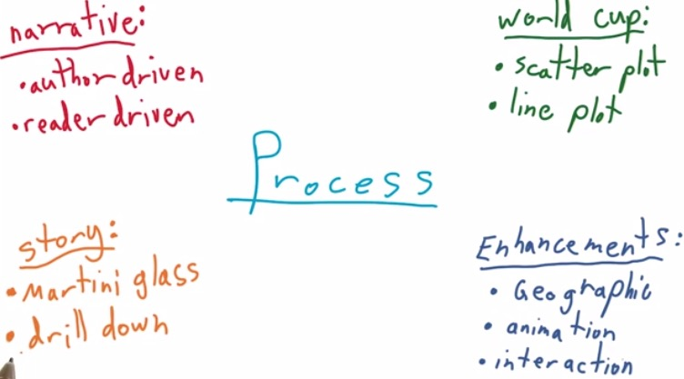

In this section we want to know how we interract and animate in various
narrative structure.

Scott Murray stated that one of the chart that tell most compelling
story is [New York Times' 2009 Jobless
Rate](http://www.nytimes.com/interactive/2009/11/06/business/economy/unemployment-lines.html?_r=0).
Here we can see the initial that jobless get higher. But there's much
category parameter that we can tuned. Races,Gender,Ages, and a Degree.
Here the readers can search the parameters and iterate over category.
The readers can find its own category and matches that to see their own
category. They also can compare that with everything else. If this was
published in paper and static, the chart is still normal. But when it's
graphic the readers can interact with the chart itself.

Matt from plot.ly share some insight about interactive chart. It's
important as ones can explore the data, zoom in and zoom out to see what
are the chart is about.The readers can have different experience, and
different insights for each of their own.

In this blog,for the chart, we can't simply use scatter plot and line
plot, for author-driven and reader-driven, as it doesn't show any
interaction and animation of the chart. we want to make some enhancement
that include geo-map, animation,interaction, and tell it in the
structure of martini glass.

# Map Visualization

To create a map visualization, first we need to acquire data that
related to the map itself. Typically, the data to structure a map comes
with three various format, shapefile,GeoJSON, and TopoJSON. For
Shapefile, the data comes with binary format, hence not readable, but it
comes with smaller size format. Need a special tool to read shapefile.
The shapefile also limited by its file size, so only limited number of
coordinat and boundary that can be input in shapefile.

On the other hand, GeoJSON, is in JSON format. JSON format has an
interface with almost any programming langguage. GeoJSON is a valid JSON
format, which means that they can parse it. It also human readable, we
can view and edit it in any text editor, or in the browser. But because
of its advantage, the code becomes more verbose and has larger file size
than shapefile, which in turn make a slower connection between client
and server. The TopoJSON however,have some topography information,  have extended the GeoJSON, encoded in
much smaller file size than GeoJSON or even TopoJSON.

# Projection

Projection however is to project our data into pixel range. If earlier
date or float format can be projected into pixel value, the latitude and
longitude can be projected into pixel value. D3 use mercator that
project the lat long  of 3d world into 2d plane world projection. This
projection into 2D, which represent by lat long of 3D world position,
isn't without any loss either. The mercator strecthes area along
equator, which sacrifice the poles area to give a better projection for
the rest of the world.

[Ogre](http://ogre.adc4gis.com/): convert spatial files to GeoJSON
[Shapefile-GeoJson-Github](http://ben.balter.com/2013/06/26/how-to-convert-shapefiles-to-geojson-for-use-on-github/)
by Ben Balter

The radius for circle in the chart is not to be underestimated also. The
[image](http://images.huffingtonpost.com/2014-08-29-Donating.vs.DeathGraph.REVISED.jpg)
here is the original and corrected version of The Truth about the Ice
Bucket Challenge by Vox media. You can see that you can make a mistake
to give value to the radius. When you give value directly to determine
the radius, the area of circle will be much larger, about two times
squared the radius.

In the animation, what we need is a function that we can animate in the
update function, a function on which we are keep changing the map. And
the second, a way to cycle through the years. This animation, could be
benefit for example the martini glass data visualization. If on the
first you have a base static map of geo location, you can make animation
that is author driven through the map of a glass, the reader-driven,
which the readers can interact your chart.

With animation D3, we use filter() method that filter only the data that
we care about, use d3 exit() to remove any elements that no longer
needed to appear on the screen. And lastly, enter() to get any data that
you want to appear in screen.

Matt said the data scientist's job to show in a graph an information
that readers need to see. Even title, axis-label, annotation could be
really help.Future Data Visualization could be world scale collaboration
consist of engineers, political science, and data scientist. It doesn't
necessarily true that others that doesn't comes from web background has
to learn web development to master web sharing data visualization.
plot.ly want to abstract those layers, and let anyone comes from various
language collaborate in big data.

> **RESOURCES:**

> * https://www.udacity.com/course/viewer#!/c-ud507/l-3066258748/m-3199288543
> * http://www.jeromecukier.net/blog/2012/07/16/animations-and-transitions/
> * http://blog.andreaskoller.com/2014/02/d3-and-ui-animations/
> * http://synthesis.sbecker.net/articles/2012/07/10/learning-d3-part-3-animation-interaction
> * http://javascriptissexy.com/understand-javascripts-this-with-clarity-and-master-it/
> * http://www.stator-afm.com/tutorial/d3-js-mouse-events/
> * http://christopheviau.com/d3_tutorial/
> * http://www.d3noob.org/2013/01/adding-tooltips-to-d3js-graph.html
> * http://bost.ocks.org/mike/bubble-map/
