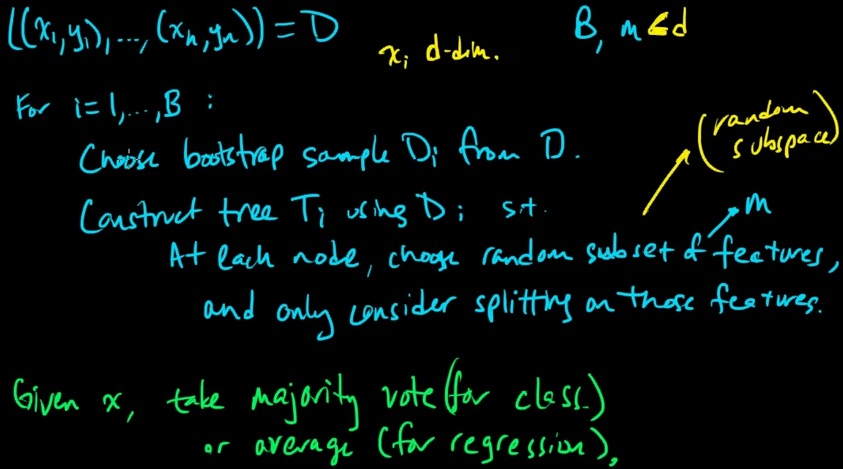
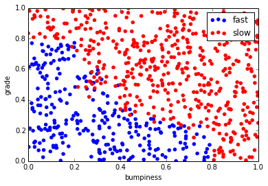
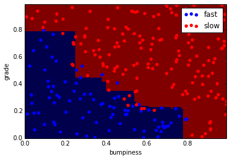

### Random Forest Classfier

Random Forest Classfier is one of the ensemble method machine learning
algorithm. It's a variance of decision tree. It uses different subset and
different selection of features and using weighted regression(by voting).
<!-- TEASER_END -->

This is the snapshot which I taken from mathematicalmonk's youtube video. You
can find the url link of the video at the bottom of this page.

So suppose we have training examples, and we call that set of training examples
contains X(set of features) and Y(the value which we are trying to predict) and
we assign that to variable of D.

Here we choose B, as the number of estimators that we defined. What I mean is we
set B-count of how many we want to keep random  sampling from our fullset of D
over and over again. Then we're taking bootstrapt sample, taking random sample
from D, and assign it to variable Di.

Using Di to construct node tree of Ti, here the tree is what I refer as decision
tree. At each node, we pick, again, random features. Then we perform features
split, just on the features picked earlier, as we do in decision tree.

Now the benefit of Random Forest, is that because we randomly select samples
(this is why Random Forest is called bagging), and randomly select features, we
have bunch of trees, depending of B, and each of those is a predictive model of
learning algorithm. This is what we called **ensemble learning algorithm**. Next
of all given x in the future, y will be decided by taking vote from all the tree
that we have. Because Random Forest is ensemble learning, it have some nice
overfitting controlling, because we're taking vote from our group of learning
algorithms, not just one learning algorithm, which prone to overfitting.

    %pylab inline

    Populating the interactive namespace from numpy and matplotlib

    %load your_algorithm.py

    #!/usr/bin/python
    
    import matplotlib.pyplot as plt
    from prep_terrain_data import makeTerrainData
    from class_vis import prettyPicture
    
    features_train, labels_train, features_test, labels_test = makeTerrainData()
    
    
    ### the training data (features_train, labels_train) have both "fast" and "slow" points mixed
    ### in together--separate them so we can give them different colors in the scatterplot,
    ### and visually identify them
    grade_fast = [features_train[ii][0] for ii in range(0, len(features_train)) if labels_train[ii]==0]
    bumpy_fast = [features_train[ii][1] for ii in range(0, len(features_train)) if labels_train[ii]==0]
    grade_slow = [features_train[ii][0] for ii in range(0, len(features_train)) if labels_train[ii]==1]
    bumpy_slow = [features_train[ii][1] for ii in range(0, len(features_train)) if labels_train[ii]==1]
    
    
    #### initial visualization
    plt.xlim(0.0, 1.0)
    plt.ylim(0.0, 1.0)
    plt.scatter(bumpy_fast, grade_fast, color = "b", label="fast")
    plt.scatter(grade_slow, bumpy_slow, color = "r", label="slow")
    plt.legend()
    plt.xlabel("bumpiness")
    plt.ylabel("grade")
    plt.show()
    #################################################################################
    
    
    ### your code here!  name your classifier object clf if you want the 
    ### visualization code (prettyPicture) to show you the decision boundary
    
    try:
        prettyPicture(clf, features_test, labels_test)
    except NameError:
        pass

    from sklearn.ensemble import RandomForestClassifier

    clf = RandomForestClassifier(min_samples_split=50)

    clf.fit(features_train,labels_train)

    RandomForestClassifier(bootstrap=True, compute_importances=None,
                criterion='gini', max_depth=None, max_features='auto',
                max_leaf_nodes=None, min_density=None, min_samples_leaf=1,
                min_samples_split=50, n_estimators=10, n_jobs=1,
                oob_score=False, random_state=None, verbose=0)

    clf.score(features_test,labels_test)

    0.92400000000000004

    prettyPicture(clf,features_test,labels_test)

>**Reference**:

> * https://www.udacity.com/course/viewer#!/c-ud120/l-2286088539/m-3032438616
> * https://www.youtube.com/watch?v=o7iDkcpOr_g

    
