Enron is one of the tenth largest companies back in 2002 at U.S. This multi-
billion dollar company suddenly collapsed and thousands of people losing their
jobs, and some of them going to jail. This company have identified as corporate
fraud, and go to bankruptcy as one of the most complex bankruptcy cases in U.S.
history. The fraud was so massive and some may wonder why it lasted until 2001.
Even Enron bankruptcy some said closely tied with 9/11 incident.
<!-- TEASER_END -->

After the incidents, the emails of the company is open to public. This is huge
and real datasets. It contains communication between people, and this corpes.

We will use Enron datasets to apply our machine learning problem. We will follow
Katie experience in explore the datasets and learn by her mistake. We will use
our various technique, different algorithm, to solve datasets problem. We will
use clustering (unsupervised learning algorithm) to uncover who's the board
director or just staff. We use regression to see the relationships between
salary/bonuses.We use recommender systems, based on the conversation of the
movie they have, and also identify some of the bugs/outliers

This datasets, while decades earlier, still applicable for modern learning. This
is a real one, not synthesized, and can be made as a project. We will explore
this dataset, comes with interesting question, and becoming expert through this
dataset.

### Person of Interest (POI)

* Indicted
* Settled without admitting guilt
* Testified in exchange for immunity

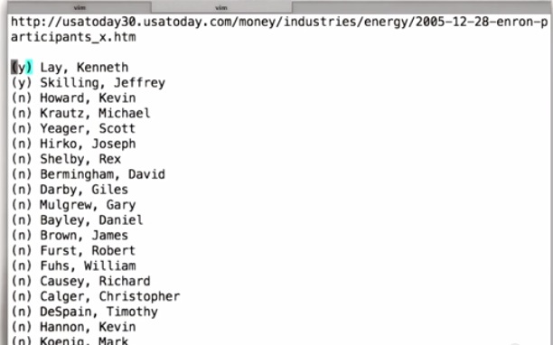

POI is person of interest by the government. In web they listed 35 people in
Enron fraud. Here Katie listed by hand. It's possible to have more or less than
he mentioned.

### Accuracy vs. Training Set Size

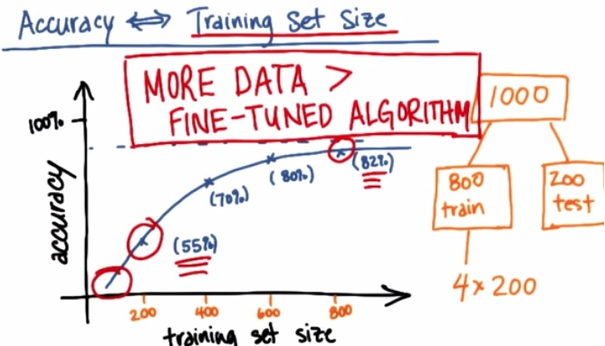

Here is the plot that for example we have 1000 training datasets. By usual
machine learning expert, they split the dataset by 80:20(train,test). For some
they split 60:20:20(train,cv,test). Here we also plot the the graph using this
incremental 200 examples. With the plot, we see that, monothonic increase, we
have curve that get's better and better, with the slope slowly increase at the
end.

If we can plot it like this, we know that if just have 400 examples, we have to
get more data. With 800 examples, we may also predict based on the curve,
increase 1000 examples will gain small performance increase.

In general, more data could be better than fine tuned algorithm. But it's
impartially true. it's true that more data could fixed high variance. But if you
algorithm has high bias, then increase your dataset wouldn't fix your
performance. For more information please check my other [blog](http
://napitupulu-jon.appspot.com/posts/Data-for-Machine-Learning.html).

### Enron Dataset

When I have downloaded, I can see that of all 150 in Enron data, only 5 people
(marked by Y in the list Katie mentioned) that are in the dataset. This
generally not a good problem, since 5 example wouldn't be enought. Let's
approach this from different angle.

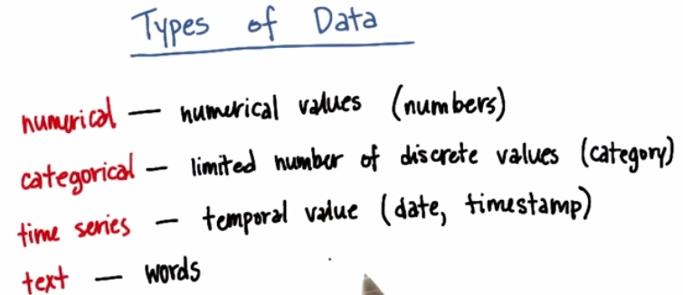

These are type of data that we typically found in the dataset.

For Example:

* Numerical: Salary, number of emails,
* Categorical: Job Title
* Time Series: Timestamps on emails,
* Text: Contents of emails,to/from fields email

### Enron Mini-Project

The Enron fraud is a big, messy and totally fascinating story about corporate
malfeasance of nearly every imaginable type. The Enron email and financial
datasets are also big, messy treasure troves of information, which become much
more useful once you know your way around them a bit. We’ve combined the email
and finance data into a single dataset, which you’ll explore in this mini-
project.

    %load explore_enron_data.py

    #!/usr/bin/python
    
    """ 
        starter code for exploring the Enron dataset (emails + finances) 
        loads up the dataset (pickled dict of dicts)
    
        the dataset has the form
        enron_data["LASTNAME FIRSTNAME MIDDLEINITIAL"] = { features_dict }
    
        {features_dict} is a dictionary of features associated with that person
        you should explore features_dict as part of the mini-project,
        but here's an example to get you started:
    
        enron_data["SKILLING JEFFREY K"]["bonus"] = 5600000
        
    """
    
    import pickle
    
    enron_data = pickle.load(open("../final_project/final_project_dataset.pkl", "r"))
    
    

    enron_data['SKILLING JEFFREY K']['bonus']

    5600000

### 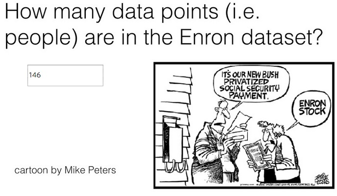

    len(enron_data)

    146

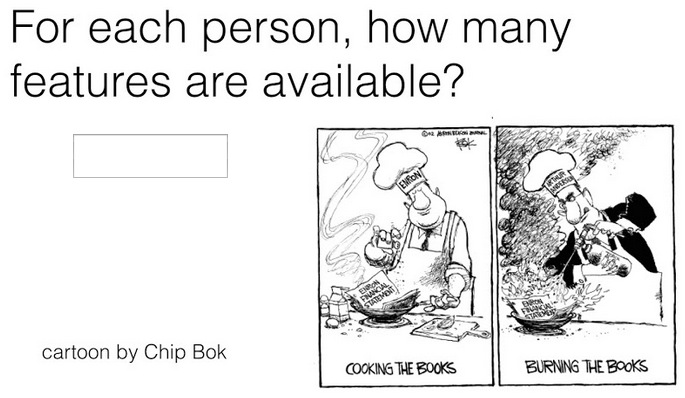

    len(enron_data['SKILLING JEFFREY K'])

    21

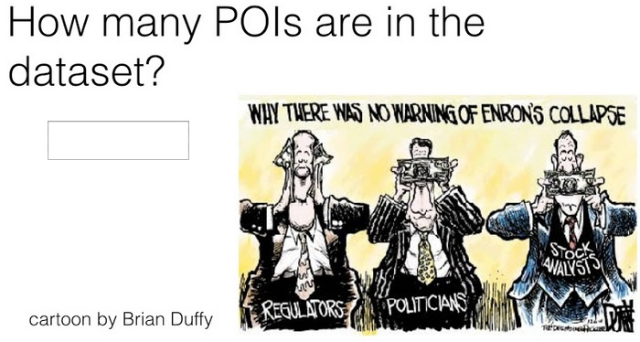

    count = 0
    for user in enron_data:
        if enron_data[user]['poi'] == True:
            count+=1
    print count

    18

    %load ../final_project/poi_email_addresses.py

    %load ../final_project/poi_names.txt

    http://usatoday30.usatoday.com/money/industries/energy/2005-12-28-enron-participants_x.htm
    
    (y) Lay, Kenneth
    (y) Skilling, Jeffrey
    (n) Howard, Kevin
    (n) Krautz, Michael
    (n) Yeager, Scott
    (n) Hirko, Joseph
    (n) Shelby, Rex
    (n) Bermingham, David
    (n) Darby, Giles
    (n) Mulgrew, Gary
    (n) Bayley, Daniel
    (n) Brown, James
    (n) Furst, Robert
    (n) Fuhs, William
    (n) Causey, Richard
    (n) Calger, Christopher
    (n) DeSpain, Timothy
    (n) Hannon, Kevin
    (n) Koenig, Mark
    (y) Forney, John
    (n) Rice, Kenneth
    (n) Rieker, Paula
    (n) Fastow, Lea
    (n) Fastow, Andrew
    (y) Delainey, David
    (n) Glisan, Ben
    (n) Richter, Jeffrey
    (n) Lawyer, Larry
    (n) Belden, Timothy
    (n) Kopper, Michael
    (n) Duncan, David
    (n) Bowen, Raymond
    (n) Colwell, Wesley
    (n) Boyle, Dan
    (n) Loehr, Christopher

    def poiEmails():
        email_list = ["kenneth_lay@enron.net",    
                "kenneth_lay@enron.com",
                "klay.enron@enron.com",
                "kenneth.lay@enron.com", 
                "klay@enron.com",
                "layk@enron.com",
                "chairman.ken@enron.com",
                "jeffreyskilling@yahoo.com",
                "jeff_skilling@enron.com",
                "jskilling@enron.com",
                "effrey.skilling@enron.com",
                "skilling@enron.com",
                "jeffrey.k.skilling@enron.com",
                "jeff.skilling@enron.com",
                "kevin_a_howard.enronxgate.enron@enron.net",
                "kevin.howard@enron.com",
                "kevin.howard@enron.net",
                "kevin.howard@gcm.com",
                "michael.krautz@enron.com"
                "scott.yeager@enron.com",
                "syeager@fyi-net.com",
                "scott_yeager@enron.net",
                "syeager@flash.net",
                "joe'.'hirko@enron.com", 
                "joe.hirko@enron.com", 
                "rex.shelby@enron.com", 
                "rex.shelby@enron.nt", 
                "rex_shelby@enron.net",
                "jbrown@enron.com",
                "james.brown@enron.com", 
                "rick.causey@enron.com", 
                "richard.causey@enron.com", 
                "rcausey@enron.com",
                "calger@enron.com",
                "chris.calger@enron.com", 
                "christopher.calger@enron.com", 
                "ccalger@enron.com",
                "tim_despain.enronxgate.enron@enron.net", 
                "tim.despain@enron.com",
                "kevin_hannon@enron.com", 
                "kevin'.'hannon@enron.com", 
                "kevin_hannon@enron.net", 
                "kevin.hannon@enron.com",
                "mkoenig@enron.com", 
                "mark.koenig@enron.com",
                "m..forney@enron.com",
                "ken'.'rice@enron.com", 
                "ken.rice@enron.com",
                "ken_rice@enron.com", 
                "ken_rice@enron.net",
                "paula.rieker@enron.com",
                "prieker@enron.com", 
                "andrew.fastow@enron.com", 
                "lfastow@pdq.net", 
                "andrew.s.fastow@enron.com", 
                "lfastow@pop.pdq.net", 
                "andy.fastow@enron.com",
                "david.w.delainey@enron.com", 
                "delainey.dave@enron.com", 
                "'delainey@enron.com", 
                "david.delainey@enron.com", 
                "'david.delainey'@enron.com", 
                "dave.delainey@enron.com", 
                "delainey'.'david@enron.com",
                "ben.glisan@enron.com", 
                "bglisan@enron.com", 
                "ben_f_glisan@enron.com", 
                "ben'.'glisan@enron.com",
                "jeff.richter@enron.com", 
                "jrichter@nwlink.com",
                "lawrencelawyer@aol.com", 
                "lawyer'.'larry@enron.com", 
                "larry_lawyer@enron.com", 
                "llawyer@enron.com", 
                "larry.lawyer@enron.com", 
                "lawrence.lawyer@enron.com",
                "tbelden@enron.com", 
                "tim.belden@enron.com", 
                "tim_belden@pgn.com", 
                "tbelden@ect.enron.com",
                "michael.kopper@enron.com",
                "dave.duncan@enron.com", 
                "dave.duncan@cipco.org", 
                "duncan.dave@enron.com",
                "ray.bowen@enron.com", 
                "raymond.bowen@enron.com", 
                "'bowen@enron.com",
                "wes.colwell@enron.com",
                "dan.boyle@enron.com",
                "cloehr@enron.com", 
                "chris.loehr@enron.com"
            ]
        return email_list

How many POI’s were there total? (Use the names file, not the email addresses,
since many folks have more than one address and a few didn’t work for Enron, so
we don’t have their emails.)

    len(poiEmails())

    90

    fo = open('../final_project/poi_names.txt','r')

    fr = fo.readlines()

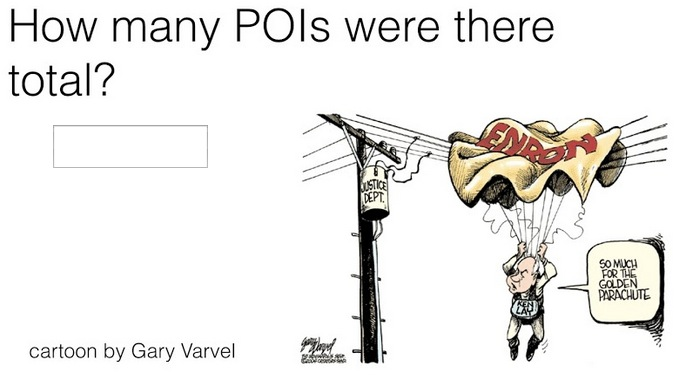

    len(fr[2:])

    35

    fo.close()

As you can see, we have many of the POIs in our E+F dataset, but not all of
them. Why is that a potential problem?

We will return to this later to explain how a POI could end up not being in the
Enron E+F dataset, so you fully understand the issue before moving on.

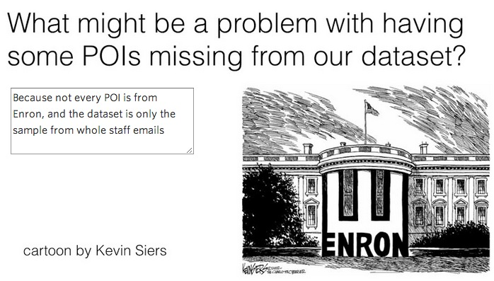

There are a few things you could say here, but our main thought is about having
enough data to really learn the patterns. In general, more data is always better
--only having 18 data points doesn't give you that many examples to learn from.

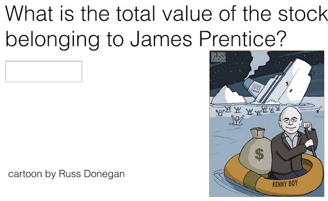

    enron_data.keys()

    ['METTS MARK',
     'BAXTER JOHN C',
     'ELLIOTT STEVEN',
     'CORDES WILLIAM R',
     'HANNON KEVIN P',
     'MORDAUNT KRISTINA M',
     'MEYER ROCKFORD G',
     'MCMAHON JEFFREY',
     'HORTON STANLEY C',
     'PIPER GREGORY F',
     'HUMPHREY GENE E',
     'UMANOFF ADAM S',
     'BLACHMAN JEREMY M',
     'SUNDE MARTIN',
     'GIBBS DANA R',
     'LOWRY CHARLES P',
     'COLWELL WESLEY',
     'MULLER MARK S',
     'JACKSON CHARLENE R',
     'WESTFAHL RICHARD K',
     'WALTERS GARETH W',
     'WALLS JR ROBERT H',
     'KITCHEN LOUISE',
     'CHAN RONNIE',
     'BELFER ROBERT',
     'SHANKMAN JEFFREY A',
     'WODRASKA JOHN',
     'BERGSIEKER RICHARD P',
     'URQUHART JOHN A',
     'BIBI PHILIPPE A',
     'RIEKER PAULA H',
     'WHALEY DAVID A',
     'BECK SALLY W',
     'HAUG DAVID L',
     'ECHOLS JOHN B',
     'MENDELSOHN JOHN',
     'HICKERSON GARY J',
     'CLINE KENNETH W',
     'LEWIS RICHARD',
     'HAYES ROBERT E',
     'MCCARTY DANNY J',
     'KOPPER MICHAEL J',
     'LEFF DANIEL P',
     'LAVORATO JOHN J',
     'BERBERIAN DAVID',
     'DETMERING TIMOTHY J',
     'WAKEHAM JOHN',
     'POWERS WILLIAM',
     'GOLD JOSEPH',
     'BANNANTINE JAMES M',
     'DUNCAN JOHN H',
     'SHAPIRO RICHARD S',
     'SHERRIFF JOHN R',
     'SHELBY REX',
     'LEMAISTRE CHARLES',
     'DEFFNER JOSEPH M',
     'KISHKILL JOSEPH G',
     'WHALLEY LAWRENCE G',
     'MCCONNELL MICHAEL S',
     'PIRO JIM',
     'DELAINEY DAVID W',
     'SULLIVAN-SHAKLOVITZ COLLEEN',
     'WROBEL BRUCE',
     'LINDHOLM TOD A',
     'MEYER JEROME J',
     'LAY KENNETH L',
     'BUTTS ROBERT H',
     'OLSON CINDY K',
     'MCDONALD REBECCA',
     'CUMBERLAND MICHAEL S',
     'GAHN ROBERT S',
     'MCCLELLAN GEORGE',
     'HERMANN ROBERT J',
     'SCRIMSHAW MATTHEW',
     'GATHMANN WILLIAM D',
     'HAEDICKE MARK E',
     'BOWEN JR RAYMOND M',
     'GILLIS JOHN',
     'FITZGERALD JAY L',
     'MORAN MICHAEL P',
     'REDMOND BRIAN L',
     'BAZELIDES PHILIP J',
     'BELDEN TIMOTHY N',
     'DURAN WILLIAM D',
     'THORN TERENCE H',
     'FASTOW ANDREW S',
     'FOY JOE',
     'CALGER CHRISTOPHER F',
     'RICE KENNETH D',
     'KAMINSKI WINCENTY J',
     'LOCKHART EUGENE E',
     'COX DAVID',
     'OVERDYKE JR JERE C',
     'PEREIRA PAULO V. FERRAZ',
     'STABLER FRANK',
     'SKILLING JEFFREY K',
     'BLAKE JR. NORMAN P',
     'SHERRICK JEFFREY B',
     'PRENTICE JAMES',
     'GRAY RODNEY',
     'PICKERING MARK R',
     'THE TRAVEL AGENCY IN THE PARK',
     'NOLES JAMES L',
     'KEAN STEVEN J',
     'TOTAL',
     'FOWLER PEGGY',
     'WASAFF GEORGE',
     'WHITE JR THOMAS E',
     'CHRISTODOULOU DIOMEDES',
     'ALLEN PHILLIP K',
     'SHARP VICTORIA T',
     'JAEDICKE ROBERT',
     'WINOKUR JR. HERBERT S',
     'BROWN MICHAEL',
     'BADUM JAMES P',
     'HUGHES JAMES A',
     'REYNOLDS LAWRENCE',
     'DIMICHELE RICHARD G',
     'BHATNAGAR SANJAY',
     'CARTER REBECCA C',
     'BUCHANAN HAROLD G',
     'YEAP SOON',
     'MURRAY JULIA H',
     'GARLAND C KEVIN',
     'DODSON KEITH',
     'YEAGER F SCOTT',
     'HIRKO JOSEPH',
     'DIETRICH JANET R',
     'DERRICK JR. JAMES V',
     'FREVERT MARK A',
     'PAI LOU L',
     'BAY FRANKLIN R',
     'HAYSLETT RODERICK J',
     'FUGH JOHN L',
     'FALLON JAMES B',
     'KOENIG MARK E',
     'SAVAGE FRANK',
     'IZZO LAWRENCE L',
     'TILNEY ELIZABETH A',
     'MARTIN AMANDA K',
     'BUY RICHARD B',
     'GRAMM WENDY L',
     'CAUSEY RICHARD A',
     'TAYLOR MITCHELL S',
     'DONAHUE JR JEFFREY M',
     'GLISAN JR BEN F']

    enron_data['SKILLING JEFFREY K'].keys()

    ['salary',
     'to_messages',
     'deferral_payments',
     'total_payments',
     'exercised_stock_options',
     'bonus',
     'restricted_stock',
     'shared_receipt_with_poi',
     'restricted_stock_deferred',
     'total_stock_value',
     'expenses',
     'loan_advances',
     'from_messages',
     'other',
     'from_this_person_to_poi',
     'poi',
     'director_fees',
     'deferred_income',
     'long_term_incentive',
     'email_address',
     'from_poi_to_this_person']

    enron_data['PRENTICE JAMES']['total_stock_value']

    1095040

    enron_data['COLWELL WESLEY']['from_this_person_to_poi']

    11

    enron_data['SKILLING JEFFREY K']['exercised_stock_options']

    19250000

### Research the Enron Fraud

In the coming lessons, we’ll talk about how the best features are often
motivated by our human understanding of the problem at hand. In this case, that
means knowing a little about the story of the Enron fraud.

If you have an hour and a half to spare, “Enron: The Smartest Guys in the Room”
is a documentary that gives an amazing overview of the story. Alternatively,
there are plenty of archival newspaper stories that chronicle the rise and fall
of Enron.

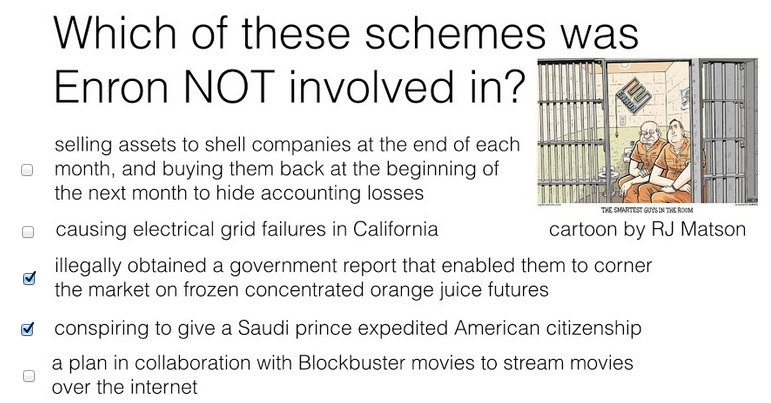

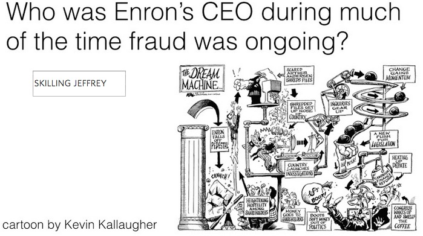

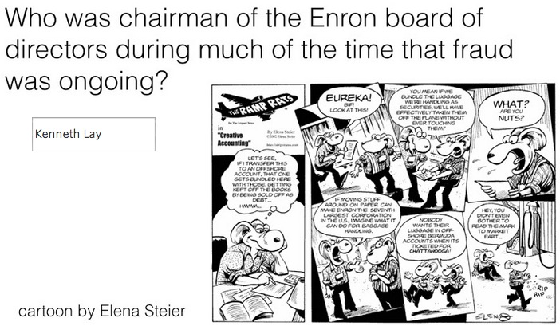

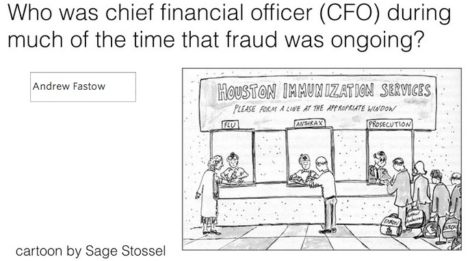

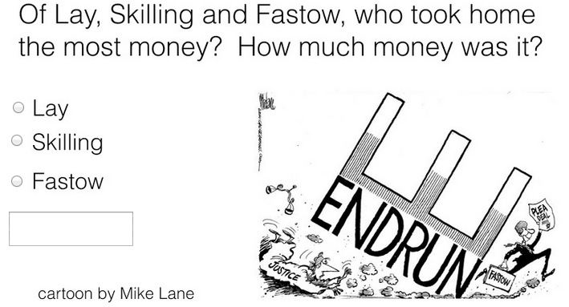

    sorted(enron_data.keys())

    ['ALLEN PHILLIP K',
     'BADUM JAMES P',
     'BANNANTINE JAMES M',
     'BAXTER JOHN C',
     'BAY FRANKLIN R',
     'BAZELIDES PHILIP J',
     'BECK SALLY W',
     'BELDEN TIMOTHY N',
     'BELFER ROBERT',
     'BERBERIAN DAVID',
     'BERGSIEKER RICHARD P',
     'BHATNAGAR SANJAY',
     'BIBI PHILIPPE A',
     'BLACHMAN JEREMY M',
     'BLAKE JR. NORMAN P',
     'BOWEN JR RAYMOND M',
     'BROWN MICHAEL',
     'BUCHANAN HAROLD G',
     'BUTTS ROBERT H',
     'BUY RICHARD B',
     'CALGER CHRISTOPHER F',
     'CARTER REBECCA C',
     'CAUSEY RICHARD A',
     'CHAN RONNIE',
     'CHRISTODOULOU DIOMEDES',
     'CLINE KENNETH W',
     'COLWELL WESLEY',
     'CORDES WILLIAM R',
     'COX DAVID',
     'CUMBERLAND MICHAEL S',
     'DEFFNER JOSEPH M',
     'DELAINEY DAVID W',
     'DERRICK JR. JAMES V',
     'DETMERING TIMOTHY J',
     'DIETRICH JANET R',
     'DIMICHELE RICHARD G',
     'DODSON KEITH',
     'DONAHUE JR JEFFREY M',
     'DUNCAN JOHN H',
     'DURAN WILLIAM D',
     'ECHOLS JOHN B',
     'ELLIOTT STEVEN',
     'FALLON JAMES B',
     'FASTOW ANDREW S',
     'FITZGERALD JAY L',
     'FOWLER PEGGY',
     'FOY JOE',
     'FREVERT MARK A',
     'FUGH JOHN L',
     'GAHN ROBERT S',
     'GARLAND C KEVIN',
     'GATHMANN WILLIAM D',
     'GIBBS DANA R',
     'GILLIS JOHN',
     'GLISAN JR BEN F',
     'GOLD JOSEPH',
     'GRAMM WENDY L',
     'GRAY RODNEY',
     'HAEDICKE MARK E',
     'HANNON KEVIN P',
     'HAUG DAVID L',
     'HAYES ROBERT E',
     'HAYSLETT RODERICK J',
     'HERMANN ROBERT J',
     'HICKERSON GARY J',
     'HIRKO JOSEPH',
     'HORTON STANLEY C',
     'HUGHES JAMES A',
     'HUMPHREY GENE E',
     'IZZO LAWRENCE L',
     'JACKSON CHARLENE R',
     'JAEDICKE ROBERT',
     'KAMINSKI WINCENTY J',
     'KEAN STEVEN J',
     'KISHKILL JOSEPH G',
     'KITCHEN LOUISE',
     'KOENIG MARK E',
     'KOPPER MICHAEL J',
     'LAVORATO JOHN J',
     'LAY KENNETH L',
     'LEFF DANIEL P',
     'LEMAISTRE CHARLES',
     'LEWIS RICHARD',
     'LINDHOLM TOD A',
     'LOCKHART EUGENE E',
     'LOWRY CHARLES P',
     'MARTIN AMANDA K',
     'MCCARTY DANNY J',
     'MCCLELLAN GEORGE',
     'MCCONNELL MICHAEL S',
     'MCDONALD REBECCA',
     'MCMAHON JEFFREY',
     'MENDELSOHN JOHN',
     'METTS MARK',
     'MEYER JEROME J',
     'MEYER ROCKFORD G',
     'MORAN MICHAEL P',
     'MORDAUNT KRISTINA M',
     'MULLER MARK S',
     'MURRAY JULIA H',
     'NOLES JAMES L',
     'OLSON CINDY K',
     'OVERDYKE JR JERE C',
     'PAI LOU L',
     'PEREIRA PAULO V. FERRAZ',
     'PICKERING MARK R',
     'PIPER GREGORY F',
     'PIRO JIM',
     'POWERS WILLIAM',
     'PRENTICE JAMES',
     'REDMOND BRIAN L',
     'REYNOLDS LAWRENCE',
     'RICE KENNETH D',
     'RIEKER PAULA H',
     'SAVAGE FRANK',
     'SCRIMSHAW MATTHEW',
     'SHANKMAN JEFFREY A',
     'SHAPIRO RICHARD S',
     'SHARP VICTORIA T',
     'SHELBY REX',
     'SHERRICK JEFFREY B',
     'SHERRIFF JOHN R',
     'SKILLING JEFFREY K',
     'STABLER FRANK',
     'SULLIVAN-SHAKLOVITZ COLLEEN',
     'SUNDE MARTIN',
     'TAYLOR MITCHELL S',
     'THE TRAVEL AGENCY IN THE PARK',
     'THORN TERENCE H',
     'TILNEY ELIZABETH A',
     'TOTAL',
     'UMANOFF ADAM S',
     'URQUHART JOHN A',
     'WAKEHAM JOHN',
     'WALLS JR ROBERT H',
     'WALTERS GARETH W',
     'WASAFF GEORGE',
     'WESTFAHL RICHARD K',
     'WHALEY DAVID A',
     'WHALLEY LAWRENCE G',
     'WHITE JR THOMAS E',
     'WINOKUR JR. HERBERT S',
     'WODRASKA JOHN',
     'WROBEL BRUCE',
     'YEAGER F SCOTT',
     'YEAP SOON']

    enron_data['SKILLING JEFFREY K']['total_payments']

    8682716

    enron_data['LAY KENNETH L']['total_payments']

    103559793

    enron_data['FASTOW ANDREW S']['total_payments']

    2424083

    enron_data['FASTOW ANDREW S']['deferral_payments']

    'NaN'

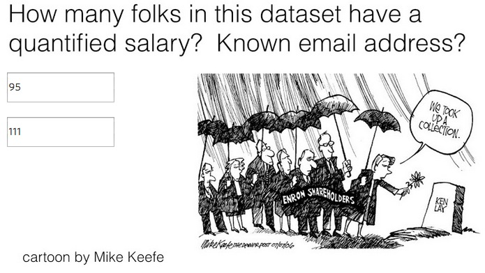

    count_salary = 0
    count_email = 0
    for key in enron_data.keys():
        if enron_data[key]['salary'] != 'NaN':
            count_salary+=1
        if enron_data[key]['email_address'] != 'NaN':
            count_email+=1
    print count_salary
    print count_email

    95
    111

### Dict to Array Conversion

A python dictionary can’t be read directly into an sklearn classification or
regression algorithm; instead, it needs a numpy array or a list of lists (each
element of the list (itself a list) is a data point, and the elements of the
smaller list are the features of that point).

We’ve written some helper functions (featureFormat() and targetFeatureSplit() in
tools/feature_format.py) that can take a list of feature names and the data
dictionary, and return a numpy array.

In the case when a feature does not have a value for a particular person, this
function will also replace the feature value with 0 (zero).

    %load ../tools/feature_format.py

    #!/usr/bin/python
    
    """ 
        A general tool for converting data from the
        dictionary format to an (n x k) python list that's 
        ready for training an sklearn algorithm
    
        n--no. of key-value pairs in dictonary
        k--no. of features being extracted
    
        dictionary keys are names of persons in dataset
        dictionary values are dictionaries, where each
            key-value pair in the dict is the name
            of a feature, and its value for that person
    
        In addition to converting a dictionary to a numpy 
        array, you may want to separate the labels from the
        features--this is what targetFeatureSplit is for
    
        so, if you want to have the poi label as the target,
        and the features you want to use are the person's
        salary and bonus, here's what you would do:
    
        feature_list = ["poi", "salary", "bonus"] 
        data_array = featureFormat( data_dictionary, feature_list )
        label, features = targetFeatureSplit(data_array)
    
        the line above (targetFeatureSplit) assumes that the
        label is the _first_ item in feature_list--very important
        that poi is listed first!
    """
    
    
    import numpy as np
    
    def featureFormat( dictionary, features, remove_NaN=True, remove_all_zeroes=True, remove_any_zeroes=False ):
        """ convert dictionary to numpy array of features
            remove_NaN=True will convert "NaN" string to 0.0
            remove_all_zeroes=True will omit any data points for which
                all the features you seek are 0.0
            remove_any_zeroes=True will omit any data points for which
                any of the features you seek are 0.0
        """
    
    
        return_list = []
    
        for key in dictionary.keys():
            tmp_list = []
            append = False
            for feature in features:
                try:
                    dictionary[key][feature]
                except KeyError:
                    print "error: key ", feature, " not present"
                    return
                value = dictionary[key][feature]
                if value=="NaN" and remove_NaN:
                    value = 0
                tmp_list.append( float(value) )
    
            ### if all features are zero and you want to remove
            ### data points that are all zero, do that here
            if remove_all_zeroes:
                all_zeroes = True
                for item in tmp_list:
                    if item != 0 and item != "NaN":
                        append = True
    
            ### if any features for a given data point are zero
            ### and you want to remove data points with any zeroes,
            ### handle that here
            if remove_any_zeroes:
                any_zeroes = False
                if 0 in tmp_list or "NaN" in tmp_list:
                    append = False
            if append:
                return_list.append( np.array(tmp_list) )
    
    
        return np.array(return_list)
    
    
    def targetFeatureSplit( data ):
        """ 
            given a numpy array like the one returned from
            featureFormat, separate out the first feature
            and put it into its own list (this should be the 
            quantity you want to predict)
    
            return targets and features as separate lists
    
            (sklearn can generally handle both lists and numpy arrays as 
            input formats when training/predicting)
        """
    
        target = []
        features = []
        for item in data:
            target.append( item[0] )
            features.append( item[1:] )
    
        return target, features
    
    
    
    

### Mission POI

As you saw a little while ago, not every POI has an entry in the dataset (e.g.
Michael Krautz). That’s because the dataset was created using the financial data
you can find in final_project/enron61702insiderpay.pdf, which is missing some
POI’s (those absences propagated through to the final dataset). On the other
hand, for many of these “missing” POI’s, we do have emails.

While it would be straightforward to add these POI’s and their email information
to the E+F dataset, and just put “NaN” for their financial information, this
could introduce a subtle problem. You will walk through that here.

How many people in the E+F dataset (as it currently exists) have “NaN” for their
total payments? What percentage of people in the dataset as a whole is this?

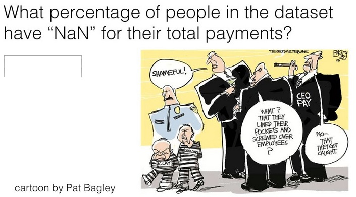

    count_NaN_tp = 0
    for key in enron_data.keys():
        if enron_data[key]['total_payments'] == 'NaN':
            count_NaN_tp+=1
    print count_NaN_tp
    print float(count_NaN_tp)/len(enron_data.keys())

    21
    0.143835616438

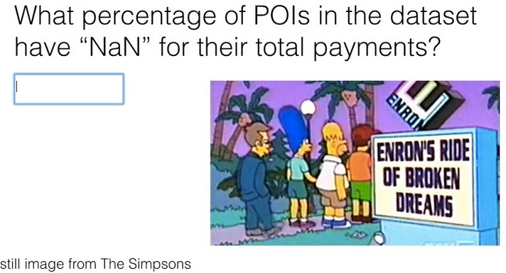

    count_NaN_tp = 0
    for key in enron_data.keys():
        if enron_data[key]['total_payments'] == 'NaN' and enron_data[key]['poi'] == True :
            print 
            count_NaN_tp+=1
    print count_NaN_tp
    print float(count_NaN_tp)/len(enron_data.keys())

    0
    0.0

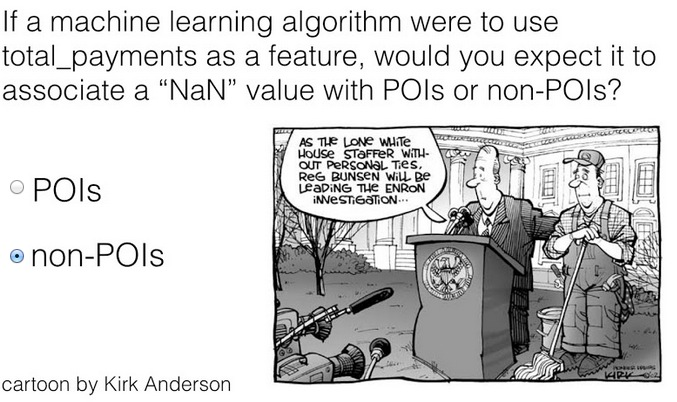

Yes, correct. No training points would have "NaN" for total_payments when the
class label is "POI"

    len(enron_data.keys())

    146

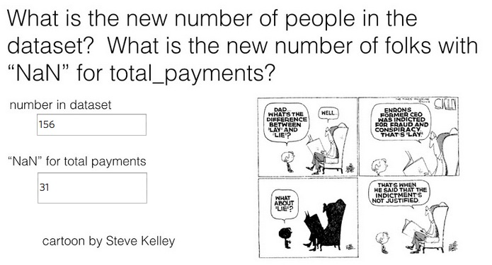

Now there are 156 folks in dataset, 31 of whom have "NaN" total_payments. This
makes for 20% of them with a "NaN" overall.

    count = 0
    for user in enron_data:
        if enron_data[user]['poi'] == True and enron_data[user]['total_payments'] == 'NaN':
            count+=1
    print count

    0

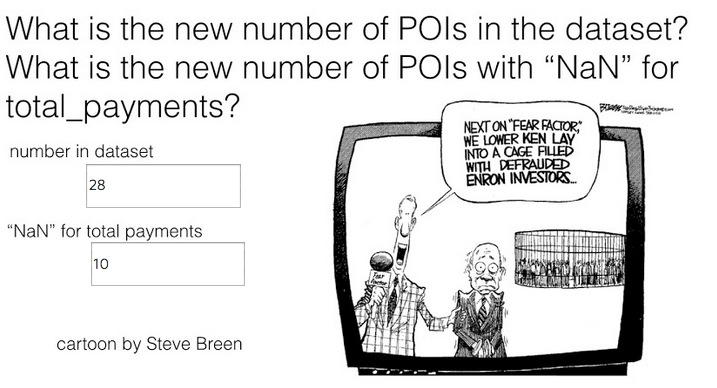

Now there are 28 POI's, 10 of whom have "NaN" for total_payments

That's 36% of the POI's who have "NaN" for total_payments, a big jump from
before.

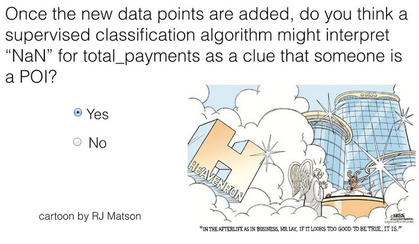

### Final Notes from Instructor

Adding in the new POI’s in this example, none of whom we have financial
information for, has introduced a subtle problem, that our lack of financial
information about them can be picked up by an algorithm as a clue that they’re
POIs. Another way to think about this is that there’s now a difference in how we
generated the data for our two classes--non-POIs all come from the financial
spreadsheet, while many POIs get added in by hand afterwards. That difference
can trick us into thinking we have better performance than we do--suppose you
use your POI detector to decide whether a new, unseen person is a POI, and that
person isn’t on the spreadsheet. Then all their financial data would contain
“NaN” but the person is very likely not a POI (there are many more non-POIs than
POIs in the world, and even at Enron)--you’d be likely to accidentally identify
them as a POI, though!

This goes to say that, when generating or augmenting a dataset, you should be
exceptionally careful if your data are coming from different sources for
different classes. It can easily lead to the type of bias or mistake that we
showed here. There are ways to deal with this, for example, you wouldn’t have to
worry about this problem if you used only email data--in that case,
discrepancies in the financial data wouldn’t matter because financial features
aren’t being used. There are also more sophisticated ways of estimating how much
of an effect these biases can have on your final answer; those are beyond the
scope of this course.

For now, the takeaway message is to be very careful about introducing features
that come from different sources depending on the class! It’s a classic way to
accidentally introduce biases and mistakes.

>Resource:

> * http://en.wikipedia.org/wiki/Enron
> * https://www.udacity.com/course/viewer#!/c-ud120/l-2291728537/m-2473678541

    
