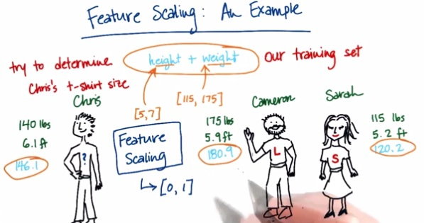
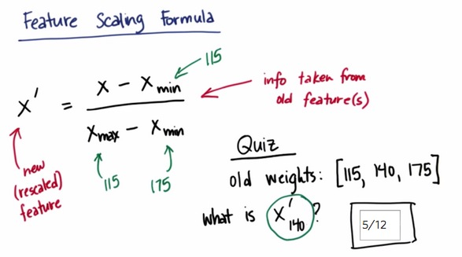
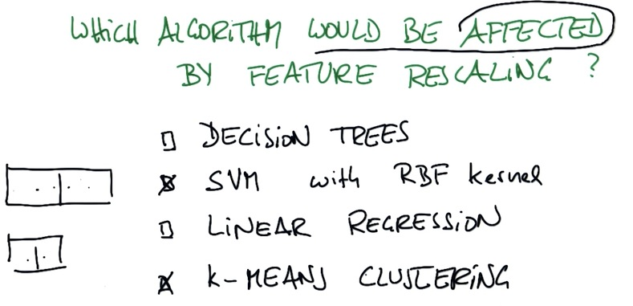

Feature Selection is one important tool in Machine Learning.It's about how we
normalize the range of each of our feature so that it can't dominate from one to
another. Let's take this picture for example.
<!-- TEASER_END -->

Suppose Chris doesn't know what's the t-shirt he has to choose, L or S. But he
has two friends, Cameron and Sarah, who knows their t-shirt size. Given height
and weight of individual, intuitively, Chris should pick Cameron's size, because
by the charasteric, Chris fit more to Cameron, compare to Sarah.

When we put it into more machine language, sum height and weight, oddly we get
Sarah's size(drawn by blue sky label). This happens because height and weight
has different range. If we look at the example, weight more dominant because it
has larger numbers.

What we want to do is scaling this features so it manage to has an equal weight.
This is called Feature Scaling which we would be discussed today.

This is the formula that is used to scale the feature. The advantage is we
always get the feature scaled from 0 to 1. The disadvantage is if we have
outliers, we may have Xmax/Xmin to have an extreme value.

Let's code this!

    ### FYI, the most straightforward implementation might 
    ### throw a divide-by-zero error, if the min and max
    ### values are the same
    ### but think about this for a second--that means that every
    ### data point has the same value for that feature!  
    ### why would you rescale it?  Or even use it at all?
    def featureScaling(arr):
      nmax = max(data)
      nmin = min(data)
      if (nmax == nmin):
          return None
      normalize = nmax - nmin
      return [float(e-nmin)/normalize for e in data ]
    
    # tests of your feature scaler--line below is input data
    data = [115, 140, 175]
    print featureScaling(data)
    

    [0.0, 0.4166666666666667, 1.0]

Turns out, sklearn already have this with few lines of code.

    from sklearn.preprocessing import MinMaxScaler

    import numpy

    weights = numpy.array([[115.0],[140.0],[175.0]])

    scaler = MinMaxScaler()

    rescaled_weight = scaler.fit_transform(weights)#find min max and apply all the elements,
    #it expect floating point element

    rescaled_weight

    array([[ 0.        ],
           [ 0.41666667],
           [ 1.        ]])

SVM and k-Means Clustering has both depend on decision boundary, linear model,
which means involve gradient that depends on both y and x axis. If we remember
the graph, it actually plot two feature(let's say only two feature) and it has
to somehow has same weight.

The Decision Tree however, doesn't apply things like gradient. It only split
either vertically or horizontally. It only split x-axis or y-axis, but not both.
That's why the split only depends on each of the feature, not joint.

Linear Regression, has same similar principles, which ignore the relation of the
features. each of feature in LR has its own coef_, and scaled automatically
depending on its coef_. Because of that it doesn't require the relationship of
the features which result to unaffected by feature scalling.

### Mini Project

As usual, because this blog post are the note that I have taken from Udacity
course, Here I attack some of the problem they have at their mini project. You
can see the link of the course for this note at the bottom of this page.

Apply feature scaling to your k-means clustering code from the last lesson, on
the “salary” and “exercised_stock_options” features (use only these two
features). What would be the rescaled value of a "salary" feature that had an
original value of 200,000, and an "exercised_stock_options" feature of 1
million? (Be sure to represent these numbers as floats, not integers!)

    import pickle

    data_dict = pickle.load( open("../final_project/final_project_dataset.pkl", "r") )
    ### there's an outlier--remove it! 
    data_dict.pop("TOTAL", 0)

    salary = []
    ex_stok = []
    for users in data_dict:
        val = data_dict[users]["salary"]
        if val == 'NaN':
            continue
        salary.append(float(val))
        val = data_dict[users]["exercised_stock_options"]
        if val == 'NaN':
            continue
        ex_stok.append(float(val))

    salary = [min(salary),200000.0,max(salary)]
    ex_stok = [min(ex_stok),1000000.0,max(ex_stok)]

    print salary
    print ex_stok

    [477.0, 200000.0, 1111258.0]
    [17378.0, 1000000.0, 34348384.0]

    salary = numpy.array([[e] for e in salary])
    ex_stok = numpy.array([[e] for e in ex_stok])

    scaler_salary = MinMaxScaler()
    scaler_stok = MinMaxScaler()

    rescaled_salary = scaler_salary.fit_transform(salary)
    rescaled_stock = scaler_salary.fit_transform(ex_stok)

    print rescaled_salary
    print rescaled_stock

    [[ 0.        ]
     [ 0.17962407]
     [ 1.        ]]
    [[ 0.      ]
     [ 0.028622]
     [ 1.      ]]

One could argue about whether rescaling the financial data is strictly
necessary, perhaps we want to keep the information that a 100,000 salary and
40,000,000 in stock options are dramatically different quantities. What if we
wanted to cluster based on “from_messages” (the number of email messages sent
from a particular email account) and “salary”? Would feature scaling be
unnecessary in this case, or critical?

Critical! Emails typically number in the hundreds or low thousands, salaries are
usually at least 1000x higher.

> **REFERENCE**:

> * https://www.udacity.com/course/viewer#!/c-ud120/l-2864738562/e-2998388773/m-
3046488600

    
