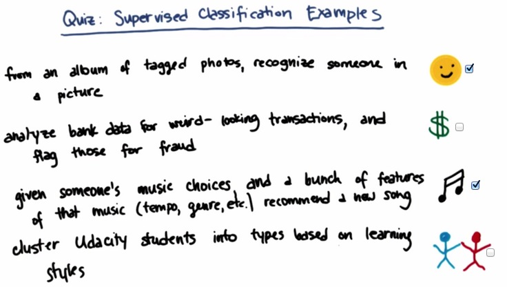
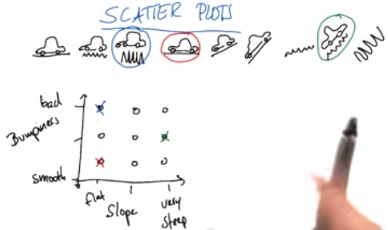
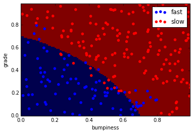
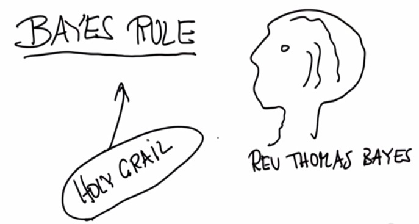
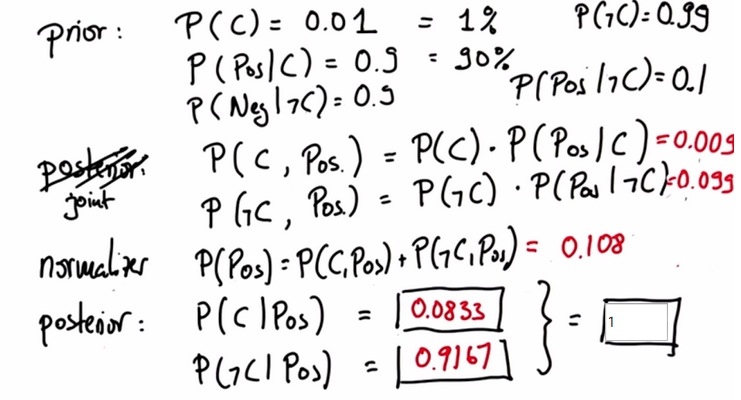

Naive Bayes is one of the machine learning algorithm. Here we first want to take
the definition of machine learning.
<!-- TEASER_END -->

## Sebastian Thrun Experience

    from IPython.display import Image

    Image('nb-ud/Screen Shot 2014-11-19 at 11.22.14 AM.jpg')

 Sebastian Thrun is the head of the project of google automatic driving car.
 He uses supervised classification to train the car.
 Supervised mean that we're giving lot of correct examples, and then give it as
material lesson to the system as a student.
 That's what the learner do, observing a teacher, for e.g. we saw parents learn
to drive to correctly, then it's our turn to drive it.
 That's what machine learning does.
 To win DARPA Grand Challenge 2006, Stanley, the car project he did at
Standford, observe thousand miles how man drive in the dessert.

###  Supervised Classification Example

    Image('nb-ud/Screen Shot 2014-11-19 at 11.45.46 AM.jpg')

1. This one is definitely supervised learning. Given an example(photo and album
tagged), the system (e.g. Facebook) try to recognize someone face.
2. Analyze bank does not supervised learning, It doesn't learn from an example.
3. Companies like Netflix learn from music or movie choice, as a feature and try
to recommend similar movies or song to the user.
4. This one also based on supervised learning.

### Feature and Labels

    Image('nb-ud/Screen Shot 2014-11-19 at 11.52.49 AM.jpg')

Katie loves to listen to Let It Go. What sort of features in the song that makes
Katie likes the song? Then based on the song,Katie makes the decision. Is she
labels the song,like or dislike?

### Features Visualization

    Image('nb-ud/Screen Shot 2014-11-19 at 12.02.38 PM.jpg')

    Image('nb-ud/Screen Shot 2014-11-19 at 12.03.19 PM.jpg')

If we plot two features, and it seems like we can make line separable, it may
easier to draw conclusion based on the next point.
But if it the case that the we plot like in the second, it could be unclear to
us to make a conclusion. It's better to add new samples, or manipulate the
features (use polynomial,log10..etc)

### Stanley Speed

    Image('nb-ud/Screen Shot 2014-11-19 at 12.11.55 PM.jpg')

Suppose Stanley's speed decided by two factor. It's bumpiness and slope. We can
take these into a classification.

    Image('nb-ud/Screen Shot 2014-11-19 at 12.25.11 PM.jpg')

The machine learning system always draw some decision surface(boundary) that
make it easier to the system if the next sample drop plot in which side of the
boundary

### Introduction to Naive Bayes

Okay, we have enough description of the machine learning. Let's dig deeper about
Naive Bayes. Bayes is actually a religious man trying to prove the existing of
God, the algorithm that he makes that makes it naive.

    Image('nb-ud/Screen Shot 2014-11-19 at 12.35.35 PM.jpg')

Naive Bayes itself later will make decision boundary as the one in the picture.
So the the incoming sample will be known its label by plotting in this graph.

### SKlearn

Now we want to create a picture as above using the scikit learn library

    import numpy as np

    %pylab inline

    Populating the interactive namespace from numpy and matplotlib

    from sklearn.naive_bayes import GaussianNB

    clf = GaussianNB()

    X = np.array([[-1,-1],[-2,-1],[-3,-2],[1,1],[2,1],[3,2]] )
    Y = np.array([1,1,1,2,2,2])

    clf.fit(X,Y)

    GaussianNB()

    print clf.predict([[-0.8,-1]])

    [1]

    %%writefile prep_terrain_data.py
    #!/usr/bin/python
    import random
    
    
    def makeTerrainData(n_points=1000):
    ###############################################################################
    ### make the toy dataset
        random.seed(42)
        grade = [random.random() for ii in range(0,n_points)]
        bumpy = [random.random() for ii in range(0,n_points)]
        error = [random.random() for ii in range(0,n_points)]
        y = [round(grade[ii]*bumpy[ii]+0.3+0.1*error[ii]) for ii in range(0,n_points)]
        for ii in range(0, len(y)):
            if grade[ii]>0.8 or bumpy[ii]>0.8:
                y[ii] = 1.0
    
    ### split into train/test sets
        X = [[gg, ss] for gg, ss in zip(grade, bumpy)]
        split = int(0.75*n_points)
        X_train = X[0:split]
        X_test  = X[split:]
        y_train = y[0:split]
        y_test  = y[split:]
    
        grade_sig = [X_train[ii][0] for ii in range(0, len(X_train)) if y_train[ii]==0]
        bumpy_sig = [X_train[ii][1] for ii in range(0, len(X_train)) if y_train[ii]==0]
        grade_bkg = [X_train[ii][0] for ii in range(0, len(X_train)) if y_train[ii]==1]
        bumpy_bkg = [X_train[ii][1] for ii in range(0, len(X_train)) if y_train[ii]==1]
    
    #    training_data = {"fast":{"grade":grade_sig, "bumpiness":bumpy_sig}
    #            , "slow":{"grade":grade_bkg, "bumpiness":bumpy_bkg}}
    
    
        grade_sig = [X_test[ii][0] for ii in range(0, len(X_test)) if y_test[ii]==0]
        bumpy_sig = [X_test[ii][1] for ii in range(0, len(X_test)) if y_test[ii]==0]
        grade_bkg = [X_test[ii][0] for ii in range(0, len(X_test)) if y_test[ii]==1]
        bumpy_bkg = [X_test[ii][1] for ii in range(0, len(X_test)) if y_test[ii]==1]
    
        test_data = {"fast":{"grade":grade_sig, "bumpiness":bumpy_sig}
                , "slow":{"grade":grade_bkg, "bumpiness":bumpy_bkg}}
    
        return X_train, y_train, X_test, y_test
    #    return training_data, test_data

    Writing prep_terrain_data.py

    %%writefile class_vis.py
    #!/usr/bin/python
    
    #from udacityplots import *
    import matplotlib 
    matplotlib.use('agg')
    
    import matplotlib.pyplot as plt
    import pylab as pl
    import numpy as np
    
    #import numpy as np
    #import matplotlib.pyplot as plt
    #plt.ioff()
    
    def prettyPicture(clf, X_test, y_test):
        x_min = 0.0; x_max = 1.0
        y_min = 0.0; y_max = 1.0
    
        # Plot the decision boundary. For that, we will assign a color to each
        # point in the mesh [x_min, m_max]x[y_min, y_max].
        h = .01  # step size in the mesh
        xx, yy = np.meshgrid(np.arange(x_min, x_max, h), np.arange(y_min, y_max, h))
        Z = clf.predict(np.c_[xx.ravel(), yy.ravel()])
    
        # Put the result into a color plot
        Z = Z.reshape(xx.shape)
        plt.xlim(xx.min(), xx.max())
        plt.ylim(yy.min(), yy.max())
    
        plt.pcolormesh(xx, yy, Z, cmap=pl.cm.seismic)
    
        # Plot also the test points
        grade_sig = [X_test[ii][0] for ii in range(0, len(X_test)) if y_test[ii]==0]
        bumpy_sig = [X_test[ii][1] for ii in range(0, len(X_test)) if y_test[ii]==0]
        grade_bkg = [X_test[ii][0] for ii in range(0, len(X_test)) if y_test[ii]==1]
        bumpy_bkg = [X_test[ii][1] for ii in range(0, len(X_test)) if y_test[ii]==1]
    
        plt.scatter(grade_sig, bumpy_sig, color = "b", label="fast")
        plt.scatter(grade_bkg, bumpy_bkg, color = "r", label="slow")
        plt.legend()
        plt.xlabel("bumpiness")
        plt.ylabel("grade")
    
        plt.savefig("test.png")
        
    import base64
    import json
    import subprocess
    
    def output_image(name, format, bytes):
        image_start = "BEGIN_IMAGE_f9825uweof8jw9fj4r8"
        image_end = "END_IMAGE_0238jfw08fjsiufhw8frs"
        data = {}
        data['name'] = name
        data['format'] = format
        data['bytes'] = base64.encodestring(bytes)
        print image_start+json.dumps(data)+image_end

    Writing class_vis.py

    %%writefile ClassifyNB.py
    
    from sklearn.naive_bayes  import GaussianNB
    
    def classify(features_train, labels_train):   
        ### import the sklearn module for GaussianNB
        ### create classifier
        ### fit the classifier on the training features and labels
        ### return the fit classifier
        clf = GaussianNB()
        clf.fit(features_train,labels_train)
        
        return clf
            
    
        

    Overwriting ClassifyNB.py

    # %%writefile GaussianNB_Deployment_on_Terrain_Data.py
    #!/usr/bin/python
    
    """ Complete the code below with the sklearn Naaive Bayes
        classifier to classify the terrain data
        
        The objective of this exercise is to recreate the decision 
        boundary found in the lesson video, and make a plot that
        visually shows the decision boundary """
    
    
    from prep_terrain_data import makeTerrainData
    from class_vis import prettyPicture, output_image
    from ClassifyNB import classify
    
    import numpy as np
    import pylab as pl
    
    from ggplot import *
    
    features_train, labels_train, features_test, labels_test = makeTerrainData()
    
    ### the training data (features_train, labels_train) have both "fast" and "slow" points mixed
    ### in together--separate them so we can give them different colors in the scatterplot,
    ### and visually identify them
    grade_fast = [features_train[ii][0] for ii in range(0, len(features_train)) if labels_train[ii]==0]
    bumpy_fast = [features_train[ii][1] for ii in range(0, len(features_train)) if labels_train[ii]==0]
    grade_slow = [features_train[ii][0] for ii in range(0, len(features_train)) if labels_train[ii]==1]
    bumpy_slow = [features_train[ii][1] for ii in range(0, len(features_train)) if labels_train[ii]==1]
    
    
    
    
        ### draw the decision boundary with the text points overlaid
    prettyPicture(clf, features_test, labels_test)
    #output_image("test.png", "png", open("test.png", "rb").read())
    
    
    
    

    %%writefile classify.py
    
    from sklearn.naive_bayes import GaussianNB
    
    def NBAccuracy(features_train, labels_train, features_test, labels_test):
        """ compute the accuracy of your Naive Bayes classifier """
        ### import the sklearn module for GaussianNB
        from sklearn.naive_bayes import GaussianNB
    
        ### create classifier
        clf = GaussianNB()
    
        ### fit the classifier on the training features and labels
        clf.fit(features_train,labels_train)
    
        ### use the trained classifier to predict labels for the test features
        pred = clf.predict(features_test)
    
    
        ### calculate and return the accuracy on the test data
        ### this is slightly different than the example, 
        ### where we just print the accuracy
        ### you might need to import an sklearn module
        accuracy = clf.score(features_test,labels_test)
        return accuracy

    Overwriting classify.py

    # %%writefile submitAccuracy.py
    from class_vis import prettyPicture
    from prep_terrain_data import makeTerrainData
    from classify import NBAccuracy
    
    import matplotlib.pyplot as plt
    import numpy as np
    import pylab as pl
    
    
    features_train, labels_train, features_test, labels_test = makeTerrainData()
    
    def submitAccuracy():
        accuracy = NBAccuracy(features_train, labels_train, features_test, labels_test)
        return accuracy

    print submitAccuracy()

    0.884

That does in fact we have close to 90% accuracy in predicting our data.
It always important to split your dataset, (this course recommend 90:10, others
80:20) for the test set so that we know is whether our learning is overfitting.

### Bayes Rule

    Image('nb-ud/Screen Shot 2014-11-19 at 2.12.38 PM.jpg')

Accoding to Sebastian Thrun, here i quote "Bayes Rule is perhaps the Holy Grail
of probabilistic inference". It found by Rev Thomas Bayes, who's trying to infer
the existing of a God. What he didn't know back then, is he open endless
possiblity for Artificial Inteligence background that we know today.

    Image('nb-ud/Screen Shot 2014-11-19 at 2.19.16 PM.jpg')

Here Bayes should infer the possibility given the condition. Now let's take it
into a quiz.

This question is tricky, especially since both specificity and sensitivity are
90%. Intuitively, given the test result is positive, we know we are in the
shaded region (blue and red). The true positive is depicted by red. As an
estimate, which answer best describes the ratio of the red shaded region to the
total (red + blue) shaded region?

    Image('nb-ud/Screen Shot 2014-11-19 at 2.25.56 PM.jpg')

If we can see at the graph, we actually observe the probability of the cancer
inside positive test probability. We Ignore the whole population for now. And of
that 90% test positive, we're calculating person that actually have disease. For
this to happen, we have to know the other side of test positive, which is the
person who doesn't have cancer but tested posititive. We do this to have the
probability of the test positive, independent whether the person have the
disease or not.

Here's the total probability for the problem

    Image('nb-ud/Screen Shot 2014-11-19 at 2.40.25 PM.jpg')

And here's the simpler intuition

    Image('nb-ud/Screen Shot 2014-11-19 at 2.43.11 PM.jpg')

By adding P(C|Pos) and P(notC|Pos) you have the total probability of 1

### Bayes Rule for Classification

    Image('nb-ud/Screen Shot 2014-11-19 at 3.13.58 PM.jpg')

Now let's do some example for Naive Bayes classification, specifically, Text
Learning

Suppose the system only learning from two people, Chris and Sara, stated by
their own frequent email, the P(Chris) and P(Sara).
The system want to learn, based on the email containing words, who's the one
that send it.

Now, the Chris has 3 frequent words (only three words) that contained as
described above. Same goes for Sara.

Now the question is:

1. 'Love Live' the one who send it? Sara
2. 'Life Deal' who send it?
3. 'Love Deal' who send it?

Now this maybe simple question, but chris won by only small margin

    P(C, 'Life Deal')  = 0.5 * 0.1 * 0.8 = 0.04
    P(S, 'Life Deal') = 0.5 * 0.3 * 0.2 = 0.03

Now if accumulate the probability, we get only the P('Life Deal'). So the
posterior probability it

    P('Life Deal') = 0.04 + 0.03 = 0.07
    P(C|'Life Deal') = 0.04/0.07 = 0.57
    P(S|'Life Deal') = 0.03/0.07 = 0.43

If you look at my other blog post,[here](http://napitupulu-jon.appspot.com/posts
/bayesian-learning.html), the prior actually doesn't matter. Because Chris and
Sara is at uniform distribution. So we can safely ignore it. What we have then
is

    P(C, 'Love Deal')  = 0.1 * 0.8 = 0.08
    P(S, 'Love Deal') = 0.5 * 0.2 = 0.1
    P('Love Deal') = 0.08 + 0.1 = 0.18
    P(C|'Love Deal') = 0.08/0.18 = 0.44
    P(S|'Love Deal') = 0.1/0.18 = 0.56

### Final Thoughts

    Image('nb-ud/Screen Shot 2014-11-19 at 3.39.09 PM.jpg')

The reason why it's called Naive Bayes, is,no matter what's the relation of the
features in one data samples, it only calculate the accumulate probabilities. In
Text Learning, for example, the Word Order is ignored. Although it's dangerous
because it's ignore the relationships of the features, it's proven to be quite
powerful.

Google have experience of trying to find words "Chicago Bulls", basketball team.
But because 'Chicago' and 'Bulls' has each different meaning, ignoring the
relatinships make the Naive Bayes break. It can handle well at 20k-200k words.

The importance is you should know when and where you use Naive Bayes. Understand
what's the problem are and know which algorithm to use. And you can calso use
test set to measure the algorithm.

### Mini Project: create a system that guess the authors given emails

A couple of years ago, J.K. Rowling (of Harry Potter fame) tried something
interesting. She wrote a book, “The Cuckoo’s Calling,” under the name Robert
Galbraith. The book received some good reviews, but no one paid much attention
to it--until an anonymous tipster on Twitter said it was J.K. Rowling. The
London Sunday Times enlisted two experts to compare the linguistic patterns of
“Cuckoo” to Rowling’s “The Casual Vacancy,” as well as to books by several other
authors. After the results of their analysis pointed strongly toward Rowling as
the author, the Times directly asked the publisher if they were the same person,
and the publisher confirmed. The book exploded in popularity overnight.

We’ll do something very similar in this project. We have a set of emails, half
of which were written by one person and the other half by another person at the
same company . Our objective is to classify the emails as written by one person
or the other based only on the text of the email. We will start with Naive Bayes
in this mini-project, and then expand in later projects to other algorithms.

We will start by giving you a list of strings. Each string is the text of an
email, which has undergone some basic preprocessing; we will then provide the
code to split the dataset into training and testing sets. (In the next lessons
you’ll learn how to do this preprocessing and splitting yourself, but for now
we’ll give the code to you).

One particular feature of Naive Bayes is that it’s a good algorithm for working
with text classification. When dealing with text, it’s very common to treat each
unique word as a feature, and since the typical person’s vocabulary is many
thousands of words, this makes for a large number of features. The relative
simplicity of the algorithm and the independent features assumption of Naive
Bayes make it a strong performer for classifying texts. In this mini-project,
you will download and install sklearn on your computer and use Naive Bayes to
classify emails by author.

    %load nb_author_id.py

    #!/usr/bin/python
    from sklearn.naive_bayes import GaussianNB
    """ 
        this is the code to accompany the Lesson 1 (Naive Bayes) mini-project 
    
        use a Naive Bayes Classifier to identify emails by their authors
        
        authors and labels:
        Sara has label 0
        Chris has label 1
    
    """
        
    import sys
    from time import time
    sys.path.append("../tools/")
    from email_preprocess import preprocess
    
    
    ### features_train and features_test are the features for the training
    ### and testing datasets, respectively
    ### labels_train and labels_test are the corresponding item labels
    features_train, features_test, labels_train, labels_test = preprocess()
    
    clf = GaussianNB()
    t0 = time()
    clf.fit(features_train,labels_train)
    print 'training time',round(time()-t0,3) ,'s'
    t0 = time()
    clf.score(features_test,labels_test)
    print 'predicting time', round(time()-t0,3),'s'

    no. of Chris training emails: 7936
    no. of Sara training emails: 7884
    training time 1.964 s
    predicting time 0.355 s

    
