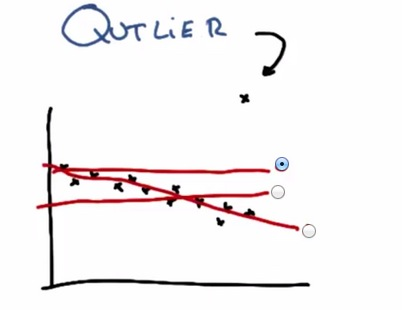
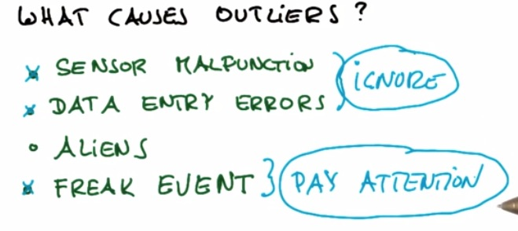
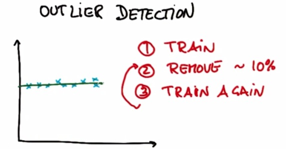
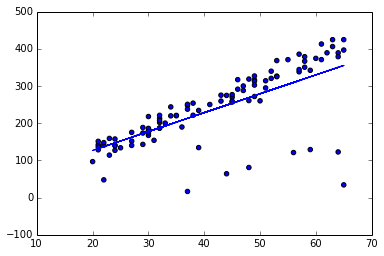
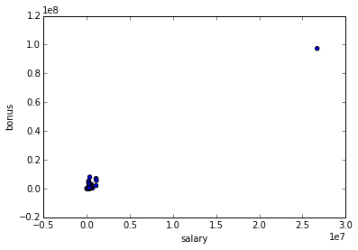
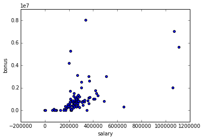

Outlier in datapoints is normally occurs. It probably some mistyped data from
input of other people (e.g. 200 instead of 20). In this plot we see there's
outliers that drawn outside the trend of the data. This cause the linear
regression, if outliers included, to draw the linear model in such a terrible
way. In this case, to best minimize the least squared error, the model would
choose the top line.
<!-- TEASER_END -->

Outliers may caused of one of the above.

* It could be sensor malfunction, in this case it often happen with in robotics
field situation
* Data Entry Errors, everytime there's input by human, there's always human
error
* Aliens may unlikely
* Freak Event, that could be sometimes happen if for example in fraud detection.

One way to avoid the outliers is byusing Outlier Detection. Suppose we have 10
training examples. We're performing our usual algorithm, in this case linear
regression. After that remove 10% of the training examples that have the highest
residual error. And finally train again.In this example we have remove 1
outliers using Outlier Detection/Outlier Rejection

Now keep in mind that, sometimes it's outlier that we want to find, sometimes
called Freak Event. For Anomaly Detection for example, we want to find fault
cpu, in thousands of cpu creation in the process. Or the case of Fraud
Detection. In this case, these outliers are the we are pay attention to.

### Mini Project

As usual, because this blog post are the note that I have taken from Udacity
course, you can see the link of the course for this note at the bottom of the
page. Here I attack some of the problem they have at their mini project.

This project has two parts. In the first part, you will run a regression, and
identify and remove the 10% of points that have the largest residual errors.
Then you’ll remove those outliers from the dataset and refit the regression,
just like the strategy that Sebastian suggested in the lesson videos.

In the second part, you will get acquainted with some of the outliers in the
Enron finance data, and learn if/how to remove them.

Sebastian described to us an algorithm for improving a regression, which you
will implement in this project. You will work through it in the next few
quizzes. To summarize, what you'll do is fit the regression on all training
points discard the 10% of points that have the largest errors between the actual
y values, and the regression-predicted y values refit on the remaining points.

Start by running the starter code (outliers/outlier_removal_regression.py) and
visualizing the points. A few outliers should clearly pop out. Deploy a linear
regression, where net worth is the target and the feature being used to predict
it is a person’s age (remember to train on the training data!).

The “correct” slope for the main body of data points is 6.25 (we know this
because we used this value to generate the data); what slope does your
regression have?

    %load outlier_removal_regression.py

    %pylab inline

    Populating the interactive namespace from numpy and matplotlib

    #!/usr/bin/python
    
    import random
    import numpy
    import matplotlib.pyplot as plt
    import pickle
    
    from outlier_cleaner import outlierCleaner
    
    
    ### load up some practice data with outliers in it
    ages = pickle.load( open("practice_outliers_ages.pkl", "r") )
    net_worths = pickle.load( open("practice_outliers_net_worths.pkl", "r") )
    
    
    
    ### ages and net_worths need to be reshaped into 2D numpy arrays
    ### second argument of reshape command is a tuple of integers: (n_rows, n_columns)
    ### by convention, n_rows is the number of data points
    ### and n_columns is the number of features
    ages       = numpy.reshape( numpy.array(ages), (len(ages), 1))
    net_worths = numpy.reshape( numpy.array(net_worths), (len(net_worths), 1))
    from sklearn.cross_validation import train_test_split
    ages_train, ages_test, net_worths_train, net_worths_test = train_test_split(ages, net_worths, test_size=0.1, random_state=42)
    
    ### fill in a regression here!  Name the regression object reg so that
    ### the plotting code below works, and you can see what your regression looks like
    
    
    try:
        plt.plot(ages, reg.predict(ages), color="blue")
    except NameError:
        pass
    plt.scatter(ages, net_worths)
    plt.show()
    
    
    ### identify and remove the most outlier-y points
    cleaned_data = []
    try:
        predictions = reg.predict(ages)
        cleaned_data = outlierCleaner( predictions, ages, net_worths )
    except NameError:
        print "your regression object doesn't exist, or isn't name reg"
        print "can't make predictions to use in identifying outliers"
    
    
    
    
    
    
    
    ### only run this code if cleaned_data is returning data
    if len(cleaned_data) > 0:
        ages, net_worths, errors = zip(*cleaned_data)
        ages       = numpy.reshape( numpy.array(ages), (len(ages), 1))
        net_worths = numpy.reshape( numpy.array(net_worths), (len(net_worths), 1))
    
        ### refit your cleaned data!
        try:
            reg.fit(ages, net_worths)
            plt.plot(ages, reg.predict(ages), color="blue")
        except NameError:
            print "you don't seem to have regression imported/created,"
            print "   or else your regression object isn't named reg"
            print "   either way, only draw the scatter plot of the cleaned data"
        plt.scatter(ages, net_worths)
        plt.xlabel("ages")
        plt.ylabel("net worths")
        plt.show()
    
    
    else:
        print "outlierCleaner() is returning an empty list, no refitting to be done"

    [49, 21, 32, 30, 53, 51, 61, 23, 39, 21]
    [[49]
     [21]
     [32]
     [30]
     [53]
     [51]
     [61]
     [23]
     [39]
     [21]]

    outlierCleaner() is returning an empty list, no refitting to be done

    from sklearn import linear_model

    reg = linear_model.LinearRegression()

    reg.fit(ages_train,net_worths_train)

    LinearRegression(copy_X=True, fit_intercept=True, normalize=False)

#### The slope of the regression is

    reg.coef_[0][0]

    5.0779306434402569

#### What is the score you get when using your regression to make predictions with the test data?

    reg.score(ages_test,net_worths_test)

    0.87826247036646721

In outliers/outlier_cleaner.py, you will find the skeleton for a function called
outlierCleaner() that you will fill in with a cleaning algorithm. It takes three
arguments: predictions is a list of predicted targets that come from your
regression, ages is the list of ages in the training set, and net_worths is the
actual value of the net worths in the training set. There should be 90 elements
in each of these lists (because the training set has 90 points in it). Your job
is to return a list called cleaned_data that has only 81 elements in it, which
are the 81 training points where the predictions and the actual values
(net_worths) have the smallest errors (90 * 0.9 = 81). The format of
cleaned_data should be a list of tuples, where each tuple has the form (age,
net_worth, error).

Once this cleaning function is working, you should see the regression result
changes. What is the new slope? Is it closer to the “correct” result of 6.25?

    %load outlier_cleaner.py

    #!/usr/bin/python
    
    
    def outlierCleaner(predictions, ages, net_worths):
        """
            clean away the 10% of points that have the largest
            residual errors (different between the prediction
            and the actual net worth)
    
            return a list of tuples named cleaned_data where 
            each tuple is of the form (age, net_worth, error)
        """
        
        #calculate the error,make it descend sort, and fetch 90% of the data
        
        errors = (net_worths-predictions)**2
        cleaned_data =zip(ages,net_worths,errors)
        cleaned_data = sorted(cleaned_data,key=lambda x:x[2][0], reverse=True)
        limit = int(len(net_worths)*0.1)
        
        
        return cleaned_data[limit:]
    

    clf_after_cleaned = linear_model.LinearRegression()

    cleaned_d = outlierCleaner(reg.predict(ages_train),ages_train,net_worths_train)

    age_cleaned = numpy.array([e[0] for e in cleaned_d])

    net_worth_cleaned = numpy.array([e[1] for e in cleaned_d])

    clf_after_cleaned.fit(age_cleaned,net_worth_cleaned)

    LinearRegression(copy_X=True, fit_intercept=True, normalize=False)

    clf_after_cleaned.coef_

    array([[ 6.36859481]])

#### The slope is 6.3, and yes it's closer to 6.5

#### And the score is

    clf_after_cleaned.score(ages_test,net_worths_test)

    0.98318945539553215

In the mini-project for the regressions lesson, you used a regression to predict
the bonuses for Enron employees. As you saw, even a single outlier can make a
big difference on the regression result. There was something we didn’t tell you,
though, which was that the dataset we had you use in that project had already
been cleaned of some significant outliers. Identifying and cleaning away
outliers is something you should always think about when looking at a dataset
for the first time, and now you’ll get some hands-on experience with the Enron
data.

You can find the starter code in outliers/enron_outliers.py, which reads in the
data (in dictionary form) and converts it into a sklearn-ready numpy array.
Since there are two features being extracted from the dictionary (“salary” and
“bonus”), the resulting numpy array will be of dimension N x 2, where N is the
number of data points and 2 is the number of features. This is perfect input for
a scatterplot; we’ll use the matplotlib.pyplot module to make that plot. (We’ve
been using pyplot for all the visualizations in this course.) Add these lines to
the bottom of the script to make your scatterplot:

    %load enron_outliers.py

    #!/usr/bin/python
    
    import pickle
    import sys
    import matplotlib.pyplot
    sys.path.append("../tools/")
    from feature_format import featureFormat, targetFeatureSplit
    
    
    ### read in data dictionary, convert to numpy array
    data_dict = pickle.load( open("../final_project/final_project_dataset.pkl", "r") )
    features = ["salary", "bonus"]
    data = featureFormat(data_dict, features)
    
    
    ### your code below
    print data.max()
    for point in data:
        salary = point[0]
        bonus = point[1]
        matplotlib.pyplot.scatter( salary, bonus )
    
    matplotlib.pyplot.xlabel("salary")
    matplotlib.pyplot.ylabel("bonus")
    matplotlib.pyplot.show()
    

    97343619.0

As you can see, visualization is one of the most powerful tools for finding
outliers!

There’s one outlier that should pop out to you immediately. Now the question is
to identify the source. We found the original data source to be very helpful for
this identification; you can find that PDF in
final_project/enron61702insiderpay.pdf
What’s the name of the dictionary key of this data point? (e.g. if this is Ken
Lay, the answer would be “LAY KENNETH L”).

#### TOTAL

Well, that makes sense. The total of a column isn't going to be close to the
mean of that column ...

Does this outlier seem like a data point that we should include when running
machine learning on this dataset? Or should we remove it?

Yes, the spreadsheet added up all the data points for us, and we need to take
that "point" out.

A quick way to remove a key-value pair from a dictionary is the following line:
dictionary.pop( key, 0 ) Write a line like this (you’ll have to modify the
dictionary and key names, of course) and remove the outlier before calling
featureFormat(). Now rerun the code, so your scatterplot doesn’t have this
outlier anymore. Are all the outliers gone?

    #!/usr/bin/python
    
    import pickle
    import sys
    import matplotlib.pyplot
    sys.path.append("../tools/")
    from feature_format import featureFormat, targetFeatureSplit
    
    
    ### read in data dictionary, convert to numpy array
    data_dict = pickle.load( open("../final_project/final_project_dataset.pkl", "r") )
    features = ["salary", "bonus"]
    
    data_dict.pop('TOTAL',0)
    
    data = featureFormat(data_dict, features)
    
    
    ### your code below
    print data.max()
    for point in data:
        salary = point[0]
        bonus = point[1]
        matplotlib.pyplot.scatter( salary, bonus )
    
    matplotlib.pyplot.xlabel("salary")
    matplotlib.pyplot.ylabel("bonus")
    matplotlib.pyplot.show()
    

    8000000.0

We see 4 more outliers, although none that are as waaaayyy out there as the last
example (the "total" line)

We would argue that there’s 4 more outliers to investigate; let's look at a
couple of them. Two people made bonuses around 6-8 million dollars, and a salary
of over 1 million dollars; in other words, they made out like bandits. What are
the names associated with those points?

    from pprint import pprint

    outliers = []
    for key in data_dict:
        val = data_dict[key]['salary']
        if val == 'NaN':
            continue
        outliers.append((key,int(val)))
    
    pprint(sorted(outliers,key=lambda x:x[1],reverse=True)[:2])

    [('SKILLING JEFFREY K', 1111258), ('LAY KENNETH L', 1072321)]

Would you guess that these are typos or weird spreadsheet lines that we should
remove, or that there’s a meaningful reason why these points are different? (In
other words, should they be removed before we, say, try to build a POI
identifier?)

Yes! They're two of Enron's biggest bosses, and definitely people of interest.

> **REFERENCE**:

> * https://www.udacity.com/course/viewer#!/c-ud120/l-2269418543/e-3021528630/m-
3013588596
