Supervised Learning has divided into 2 major category, classfication and
regression. The classfication is where the machine learning algorithm predict
discrete output, the regresion predict continuous output, hence often called
Continuous Supervised Learning.
<!-- TEASER_END -->

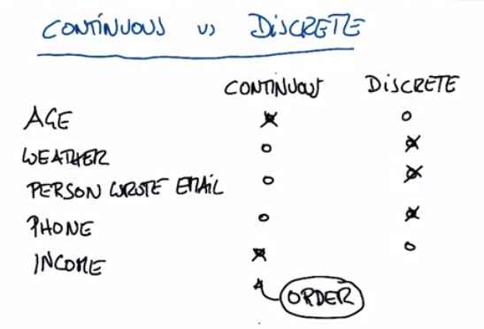

This is examples to differentiate classification and regression. It's pretty
easy to distinct that, discrete is categorical. Continuous is order, and
regression is non-order.

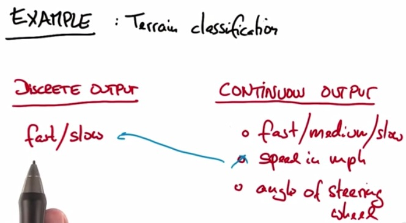

For terrain classification, this supposed to be continuous output.

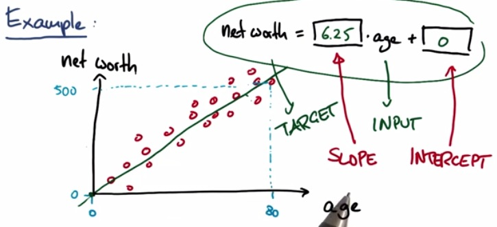

This is the slope(gradient) and intercept(bias) that we have for (linear)
regression.

To get better understanding about the intercept and the slope, see quiz below

    %ls

    finance_regression.py  regression-ud.ipynb

    %pylab inline

    Populating the interactive namespace from numpy and matplotlib

### r-squared

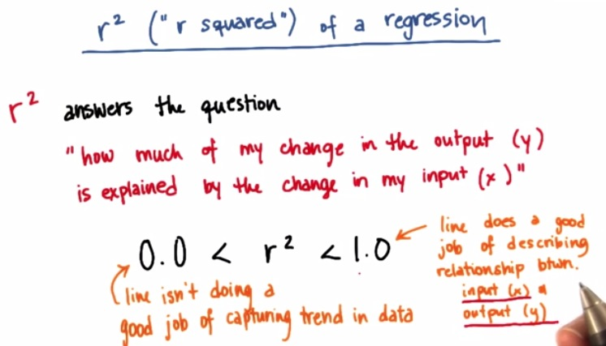

As always, r-squared is important to measure based on the performance of our
learning algorithm against the test set. For this, r-squared is the acuracy
which just using clf.score() if we're using scikit-learn. This r-squared is
perfomance metric that if you're closely correct, you would approach 1(or -1,
depending on the case) and approach zero if you have poor perfomance

Let's see how we got to the problem this far.

    %%writefile ages_net_worths.py
    
    import numpy
    import random
    
    def ageNetWorthData():
    
        random.seed(42)
        numpy.random.seed(42)
    
        ages = []
        for ii in range(100):
            ages.append( random.randint(20,65) )
        net_worths = [ii * 6.25 + numpy.random.normal(scale=40.) for ii in ages]
    ### need massage list into a 2d numpy array to get it to work in LinearRegression
        ages       = numpy.reshape( numpy.array(ages), (len(ages), 1))
        net_worths = numpy.reshape( numpy.array(net_worths), (len(net_worths), 1))
    
        from sklearn.cross_validation import train_test_split
        ages_train, ages_test, net_worths_train, net_worths_test = train_test_split(ages, net_worths)
    
        return ages_train, ages_test, net_worths_train, net_worths_test

    Writing ages_net_worths.py

    # %%writefile regressionQuiz.py
    
    import numpy
    import matplotlib.pyplot as plt
    
    from ages_net_worths import ageNetWorthData
    
    ages_train, ages_test, net_worths_train, net_worths_test = ageNetWorthData()
    
    
    
    from sklearn.linear_model import LinearRegression
    
    reg = LinearRegression()
    reg.fit(ages_train, net_worths_train)
    
    ### get Katie's net worth (she's 27)
    ### sklearn predictions are returned in an array,
    ### so you'll want to do something like net_worth = predict([27])[0]
    ### (not exact syntax, the point is that [0] at the end)
    km_net_worth = reg.predict([27])[0] ### fill in the line of code to get the right value
    
    ### get the slope
    ### again, you'll get a 2-D array, so stick the [0][0] at the end
    slope = reg.coef_ ### fill in the line of code to get the right value
    
    ### get the intercept
    ### here you get a 1-D array, so stick [0] on the end to access
    ### the info we want
    intercept = reg.intercept_ ### fill in the line of code to get the right value
    
    
    ### get the score on test data
    test_score = reg.score(ages_test,net_worths_test) ### fill in the line of code to get the right value
    
    
    ### get the score on the training data
    training_score = reg.score(ages_train,net_worths_train) ### fill in the line of code to get the right value
    
    
    
    def submitFit():
        return {"networth":km_net_worth,
                "slope":slope,
                "intercept":intercept,
                "stats on test":test_score,
                "stats on training": training_score}

    print submitFit()

    {'slope': array([[ 6.47354955]]), 'stats on training': 0.87458823582171863, 'intercept': array([-14.35378331]), 'stats on test': 0.81236572923084704, 'networth': 160.43205453082504}

#### Linear Regression Error

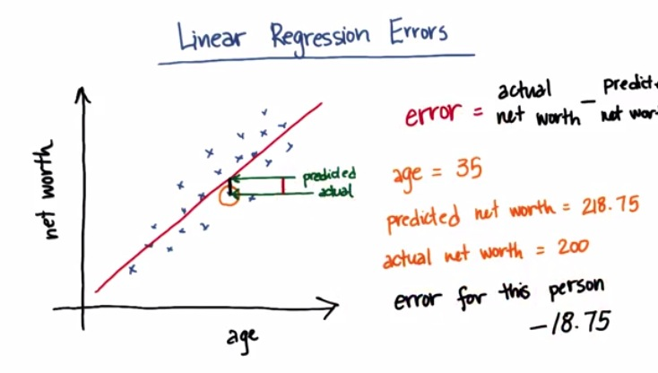

As we can see the error is minimized by the given formula. The error in plot
shown by the distance of the predicted value(from point x =35, point y = value
that fall on the regression line)

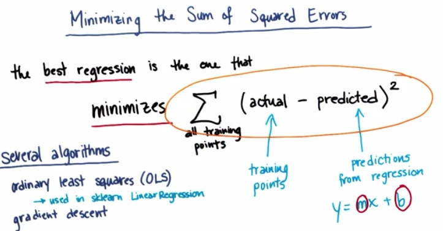

The error that minimize is sum of the absolute squared of all sum error in the
data points. The SKLearn use OLS for minimizing the sum of squared of error, and
the other, gradient descent. For more information about gradient descent, please
check my other [blog post](http://napitupulu-jon.appspot.com/posts/Gradient-
Descent.html).

### Classification vs Regression

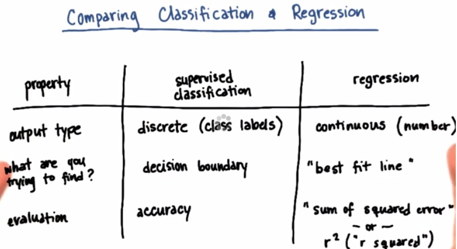

These are general difference. The output is diferent, as I mentioned earlier.
Supervised tries to find boundary, which tends to be finite/infinite. In
regression it's whole other thing, we're try to find the trend of the data.
Which linear/curve line that we can find to best find the trend of the data.
Last the accuracy or r-squared in regression. This can be achieve automatically
in scikit-learn score method.

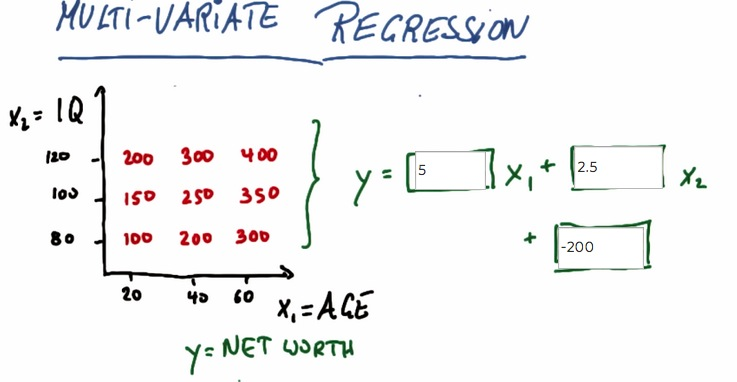

This is where we have more than one feature. To do this by intuition, we have to
know what value of net worth every increase x1, and net worth every increase x2.
in x1, net worth increase every 5 times. x2, increase every 2.5. Now if we
combine these, we have over net worth, decrease it by putting the intercept
value.

### Another problem

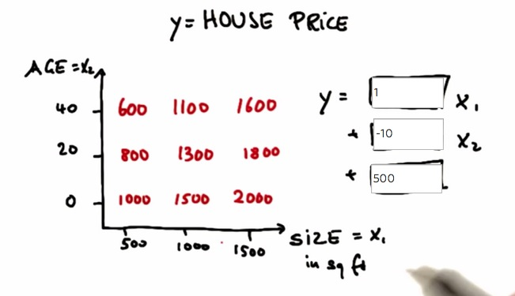

### Mini Project

In this project, you will use regression to predict financial data for Enron
employees and associates. Once you know some financial data about an employee,
like their salary, what would you predict for the size of their bonus?

    %load finance_regression.py

    #!/usr/bin/python
    
    """
        starter code for the regression mini-project
        
        loads up/formats a modified version of the dataset
        (why modified?  we've removed some trouble points
        that you'll find yourself in the outliers mini-project)
    
        draws a little scatterplot of the training/testing data
    
        you fill in the regression code where indicated
    
    """    
    
    
    import sys
    import pickle
    sys.path.append("../tools/")
    from feature_format import featureFormat, targetFeatureSplit
    dictionary = pickle.load( open("../final_project/final_project_dataset_modified.pkl", "r") )
    
    ### list the features you want to look at--first item in the 
    ### list will be the "target" feature
    features_list = ["bonus", "salary"]
    data = featureFormat( dictionary, features_list, remove_any_zeroes=True)#, "long_term_incentive"], remove_any_zeroes=True )
    
    target, features = targetFeatureSplit( data )
    
    ### training-testing split needed in regression, just like classification
    from sklearn.cross_validation import train_test_split
    feature_train, feature_test, target_train, target_test = train_test_split(features, target, test_size=0.5, random_state=42)
    train_color = "b"
    test_color = "b"
    
    
    
    ### your regression goes here!
    ### please name it reg, so that the plotting code below picks it up and 
    ### plots it correctly
    
    
    
    
    
    
    
    
    ### draw the scatterplot, with color-coded training and testing points
    import matplotlib.pyplot as plt
    for feature, target in zip(feature_test, target_test):
        plt.scatter( feature, target, color=test_color ) 
    for feature, target in zip(feature_train, target_train):
        plt.scatter( feature, target, color=train_color ) 
    
    ### labels for the legend
    plt.scatter(feature_test[0], target_test[0], color=test_color, label="test")
    plt.scatter(feature_test[0], target_test[0], color=train_color, label="train")
    
    
    
    
    ### draw the regression line, once it's coded
    try:
        plt.plot( feature_test, reg.predict(feature_test) )
    except NameError:
        pass
    plt.xlabel(features_list[1])
    plt.ylabel(features_list[0])
    plt.legend()
    plt.show()

    [ 600000.  365788.]

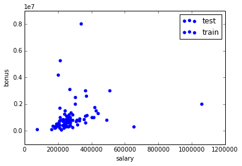

### Let's use ggplot!

    
    from pandas import *
    from ggplot import *
    
    d = {'feature':Series(feature_train+feature_test),
         'label':Series(target_train+target_test),
         'group':Series(['train']*len(target_train)+['test']*len(target_test))}
    
    df = DataFrame(d)
    
    pl = ggplot(aes(x='feature',y='label',color='group'),df) + geom_point()
    # ggsave(filename='saveme.jpg',plot=pl)
    print pl

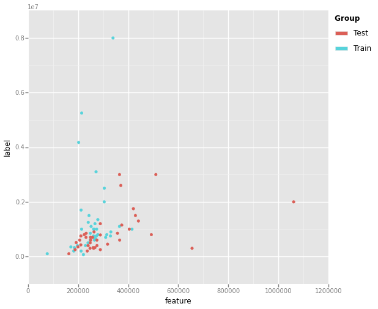

    <ggplot: (282856601)>

    df_sb = DataFrame.from_dict(dictionary,orient='index')

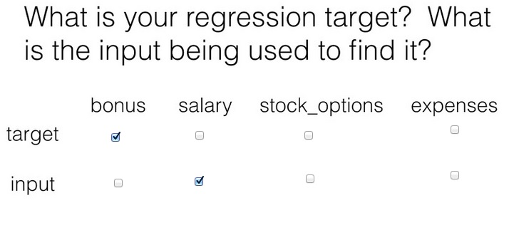

    from sklearn import linear_model

    clf = linear_model.LinearRegression()
    clf.fit(feature_train,target_train)

    LinearRegression(copy_X=True, fit_intercept=True, normalize=False)

    print clf.coef_
    print clf.intercept_

    [ 5.44814029]
    -102360.543294

Imagine you were a less savvy machine learner, and didn’t know to test on a
holdout test set. Instead, you tested on the same data that you used to train,
by comparing the regression predictions to the target values (i.e. bonuses) in
the training data. What score do you find? You may not have an intuition yet for
what a “good” score is; this score isn’t very good (but it could be a lot
worse).

    clf.score(feature_train,target_train)

    0.045509192699524359

Now compute the score for your regression on the test data, like you know you
should. What’s that score on the testing data? If you made the mistake of only
assessing on the training data, would you overestimate or underestimate the
performance of your regression?

    clf.score(feature_test,target_test)

    -1.484992417368511

There are lots of finance features available, some of which might be more
powerful than others in terms of predicting a person’s bonus. For example,
suppose you thought about the data a bit and guess that the
“long_term_incentive” feature, which is supposed to reward employees for
contributing to the long-term health of the company, might be more closely
related to a person’s bonus than their salary is.

A way to confirm that you’re right in this hypothesis is to regress the bonus
against the long term incentive, and see if the regression score is
significantly higher than regressing the bonus against the salary. Perform the
regression of bonus against long term incentive--what’s the score on the test
data?

    features_list = ["bonus", "long_term_incentive"]
    data = featureFormat( dictionary, features_list, remove_any_zeroes=True)#, "long_term_incentive"], remove_any_zeroes=True )
    
    target, features = targetFeatureSplit( data )
    
    ### training-testing split needed in regression, just like classification
    from sklearn.cross_validation import train_test_split
    feature_train, feature_test, target_train, target_test = train_test_split(features, target, test_size=0.5, random_state=42)

    clf = linear_model.LinearRegression()

    clf.fit(feature_train,target_train)

    LinearRegression(copy_X=True, fit_intercept=True, normalize=False)

    clf.score(feature_test,target_test)

    -0.59271289994986431

If you had to predict someone’s bonus and you could only have one piece of
information about them, would you rather know their salary or the long term
incentive that they received?

Better score will produce better fit

This is a sneak peek of the next lesson, on outlier identification and removal.
Go back to a setup where you are using the salary to predict the bonus, and
rerun the code to remind yourself of what the data look like. You might notice a
few data points that fall outside the main trend, someone who gets a high salary
(over a million dollars!) but a relatively small bonus. This is an example of an
outlier, and we’ll spend lots of time on them in the next lesson.

A point like this can have a big effect on a regression: if it falls in the
training set, it can have a significant effect on the slope/intercept if it
falls in the test set, it can make the score much lower than it would otherwise
be As things stand right now, this point falls into the test set (and probably
hurting the score on our test data as a result). Let’s add a little hack to see
what happens if it falls in the training set instead. Add these two lines near
the bottom of finance_regression.py, right before plt.xlabel(features_list[1]):

    reg.fit(feature_test, target_test)
    plt.plot(feature_train, reg.predict(feature_train), color="r")

Now we’ll be drawing two regression lines, one fit on the test data (with
outlier) and one fit on the training data (no outlier). Look at the plot now--
big difference, huh? That single outlier is driving most of the difference.
What’s the slope of the new regression line?

(That’s a big difference, and it’s mostly driven by the outliers. The next
lesson will dig into outliers in more detail so you have tools to detect and
deal with them.)

    #!/usr/bin/python
    
    """
        starter code for the regression mini-project
        
        loads up/formats a modified version of the dataset
        (why modified?  we've removed some trouble points
        that you'll find yourself in the outliers mini-project)
    
        draws a little scatterplot of the training/testing data
    
        you fill in the regression code where indicated
    
    """    
    
    
    import sys
    import pickle
    sys.path.append("../tools/")
    from feature_format import featureFormat, targetFeatureSplit
    dictionary = pickle.load( open("../final_project/final_project_dataset_modified.pkl", "r") )
    
    ### list the features you want to look at--first item in the 
    ### list will be the "target" feature
    features_list = ["bonus", "salary"]
    data = featureFormat( dictionary, features_list, remove_any_zeroes=True)#, "long_term_incentive"], remove_any_zeroes=True )
    
    target, features = targetFeatureSplit( data )
    
    ### training-testing split needed in regression, just like classification
    from sklearn.cross_validation import train_test_split
    feature_train, feature_test, target_train, target_test = train_test_split(features, target, test_size=0.5, random_state=42)
    train_color = "b"
    test_color = "b"
    
    
    
    ### your regression goes here!
    ### please name it reg, so that the plotting code below picks it up and 
    ### plots it correctly
    
    
    from sklearn import linear_model
    
    reg = linear_model.LinearRegression()
    reg.fit(feature_train,target_train)
    
    
    
    ### draw the scatterplot, with color-coded training and testing points
    import matplotlib.pyplot as plt
    for feature, target in zip(feature_test, target_test):
        plt.scatter( feature, target, color=test_color ) 
    for feature, target in zip(feature_train, target_train):
        plt.scatter( feature, target, color=train_color ) 
    
    ### labels for the legend
    plt.scatter(feature_test[0], target_test[0], color=test_color, label="test")
    plt.scatter(feature_test[0], target_test[0], color=train_color, label="train")
    
    
    
    
    ### draw the regression line, once it's coded
    try:
        plt.plot( feature_test, reg.predict(feature_test) )
    except NameError:
        pass
    reg.fit(feature_test, target_test)
    plt.plot(feature_train, reg.predict(feature_train), color="r")
    
    
    plt.xlabel(features_list[1])
    plt.ylabel(features_list[0])
    plt.legend()
    plt.show()

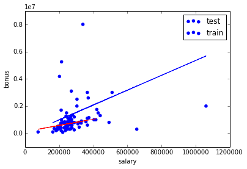

    reg.coef_

    array([ 2.27410114])

The slope is about 2.27 after removing the outlier, which is a big difference
from what we had before (about 5.4). A small number of outliers makes a big
difference!

> **REFERENCE**:

> * https://www.udacity.com/course/viewer#!/c-ud120/l-2301748537
