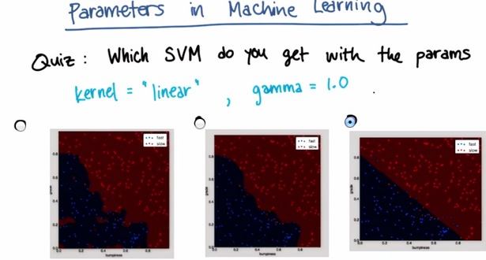
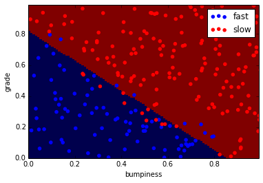
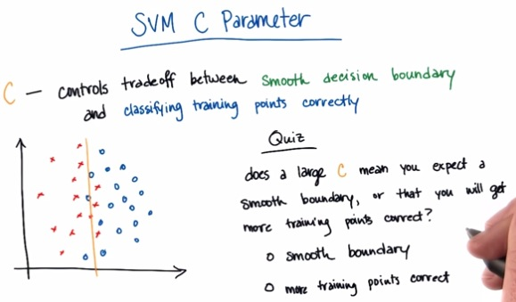
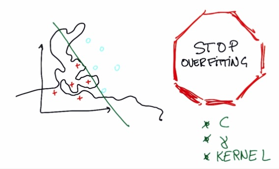

SVM(Support Vector Machine) is really popular algorithm nowadays. It's really
young but it's fenomenal and use by many. In here we learn why SVM is so
powerful. There's also many of SVM blog that i made in the past. If you're
curious, please click tag 'Support Vector Machine' at the top of the page.
<!-- TEASER_END -->

SVM choose the line that maximize the distance of both nearest point. This
distance often called Margin.SVM tries to maximize the margin, but also act as
other learning algorithm, prioritize the correctness of classifying. Even if
there's point that can't be classfied correctly, while retain its largest
margin, SVM will treat it as outliers, and can safely ignore the points. But the
percentage in which the SVM has firm belief to retain the largest margin, is
something called C. Check [here](http://napitupulu-jon.appspot.com/posts/Large-
Margin-Intuition.html) to get more intuition about it.

### Using SVM with SKlearn

It's really just use the same syntax. We're going to have input,output,fit and
predict.

    %load '../naive_bayes/class_vis.py'

    #!/usr/bin/python
    
    #from udacityplots import *
    import matplotlib 
    matplotlib.use('agg')
    
    import matplotlib.pyplot as plt
    import pylab as pl
    import numpy as np
    
    #import numpy as np
    #import matplotlib.pyplot as plt
    #plt.ioff()
    
    def prettyPicture(clf, X_test, y_test):
        x_min = 0.0; x_max = 1.0
        y_min = 0.0; y_max = 1.0
    
        # Plot the decision boundary. For that, we will assign a color to each
        # point in the mesh [x_min, m_max]x[y_min, y_max].
        h = .01  # step size in the mesh
        xx, yy = np.meshgrid(np.arange(x_min, x_max, h), np.arange(y_min, y_max, h))
        Z = clf.predict(np.c_[xx.ravel(), yy.ravel()])
    
        # Put the result into a color plot
        Z = Z.reshape(xx.shape)
        plt.xlim(xx.min(), xx.max())
        plt.ylim(yy.min(), yy.max())
    
        plt.pcolormesh(xx, yy, Z, cmap=pl.cm.seismic)
    
        # Plot also the test points
        grade_sig = [X_test[ii][0] for ii in range(0, len(X_test)) if y_test[ii]==0]
        bumpy_sig = [X_test[ii][1] for ii in range(0, len(X_test)) if y_test[ii]==0]
        grade_bkg = [X_test[ii][0] for ii in range(0, len(X_test)) if y_test[ii]==1]
        bumpy_bkg = [X_test[ii][1] for ii in range(0, len(X_test)) if y_test[ii]==1]
    
        plt.scatter(grade_sig, bumpy_sig, color = "b", label="fast")
        plt.scatter(grade_bkg, bumpy_bkg, color = "r", label="slow")
        plt.legend()
        plt.xlabel("bumpiness")
        plt.ylabel("grade")
    
        plt.savefig("test.png")
        
    import base64
    import json
    import subprocess
    
    def output_image(name, format, bytes):
        image_start = "BEGIN_IMAGE_f9825uweof8jw9fj4r8"
        image_end = "END_IMAGE_0238jfw08fjsiufhw8frs"
        data = {}
        data['name'] = name
        data['format'] = format
        data['bytes'] = base64.encodestring(bytes)
        print image_start+json.dumps(data)+image_end

    %load '../naive_bayes/prep_terrain_data.py'

    #!/usr/bin/python
    import random
    
    
    def makeTerrainData(n_points=1000):
    ###############################################################################
    ### make the toy dataset
        random.seed(42)
        grade = [random.random() for ii in range(0,n_points)]
        bumpy = [random.random() for ii in range(0,n_points)]
        error = [random.random() for ii in range(0,n_points)]
        y = [round(grade[ii]*bumpy[ii]+0.3+0.1*error[ii]) for ii in range(0,n_points)]
        for ii in range(0, len(y)):
            if grade[ii]>0.8 or bumpy[ii]>0.8:
                y[ii] = 1.0
    
    ### split into train/test sets
        X = [[gg, ss] for gg, ss in zip(grade, bumpy)]
        split = int(0.75*n_points)
        X_train = X[0:split]
        X_test  = X[split:]
        y_train = y[0:split]
        y_test  = y[split:]
    
        grade_sig = [X_train[ii][0] for ii in range(0, len(X_train)) if y_train[ii]==0]
        bumpy_sig = [X_train[ii][1] for ii in range(0, len(X_train)) if y_train[ii]==0]
        grade_bkg = [X_train[ii][0] for ii in range(0, len(X_train)) if y_train[ii]==1]
        bumpy_bkg = [X_train[ii][1] for ii in range(0, len(X_train)) if y_train[ii]==1]
    
    #    training_data = {"fast":{"grade":grade_sig, "bumpiness":bumpy_sig}
    #            , "slow":{"grade":grade_bkg, "bumpiness":bumpy_bkg}}
    
    
        grade_sig = [X_test[ii][0] for ii in range(0, len(X_test)) if y_test[ii]==0]
        bumpy_sig = [X_test[ii][1] for ii in range(0, len(X_test)) if y_test[ii]==0]
        grade_bkg = [X_test[ii][0] for ii in range(0, len(X_test)) if y_test[ii]==1]
        bumpy_bkg = [X_test[ii][1] for ii in range(0, len(X_test)) if y_test[ii]==1]
    
        test_data = {"fast":{"grade":grade_sig, "bumpiness":bumpy_sig}
                , "slow":{"grade":grade_bkg, "bumpiness":bumpy_bkg}}
    
        return X_train, y_train, X_test, y_test
    #    return training_data, test_data

    import sys
    from class_vis import prettyPicture
    from prep_terrain_data import makeTerrainData
    
    import matplotlib.pyplot as plt
    import copy
    import numpy as np
    import pylab as pl
    
    
    features_train, labels_train, features_test, labels_test = makeTerrainData()
    
    
    ########################## SVM #################################
    ### we handle the import statement and SVC creation for you here
    from sklearn.svm import SVC
    clf = SVC(kernel="linear")
    
    
    #### now your job is to fit the classifier
    #### using the training features/labels, and to
    #### make a set of predictions on the test data
    
    clf.fit(features_train,labels_train)
    
    
    #### store your predictions in a list named pred
    
    pred = clf.predict(features_test)
    
    
    
    from sklearn.metrics import accuracy_score
    acc = accuracy_score(pred, labels_test)
    
    def submitAccuracy():
        return acc

SVM will gives us linear separable if we're trying to include polynomial
features if we're trying to solve non-linear data. The z features, as two
dimensional, will consider the problem as top right, making z capable of
linearly separating the graph.

Adding |x| as new feature, will flip all the point in -x into x+.Which in turn
makes the graph linearly separable.

There's kernel trick to create x parameter to become more polynomial.
Check this [link](http://napitupulu-jon.appspot.com/posts/Kernels-I.html) for
more intuition

It's important to understand more of parameters in SVM

Please check the sklearn for more documentation in this [link](http://scikit-
learn.org/stable/modules/generated/sklearn.svm.SVC.html)

    import sys

    %pylab inline

    Populating the interactive namespace from numpy and matplotlib

    sys.path.append('../naive_bayes')

    import sys
    from class_vis import prettyPicture
    from prep_terrain_data import makeTerrainData
    
    import matplotlib.pyplot as plt
    import copy
    import numpy as np
    import pylab as pl
    
    
    features_train, labels_train, features_test, labels_test = makeTerrainData()

    from sklearn.svm import SVC

    clf = SVC(kernel='linear',gamma=1.0)

    clf.fit(features_train,labels_train)

    SVC(C=1.0, cache_size=200, class_weight=None, coef0=0.0, degree=3, gamma=1.0,
      kernel='linear', max_iter=-1, probability=False, random_state=None,
      shrinking=True, tol=0.001, verbose=False)

    prettyPicture(clf, features_test, labels_test)

For this quiz, the answer should me more training corrects. C works as contrary
of lambda, where the larger the C, the more the system overfit the train data.
Again, you may check at this [link](http://napitupulu-jon.appspot.com/posts
/Large-Margin-Intuition.html) to get more intuition about C value.

The Machine Learning nightmare is overfitting. Anything can happen, if not
optimal, then you either get underfitting or overfitting. This also take into
account that all of these 3, if not tuned correctly will be prone to
overfitting.

### Final Thoughts

SVM can be at an advantage and disadvantage. If we can see clear distance
separable plane between two datasets, then it's a good idea to use SVM. But,
because SVM has firm belief(shown by 'margin'), it has weakness in datasets that
have close margin. For this, Naive Bayes is recommended.

It also tends to not work so well given huge dataset and huge parameters. It
still good, but the algorithm will be very slow. For this, there's many library
implementing SVM have readily optimize SVM. For more thoughts into this, please
check this [link](http://napitupulu-jon.appspot.com/posts/Using-SVM.html)

### Mini Project

In this mini-project, we’ll tackle the exact same email author ID problem as the
Naive Bayes mini-project, but now with an SVM. What we find will help clarify
some of the practical differences between the two algorithms. This project also
gives us a chance to play around with parameters a lot more than Naive Bayes
did, so we will do that too.

    %load svm_author_id.py

    #!/usr/bin/python
    
    """ 
        this is the code to accompany the Lesson 2 (SVM) mini-project
    
        use an SVM to identify emails from the Enron corpus by their authors
        
        Sara has label 0
        Chris has label 1
    
    """
        
    import sys
    from time import time
    sys.path.append("../tools/")
    from email_preprocess import preprocess
    
    
    ### features_train and features_test are the features for the training
    ### and testing datasets, respectively
    ### labels_train and labels_test are the corresponding item labels
    features_train, features_test, labels_train, labels_test = preprocess()
    

    no. of Chris training emails: 7936
    no. of Sara training emails: 7884

    clf = SVC(kernel='linear')

    clf.fit(features_train,labels_train)

    SVC(C=1.0, cache_size=200, class_weight=None, coef0=0.0, degree=3, gamma=0.0,
      kernel='linear', max_iter=-1, probability=False, random_state=None,
      shrinking=True, tol=0.001, verbose=False)

#### And the accuracy of this classifier is....

    clf.score(features_test,labels_test)

    0.98407281001137659

exact times may vary a bit, but in general, the SVM is MUCH slower to train and
use for predicting

    features_train = features_train[:len(features_train)/100]
    labels_train = labels_train[:len(labels_train)/100]

    clf.fit(features_train,labels_train)

    SVC(C=1.0, cache_size=200, class_weight=None, coef0=0.0, degree=3, gamma=0.0,
      kernel='linear', max_iter=-1, probability=False, random_state=None,
      shrinking=True, tol=0.001, verbose=False)

    clf.score(features_test,labels_test)

    0.88452787258248011

Only 1% of the features, but over 88% the performance? Not too shabby!

It's good sometimes to have lower performance but instance learning. Voice
recognition and transaction blocking need to happen in real time, with almost no
delay. There's no obvious need to predict an email author instantly.

    clf_rbf = SVC(kernel='rbf')

    clf_rbf.fit(features_train,labels_train)

    SVC(C=1.0, cache_size=200, class_weight=None, coef0=0.0, degree=3, gamma=0.0,
      kernel='rbf', max_iter=-1, probability=False, random_state=None,
      shrinking=True, tol=0.001, verbose=False)

    clf_rbf.score(features_test,labels_test)

    0.61604095563139927

C (say, 10.0, 100., 1000., and 10000.). Which one gives the best accuracy?

    clf_rbf = SVC(kernel='rbf',C=10000)

    clf_rbf.fit(features_train,labels_train)

    SVC(C=10000, cache_size=200, class_weight=None, coef0=0.0, degree=3,
      gamma=0.0, kernel='rbf', max_iter=-1, probability=False,
      random_state=None, shrinking=True, tol=0.001, verbose=False)

    clf_rbf.score(features_test,labels_test)

    0.89249146757679176

    features_train, features_test, labels_train, labels_test = preprocess()

    no. of Chris training emails: 7936
    no. of Sara training emails: 7884

    clf_rbf.fit(features_train,labels_train)

    SVC(C=10000, cache_size=200, class_weight=None, coef0=0.0, degree=3,
      gamma=0.0, kernel='rbf', max_iter=-1, probability=False,
      random_state=None, shrinking=True, tol=0.001, verbose=False)

    clf_rbf.score(features_test,labels_test)

    0.99089874857792948

Over 99% accuracy, pretty good!

What class does your SVM (0 or 1, corresponding to Sara and Chris respectively)
predict for element 10 of the test set? The 26th? The 50th? (Use the RBF kernel,
C=10000, and 1% of the training set. Normally you'd get the best results using
the full training set, but we found that using 1% sped up the computation
considerably and did not change our results--so feel free to use that shortcut
here.)

And just to be clear, the data point numbers that we give here (10, 26, 50)
assume a zero-indexed list. So the correct answer for element #100 would be
found using something like answer=predictions[100]

    features_train = features_train[:len(features_train)/100]
    labels_train = labels_train[:len(labels_train)/100]

    clf_rbf = SVC(kernel='rbf',C=10000)

    clf_rbf.fit(features_train,labels_train)

    SVC(C=10000, cache_size=200, class_weight=None, coef0=0.0, degree=3,
      gamma=0.0, kernel='rbf', max_iter=-1, probability=False,
      random_state=None, shrinking=True, tol=0.001, verbose=False)

    pred = clf_rbf.predict(features_test)

    print pred[10]
    print pred[26]
    print pred[50]

    1
    0
    1

Just like the SVM, you are over 99% correct! (Actually, on this one, you're 100%
correct)

    features_train, features_test, labels_train, labels_test = preprocess()

    no. of Chris training emails: 7936
    no. of Sara training emails: 7884

    clf_rbf = SVC(kernel='rbf',C=10000)

    clf_rbf.fit(features_train,labels_train)

    SVC(C=10000, cache_size=200, class_weight=None, coef0=0.0, degree=3,
      gamma=0.0, kernel='rbf', max_iter=-1, probability=False,
      random_state=None, shrinking=True, tol=0.001, verbose=False)

    pred = clf_rbf.predict(features_test)

    len(pred)

    1758

    n = []

    [n.append(e) for e in pred if e == 1]

    len(n)

    877

### Thoughts on Instructor

Hopefully it’s becoming clearer what Sebastian meant when he said Naive Bayes is
great for text--it’s faster and generally gives better performance than an SVM
for this particular problem. Of course, there are plenty of other problems where
an SVM might work better. Knowing which one to try when you’re tackling a
problem for the first time is part of the art and science of machine learning.
In addition to picking your algorithm, depending on which one you try, there are
parameter tunes to worry about as well, and the possibility of overfitting
(especially if you don’t have lots of training data).

Our general suggestion is to try a few different algorithms for each problem.
Tuning the parameters can be a lot of work, but just sit tight for now--toward
the end of the class we will introduce you to GridCV, a great sklearn tool that
can find an optimal parameter tune almost automatically.

    
