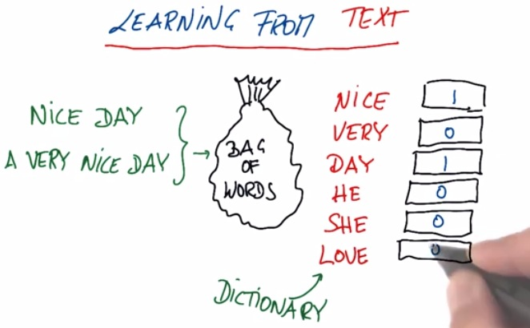
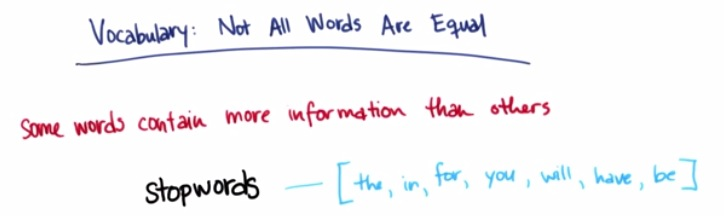
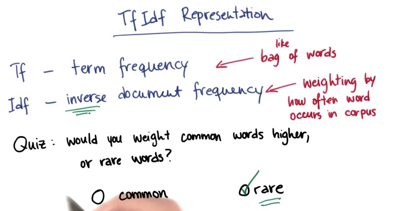

Text Learning, is machine learning on broad area which incorporate text. Many
search giants, like Google, Yahoo, Baidu, tried to to learn text from various
search. In this example we take a look at bag of words, which contains words,
and from the data, count the frequency of word occurs in the text.
<!-- TEASER_END -->

So Bag of Words has interesting characteristics:

* Word order doesn't matter. It can only throw the text, without the order and
dump into the bag (hence the name)
* Because it long phrases, it actually duplicate the words and return double of
its vector leng.
* We may throw more complex model of bag of words, but really it just count one
words, thus didn't handle the complexity of phrase. When Google first start as
search engine, words like Chicago Bulls, if you put it into search engine,
returns cities and animal. Now their engineers has model the bag complexity
enough to catch the phrase.

The sklearn has the module to count how many words occurs in one sentence,
called CountVectorizer

    %pylab inline

    Populating the interactive namespace from numpy and matplotlib

    import numpy

    from sklearn.feature_extraction.text import CountVectorizer

    vectorizer = CountVectorizer()

    string1 = "hi Katie the self driving car will be late Best Sebastian"
    string2 = "Hi Sebastian the machine learning will be great greate best Katie"

    email_list = [string1,string2]

    
    bag_of_words = vectorizer.fit(email_list)

    bag_of_words = vectorizer.transform(email_list)

    print bag_of_words

      (0, 0)	1
      (0, 1)	1
      (0, 2)	1
      (0, 3)	1
      (0, 6)	1
      (0, 7)	1
      (0, 8)	1
      (0, 11)	1
      (0, 12)	1
      (0, 13)	1
      (0, 14)	1
      (1, 0)	1
      (1, 1)	1
      (1, 4)	1
      (1, 5)	1
      (1, 6)	1
      (1, 7)	1
      (1, 9)	1
      (1, 10)	1
      (1, 11)	1
      (1, 13)	1
      (1, 14)	1

    print vectorizer.vocabulary_.get('great')

    4

Some text may not be important to include in the learning algorithm. These words
are just too frequent, and it doesn't help much to learn what the text are
about. Stopwords containing some unnecessary words that adding it only becomes
noise, because it will contribute largely (because it's too frequent) on the
data. Does why it's important to escape these words as preprocessing in text
learning.

Words can also compacted from all kinds of available extension of words into
only a root for that words, for example respon.

    from nltk.stem.snowball import SnowballStemmer

    stemmer = SnowballStemmer("english")

    stemmer.stem("responsiveness")

    u'respons'

    stemmer.stem("unresponsive")

    u'unrespons'

This is one particular example that we choose from nltk that also gonna play a
bit around in the later mini project. Notice that the stem still maintain "un"
prefix. Sometimes we may want to represent the words that only 'repon' and
'unrespon', could be totally different matters. We could also fine-tuning this
stem function. This is really benefit as we can reduce thousands of features
into one that has same meaning, which is greatly beneficient for the algorithm.

This stemming, preprocessing text learning, should done first before you use bag
of words representation.

TFIDF is also one interesting technique in text learning. While TF is similar to
bag of words, IDF is how rare a word occurs in document(corpus). Sometimes this
rare word, that if in author guess, only appear in one particular author, is
important. That word will determine which author that writes the documents. And
because of that, rare words rank higher.

### Mini Project

As usual, because this blog post are the note that I have taken from Udacity
course, Here I attack some of the problem they have at their mini project. You
can see the link of the course for this note at the bottom of this page.

In the beginning of this class, you identified emails by their authors using a
number of supervised classification algorithms. In those projects, we handled
the preprocessing for you, transforming the input emails into a TfIdf so they
could be fed into the algorithms. Now you will construct your own version of
that preprocessing step, so that you are going directly from raw data to
processed features.

You will be given two text files: one contains the locations of all the emails
from Sara, the other has emails from Chris. You will also have access to the
parseOutText() function, which accepts an opened email as an argument and
returns a string containing all the (stemmed) words in the email.

You’ll start with a warmup exercise to get acquainted with parseOutText(). Go to
the tools directory and run parse_out_email_text.py, which contains
parseOutText() and a test email to run this function over.

parseOutText() takes the opened email and returns only the text part, stripping
away any metadata that may occur at the beginning of the email, so what's left
is the text of the message. We currently have this script set up so that it will
print the text of the email to the screen, what is the text that you get when
you run parseOutText()?

    %load ../tools/parse_out_email_text.py

    #!/usr/bin/python
    
    from nltk.stem.snowball import SnowballStemmer
    import string
    
    def parseOutText(f):
        """ given an opened email file f, parse out all text below the
            metadata block at the top
            (in Part 2, you will also add stemming capabilities)
            and return a string that contains all the words
            in the email (space-separated) 
            
            example use case:
            f = open("email_file_name.txt", "r")
            text = parseOutText(f)
            
            """
    
    
        f.seek(0)  ### go back to beginning of file (annoying)
        all_text = f.read()
    
        ### split off metadata
        content = all_text.split("X-FileName:")
        words = ""
        if len(content) > 1:
            ### remove punctuation
            text_string = content[1].translate(string.maketrans("", ""), string.punctuation)
    
            ### project part 2: comment out the line below
            words = text_string
    
            ### split the text string into individual words, stem each word,
            ### and append the stemmed word to words (make sure there's a single
            ### space between each stemmed word)
            
    
    
    
        return words
    
        
    
    def main():
        ff = open("../text_learning/test_email.txt", "r")
        text = parseOutText(ff)
        print text
    
    
    
    if __name__ == '__main__':
        main()
    

    
    
    Hi Everyone  If you can read this message youre properly using parseOutText  Please proceed to the next part of the project
    

In parseOutText(), comment out the following line:

words = text_string

Augment parseOutText() so that the string it returns has all the words stemmed
using a SnowballStemmer (use the nltk package, some examples that I found
helpful can be found here: http://www.nltk.org/howto/stem.html ). Rerun
parse_test.py, which will use your updated parseOutText() function--what’s your
output now?

Hint: you'll need to break the string down into individual words, stem each
word, then recombine all the words into one string.

    %%writefile ../tools/parse_out_email_text.py
    
    from nltk.stem.snowball import SnowballStemmer
    import string
    
    def parseOutText(f):
        """ given an opened email file f, parse out all text below the
            metadata block at the top
            (in Part 2, you will also add stemming capabilities)
            and return a string that contains all the words
            in the email (space-separated) 
            
            example use case:
            f = open("email_file_name.txt", "r")
            text = parseOutText(f)
            
            """
    
    
        f.seek(0)  ### go back to beginning of file (annoying)
        all_text = f.read()
    
        ### split off metadata
        content = all_text.split("X-FileName:")
        words = ""
        if len(content) > 1:
            ### remove punctuation
            text_string = content[1].translate(string.maketrans("", ""), string.punctuation)
    
            ### split the text string into individual words, stem each word,
            ### and append the stemmed word to words (make sure there's a single
            ### space between each stemmed word)
            from nltk.stem.snowball import SnowballStemmer
            stemmer = SnowballStemmer("english")
            
            split_list = text_string.split();
            words = ''
            for e in split_list:
                words += stemmer.stem(e) + " "
                
    
        return words
    
        
    
    def main():
        ff = open("../text_learning/test_email.txt", "r")
        text = parseOutText(ff)
        print text
    
    
    
    if __name__ == '__main__':
        main()
    

    Overwriting ../tools/parse_out_email_text.py

In vectorize_text.py, you will iterate through all the emails from Chris and
from Sara. For each email, feed the opened email to parseOutText() and return
the stemmed text string. Then do two things:

remove signature words (“sara”, “shackleton”, “chris”, “germani”--bonus points
if you can figure out why it's "germani" and not "germany")
append the updated text string to word_data -- if the email is from Sara, append
0 (zero) to from_data, or append a 1 if Chris wrote the email.
Once this step is complete, you should have two lists: one contains the stemmed
text of each email, and the second should contain the labels that encode (via a
0 or 1) who the author of that email is.

Running over all the emails can take a little while (5 minutes or more), so
we've added a temp_counter to cut things off after the first 200 emails. Of
course, once everything is working, you'd want to run over the full dataset.

In the box below, put the string that you get for word_data[152].

    %load vectorize_text.py

    %%writefile vectorize_text.py
    import pickle
    import sys
    import re
    sys.path.append( "../tools/" )
    from parse_out_email_text import parseOutText
    
    """
        starter code to process the emails from Sara and Chris to extract
        the features and get the documents ready for classification
    
        the list of all the emails from Sara are in the from_sara list
        likewise for emails from Chris (from_chris)
    
        the actual documents are in the Enron email dataset, which
        you downloaded/unpacked in Part 0 of the first mini-project
    
        the data is stored in lists and packed away in pickle files at the end
    
    """
    
    
    from_sara  = open("from_sara.txt", "r")
    from_chris = open("from_chris.txt", "r")
    
    from_data = []
    word_data = []
    
    ### temp_counter is a way to speed up the development--there are
    ### thousands of emails from Sara and Chris, so running over all of them
    ### can take a long time
    ### temp_counter helps you only look at the first 200 emails in the list
    temp_counter = 0
    
    
    for name, from_person in [("sara", from_sara), ("chris", from_chris)]:
        for path in from_person:
            ### only look at first 200 emails when developing
            ### once everything is working, remove this line to run over full dataset
    #         temp_counter += 1
    #         if temp_counter < 200:
            path = "../"+path[:-1]
            #print path
            email = open(path, "r")
    
            ### use parseOutText to extract the text from the opened email
            words = parseOutText(email)
    
            ### use str.replace() to remove any instances of the words
            #last two words are the outliers to get rid of in next lesson, feature-selection.
            #I'm adding this from the next lesson, the future. Whaaaa?
            list_rep  = ["sara", "shackleton", "chris", "germani","sshacklensf","cgermannsf"]
            for e in list_rep:
                words = words.replace(e,"")
            ### append the text to word_data
            word_data.append(words)
            ### append a 0 to from_data if email is from Sara, and 1 if email is from Chris
            from_data.append(0 if name == "sara" else 1)
    
            email.close()
    
    print "emails processed"
    from_sara.close()
    from_chris.close()
    
    pickle.dump( word_data, open("your_word_data.pkl", "w") )
    pickle.dump( from_data, open("your_email_authors.pkl", "w") )
    
    print word_data[152]
    
    
    
    ### in Part 4, do TfIdf vectorization here

    Overwriting vectorize_text.py

    print len(word_data)

    17578

Transform the word_data into a tf-idf matrix using the sklearn TfIdf
transformation. Remove english stopwords.

You can access the mapping between words and feature numbers using
get_feature_names(), which returns a list of all the words in the vocabulary.
How many words are there?

Be sure to use the tf-idf Vectorizer class to transform the word_data.Don't
forget to remove english stop words when you set up the vectorizer.

    from nltk.corpus import stopwords

    sw = stopwords.words("english")

    from sklearn.feature_extraction.text import TfidfVectorizer
    vectorizer = TfidfVectorizer(stop_words="english")
    vectorizer.fit_transform(word_data)
    # bag_words = vectorizer.transform(word_data)
    print len(vectorizer.get_feature_names())

    38757

What is word number 34597 in your TfIdf?

(Just to be clear--if the question were "what is word number 100," we would be
looking for the word corresponding to vocab_list[100]. Zero-indexed arrays are
so confusing to talk about sometimes.)

    vectorizer.get_feature_names()[34597]

    u'stephaniethank'

> **REFERENCE**:

> * https://www.udacity.com/course/viewer#!/c-ud120/l-2892378590/e-3012738650/m-
3015918703

    
